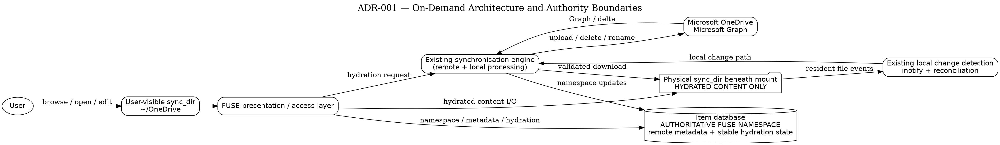
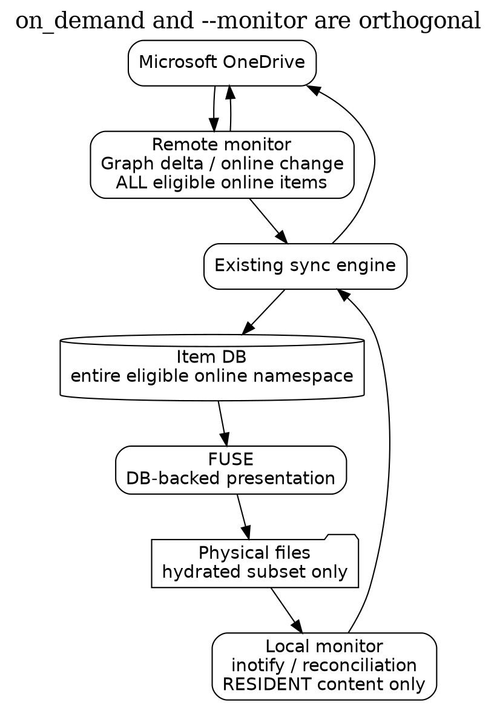
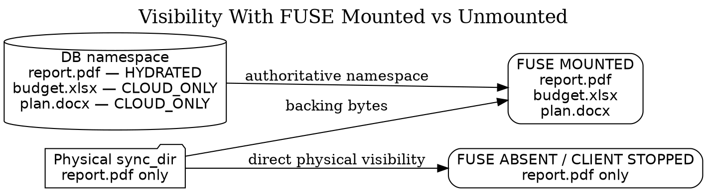
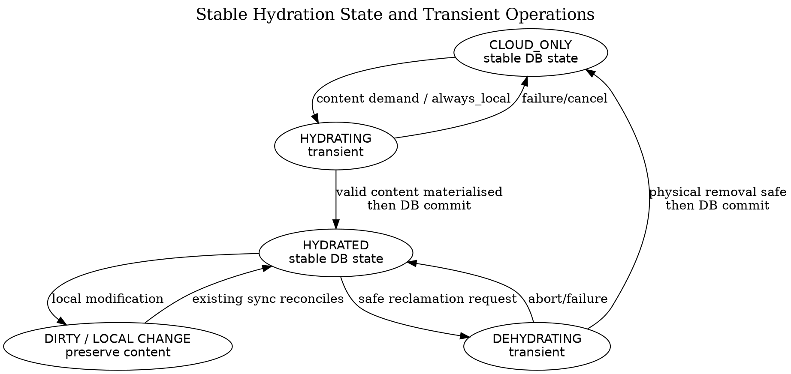
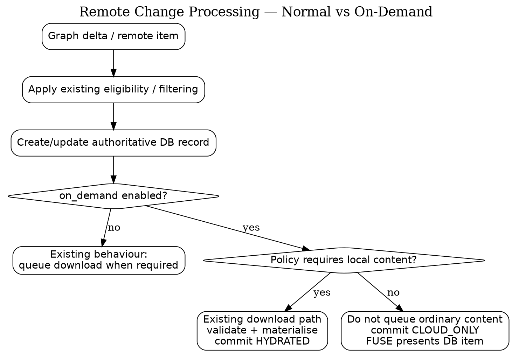
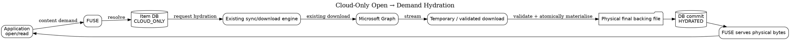
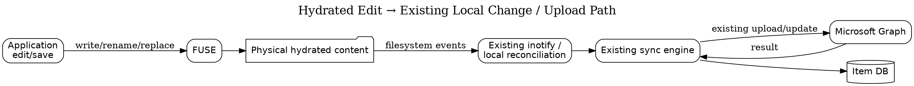
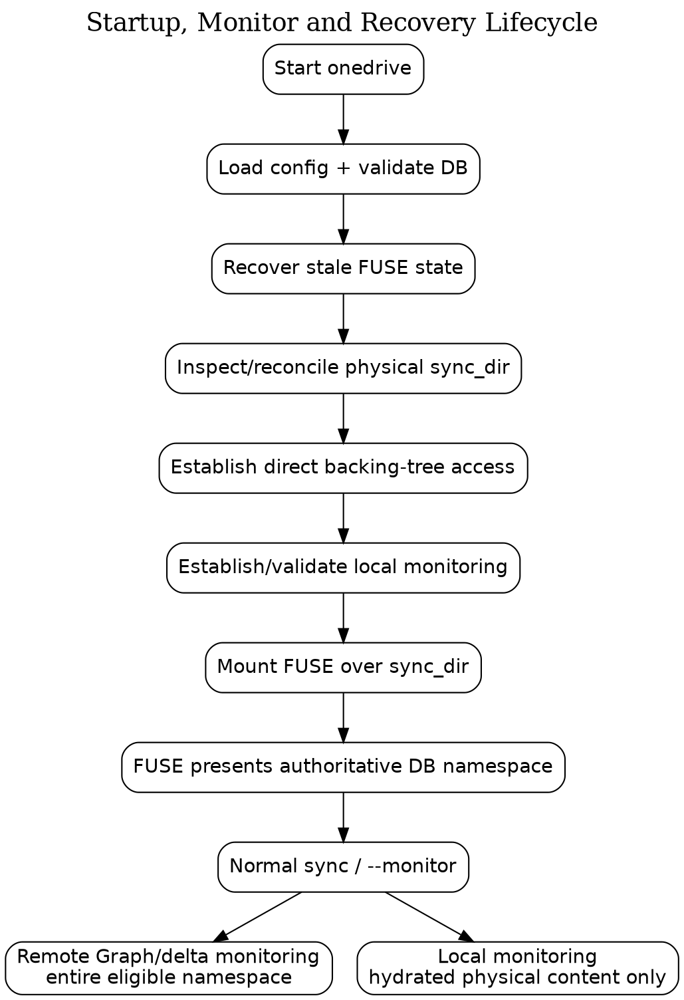

# ADR-001: FUSE Overlay, Authoritative Namespace and Local Storage

**Status:** Proposed  
**Feature:** On-Demand Files  
**Configuration flag:** `on_demand`  
**Default:** `on_demand = "false"`  
**Scope:** FUSE namespace presentation, database authority, hydration state, physical storage, synchronisation and monitor integration, local change detection, lifecycle and recovery  
**Target:** `implement-on-demand-capability`

> This ADR defines the intended architecture and safety invariants for on-demand support. It distinguishes architectural decisions from implementation mechanisms that still require prototype validation. Where this ADR says **must**, the behaviour is an architectural invariant. Where it says **to validate** or **open decision**, implementation evidence is still required.

---

## 1. Context

The existing `onedrive` client maintains an item database representing the eligible online OneDrive state known to the client and synchronises content into a normal local `sync_dir`, normally:

```text
~/OneDrive
```

or a user-configured path.

On-demand support must allow the complete eligible online namespace to be visible at that same `sync_dir` without requiring every remote file to consume local storage.

The feature must retain the existing synchronisation engine and its normal operating modes. It must not create a second implementation of Microsoft Graph change processing, downloads, uploads, conflict handling, local change processing or `--monitor`.

The core model is:

> **The item database is the authoritative namespace presented by FUSE.**

The database continues to represent the complete eligible online namespace. On-demand support extends the database state so the client can distinguish items whose content is physically resident from items represented only by remote metadata.

FUSE presents the namespace from that database state:

- a **hydrated** file has real physical backing content in `sync_dir`;
- a **cloud-only** file exists in the FUSE namespace because it exists in the authoritative database, but no complete physical file content is required underneath the mount.

The physical filesystem is therefore not a second source of namespace truth. It is the backing store for hydrated content and a source of evidence about local changes.

When:

```ini
on_demand = "false"
```

the existing client behaviour remains unchanged.

When:

```ini
on_demand = "true"
```

on-demand changes **when file content is materialised locally and how the namespace is presented**. It does not replace the existing synchronisation lifecycle.

---

## 2. Decision

When `on_demand = "true"`:

1. The item database remains the complete client-side representation of the eligible online OneDrive namespace.
2. The database gains explicit stable hydration state for applicable file items.
3. FUSE is mounted over the existing configured `sync_dir`.
4. FUSE builds/presents its visible namespace from the item database.
5. Cloud-only database items are visible without physical placeholder files.
6. Hydrated database items are backed by real physical content in the existing `sync_dir`.
7. The existing sync engine continues to process Microsoft Graph changes.
8. The existing `--monitor` mode remains available and continues to monitor online and local change.
9. Remote monitoring continues across the entire eligible online namespace, whether individual files are hydrated or cloud-only.
10. Local filesystem monitoring applies to physical resident content. A cloud-only file has no physical content to monitor locally.
11. In on-demand mode, ordinary eligible remote files that would otherwise be downloaded are recorded as cloud-only and are not placed on the normal content download queue unless policy requires local content.
12. FUSE observes user/application filesystem operations. A content-requiring operation against a cloud-only file requests hydration.
13. Hydration uses the existing download machinery.
14. Only after valid physical content has been safely materialised is stable database state changed to hydrated.
15. Once hydrated, local edits should flow through the existing physical filesystem, inotify/local-change and upload path wherever possible.
16. FUSE does not become a separate upload or Graph synchronisation engine.
17. User deletion and dehydration are different operations and must never be inferred from physical absence alone.
18. On clean shutdown, FUSE is unmounted and physical hydrated content in `sync_dir` becomes directly visible.
19. On restart, physical local changes are reconciled safely and the authoritative FUSE namespace is rebuilt from database state.

---

## 3. Architecture and authority boundaries



PlantUML source: [`plantuml/adr-001-architecture-overview.puml`](plantuml/adr-001-architecture-overview.puml)

The authority boundaries are deliberately narrow:

| Component | Authority / responsibility |
| --- | --- |
| Microsoft OneDrive / Microsoft Graph | Remote service state and remote content |
| Existing sync engine | Synchronisation decisions, Graph interaction, existing upload/download/conflict behaviour |
| Item database | **Authoritative namespace presented by FUSE**, remote identity/metadata and stable hydration state |
| Physical `sync_dir` | Backing content for hydrated items and evidence of local physical change |
| FUSE | Namespace presentation, filesystem access mediation and demand signal for hydration |
| Existing inotify/local reconciliation | Local change detection for content that physically exists |

The key distinction is:

> **Database authority governs namespace presentation. It does not authorise destruction or overwriting of contradictory unsynchronised physical content.**

---

## 4. `on_demand` is orthogonal to normal synchronisation and `--monitor`

This is a foundational design requirement.

`on_demand` is **not** an alternative to `--monitor`, a special sync mode, or a replacement event loop.

It is a storage/presentation capability that changes whether eligible remote content is immediately materialised.

The following combinations are conceptually valid:

```text
on_demand=false + single sync
on_demand=false + --monitor
on_demand=true  + single sync
on_demand=true  + --monitor
```

The meaning of `--monitor` does not change: the client continues monitoring Microsoft OneDrive for remote changes and the local filesystem for local changes.

What changes is the **scope of physical local monitoring**, because cloud-only content has no local backing file to observe.



PlantUML source: [`plantuml/adr-001-monitor-orthogonality.puml`](plantuml/adr-001-monitor-orthogonality.puml)

### 4.1 Remote monitoring

Remote Graph/delta monitoring continues across the **entire eligible online namespace**.

For a cloud-only item, remote change processing can:

- update its database metadata;
- rename or move its database namespace location;
- remove the database item after a genuine remote deletion;
- alter future policy decisions; and
- cause FUSE to present the updated state.

None of those operations inherently require downloading file content.

### 4.2 Local monitoring

Local monitoring applies to content that physically exists.

For a hydrated file:

```text
physical content exists
        |
        v
existing inotify / local reconciliation can observe change
```

For a cloud-only file:

```text
database item exists
hydrated = false
physical content absent
        |
        v
there is no local file content for inotify to monitor
```

This is expected, not a monitoring gap. The item remains represented through remote monitoring + database state + FUSE.

### 4.3 Hydration changes monitoring applicability

When a cloud-only file is hydrated, real physical content appears and becomes eligible for normal local monitoring.

When a safely synchronised hydrated file is deliberately dehydrated, the physical content disappears and there is no longer local content to monitor.

This does **not** mean the item ceases to be monitored. It moves back to remote/database-only representation until it is hydrated again.

### 4.4 Implementation caution

The architecture does not require creating and destroying one inotify watch for every file hydration transition.

The existing watch model must first be examined and experimentally validated. If the client already watches physical directory trees, the desired implementation is to preserve that model and allow resident files to naturally appear/disappear beneath those watched directories.

The implementation must not redesign local monitoring unless testing demonstrates that the existing mechanism cannot safely observe operations routed through the FUSE overlay.

---

## 5. Database as the authoritative FUSE namespace

FUSE must not independently construct the OneDrive namespace by treating the physical filesystem and database as competing sources.

The namespace presented by FUSE is derived from the item database.

For example, if the database contains:

```text
Documents/
    report.pdf       HYDRATED
    budget.xlsx      CLOUD_ONLY

Photos/
    holiday.jpg      HYDRATED
    archive.zip      CLOUD_ONLY

Projects/
    plan.docx        CLOUD_ONLY
    notes.txt        HYDRATED
```

FUSE presents:

```text
~/OneDrive/
├── Documents/
│   ├── report.pdf
│   └── budget.xlsx
├── Photos/
│   ├── holiday.jpg
│   └── archive.zip
└── Projects/
    ├── plan.docx
    └── notes.txt
```

The physical directory contains only resident content:

```text
~/OneDrive/
├── Documents/
│   └── report.pdf
├── Photos/
│   └── holiday.jpg
└── Projects/
    └── notes.txt
```



PlantUML source: [`plantuml/adr-001-shutdown-visibility.puml`](plantuml/adr-001-shutdown-visibility.puml)

When FUSE is absent, cloud-only items are not locally visible as filesystem entries. They have not been deleted. They remain represented in the database and online.

### 5.1 Directories

Directories require explicit design attention.

The database already represents the online hierarchy and therefore determines which eligible directories FUSE presents, including directories whose descendants are entirely cloud-only.

A physical directory may exist because one or more descendants are hydrated, because a local unsynchronised item exists, or because existing client behaviour requires it.

The implementation must not assume that every FUSE-visible directory requires a corresponding physical directory.

Conversely, a physical directory containing unsynchronised local content must never be removed merely because the current database view has no hydrated remote child beneath it.

---

## 6. Stable hydration state versus transient operations

The database schema requires explicit state describing whether file content is stably resident.

The architectural stable states are equivalent to:

```text
CLOUD_ONLY
HYDRATED
```

The exact database representation remains an implementation decision. A boolean may be sufficient for stable state, but the design must not misuse that boolean to represent every transient operation.

Examples of transient conditions include:

```text
hydration requested
hydration in progress
dehydration in progress
download validation in progress
local content dirty / awaiting upload
operation failed / recovery required
```



PlantUML source: [`plantuml/adr-001-state-machine.puml`](plantuml/adr-001-state-machine.puml)

### 6.1 Stable-state rules

A stable transition to `HYDRATED` occurs only after:

1. the correct item has been downloaded;
2. content has passed the existing validation requirements;
3. valid final backing content exists at the intended physical location; and
4. the transition can survive restart/recovery.

A stable transition to `CLOUD_ONLY` occurs only after:

1. local content is proven safe to remove;
2. no unsynchronised local change would be lost;
3. policy permits dehydration;
4. the physical removal has completed safely; and
5. restart/recovery cannot misinterpret the transition as user deletion.

### 6.2 Dirty state is not hydration state

A hydrated file can also be locally modified.

That is not a third presentation state equivalent to cloud-only/hydrated. It is synchronisation state associated with resident content.

A dirty/unsynchronised file must be preserved and is not eligible for automatic dehydration.

### 6.3 Pin/`always_local` is policy, not hydration state

`always_local` expresses a retention requirement.

It can cause a cloud-only item to hydrate and can prevent a hydrated item from being dehydrated, but it should not be conflated with whether bytes currently exist on disk.

---

## 7. Remote processing: preserve the engine, change materialisation

The implementation principle is:

> **Do not replace working synchronisation paths. Change when content is materialised.**

Remote enumeration, delta processing, filtering, item identity and database maintenance remain in the existing engine.

The important on-demand decision occurs at or before the point where an eligible remote file would normally enter the content download queue.



PlantUML source: [`plantuml/adr-001-remote-processing.puml`](plantuml/adr-001-remote-processing.puml)

### 7.1 Normal mode

With `on_demand = "false"`, existing logic is unchanged.

### 7.2 On-demand mode

With `on_demand = "true"`:

1. remote metadata is processed normally;
2. existing eligibility/filtering rules are applied;
3. the authoritative DB item is created/updated;
4. if policy requires local content, the existing download path is used;
5. otherwise, the item remains cloud-only and is not placed on the ordinary content download queue;
6. FUSE presents it from DB metadata.

The on-demand decision should therefore be as narrow as practical. It should not fork the entire remote synchronisation pipeline.

---

## 8. FUSE namespace update model

FUSE must reflect authoritative DB changes for:

- new remote items;
- rename;
- move;
- delete;
- relevant metadata changes;
- hydration state transitions;
- future `always_local` effects.

FUSE must not maintain an independent namespace that can diverge from the DB.

The exact update mechanism remains open. Candidate approaches include:

- resolving current DB state during lookup/readdir;
- explicit in-process notification/invalidation;
- a bounded FUSE-side cache with strict invalidation;
- FUSE kernel cache invalidation APIs where appropriate; or
- a combination.

The chosen mechanism must be evaluated for very large namespaces. On-demand support should not turn every filesystem operation into an unnecessarily expensive full database traversal.

---

## 9. Hydration on content demand

Namespace visibility alone must not hydrate a file.

A content-requiring operation against a cloud-only item requests hydration.



PlantUML source: [`plantuml/adr-001-hydration-sequence.puml`](plantuml/adr-001-hydration-sequence.puml)

### 9.1 What should not inherently hydrate

Operations such as these should normally be satisfiable from DB/FUSE metadata:

- directory enumeration;
- pathname lookup;
- ordinary stat/attribute queries;
- existence checks.

The exact FUSE callback-to-hydration boundary must be tested against real file managers and applications.

### 9.2 What requires content

An operation that genuinely needs bytes must either:

- read already hydrated physical content; or
- request hydration and wait/fail according to defined filesystem semantics.

### 9.3 Hydration requirements

Hydration must:

- use the correct remote item identity;
- reuse the existing download path wherever practical;
- avoid exposing incomplete content as complete;
- coordinate simultaneous opens of the same cloud-only item;
- handle network failure;
- handle disk-full conditions;
- handle remote changes during hydration;
- preserve existing validation behaviour;
- materialise final backing content atomically where possible;
- commit stable `HYDRATED` state only after safe materialisation; and
- return an appropriate filesystem error when hydration cannot complete.

FUSE must not implement an independent Microsoft Graph downloader.

---

## 10. Hydrated edits and existing local-change processing

Once hydrated, a file is real physical content.

The intended path for an ordinary edit is:



PlantUML source: [`plantuml/adr-001-local-edit-sequence.puml`](plantuml/adr-001-local-edit-sequence.puml)

The architectural target is:

> **No special FUSE upload engine.**

FUSE mediates the filesystem operation; the physical backing content changes; the existing local-change machinery observes the physical change; the existing sync engine performs the upload/update.

### 10.1 This must be proven, not assumed

Mounting FUSE over `sync_dir` changes pathname resolution and may affect where watches are attached and which events are emitted.

The physical-overlay prototype must establish:

- where current inotify watches are attached;
- whether FUSE-routed writes generate the required events against the physical backing tree;
- behaviour for direct write-in-place;
- behaviour for editor atomic-save patterns (temporary file + rename);
- create/delete/rename/move events;
- whether hydration writes themselves generate events that must be suppressed/recognised;
- whether watch setup must occur before or after the mount;
- whether watches survive mount lifecycle changes; and
- whether the existing monitor code can continue without architectural redesign.

If the prototype disproves the intended path, the ADR must be revised before introducing a second local-change pipeline.

---

## 11. Underlying physical `sync_dir` access

FUSE is mounted over the configured `sync_dir`.

After mounting, ordinary pathname lookup through `sync_dir` enters FUSE. The existing engine nevertheless needs direct access to physical backing content for:

- download materialisation;
- upload reads;
- metadata operations;
- rename/move/delete;
- startup reconciliation;
- local scanning;
- conflict handling.

### 11.1 Proposed mechanism to validate

Before mounting FUSE, retain a directory handle/file descriptor to the physical `sync_dir` and use directory-relative operations where appropriate:

```text
openat()
fstatat()
mkdirat()
unlinkat()
renameat()
```

This is a **prototype hypothesis**, not yet a final architectural decision.

Testing must establish:

- retained access after mount;
- compatibility with existing D filesystem abstractions;
- atomic rename/replacement;
- symlink and traversal safety;
- recursion avoidance;
- interaction with inotify;
- Linux behaviour;
- FreeBSD behaviour;
- recovery after FUSE failure.

The objective is not to force the entire codebase onto `*at()` APIs if a simpler safe abstraction exists. The objective is to guarantee that the engine can distinguish **the user-visible FUSE path** from **the physical backing tree** without maintaining a second user-visible directory.

---

## 12. Local state versus namespace authority

The DB being authoritative for FUSE does not mean stale DB metadata overrides local physical evidence.

Example:

1. `report.pdf` is hydrated.
2. `onedrive` stops and FUSE is unmounted.
3. The user edits physical `report.pdf`.
4. The DB still reflects the previous remote state.
5. `onedrive` restarts.

The DB still establishes that `report.pdf` belongs in the FUSE namespace.

The physical filesystem establishes that resident local content changed and requires reconciliation.

The correct behaviour is therefore to preserve and process the local change, not overwrite it merely because the DB is authoritative for namespace presentation.

This is especially important because clean shutdown intentionally exposes hydrated physical files for ordinary offline access.

---

## 13. Cloud-only absence is never local deletion

This is a release-blocking invariant.

```text
DB item exists
stable hydration state = CLOUD_ONLY
no physical backing file
```

means:

```text
EXPECTED ON-DEMAND STATE
```

It does not mean:

```text
USER DELETED FILE
```

The existing local scan/deletion logic must therefore become hydration-aware wherever physical absence is currently meaningful.

The implementation must identify every path that can infer deletion from local absence and prove that cloud-only state cannot enter that path incorrectly.

---

## 14. User deletion and dehydration are separate operations

### 14.1 User deletion

The user intends the item itself to be removed.

The operation must enter existing local deletion/synchronisation semantics and ultimately affect the remote item according to normal configuration and safety rules.

### 14.2 Dehydration

The user or policy intends only to remove local content.

The DB namespace item remains. The remote object remains. FUSE continues to present the item as cloud-only.

The two operations must have different explicit transitions.

Physical-file absence alone can never distinguish them.

---

## 15. Dehydration safety boundary

Dehydration is permitted only when local backing content can be removed without data loss.

A file must not be automatically dehydrated when it is:

- locally modified or unsynchronised;
- uploading;
- hydrating/downloading;
- subject to unresolved conflict;
- unsafe to remove while actively used;
- required by `always_local`;
- not proven to have a valid remote copy; or
- in any ambiguous state.

Conceptually:

```text
HYDRATED
   |
verify remote/local safety
   |
begin dehydration
   |
remove physical backing safely
   |
commit stable CLOUD_ONLY state
   |
FUSE namespace remains
```

Crash-safe ordering must be designed explicitly.

Manual free-up-space, cache limits and expiry are policies layered above this primitive.

Automatic expiry must be **opt-in and disabled by default**.

---

## 16. `always_local`

A future `sync_list`-style `always_local` policy identifies items/paths that should remain resident.

Conceptually:

```text
always_local match
    |
    +-- CLOUD_ONLY -> hydrate
    |
    +-- HYDRATED -> retain
    |
    +-- automatic dehydration -> prohibited
```

`always_local` does not define namespace membership independently of the existing eligibility/filtering model.

Its exact syntax and precedence against:

- `sync_list`;
- skip rules;
- account/drive scope;
- shared-folder behaviour; and
- other existing filtering

require a separate decision.

---

## 17. Startup, reconciliation and monitor lifecycle



PlantUML source: [`plantuml/adr-001-startup-recovery.puml`](plantuml/adr-001-startup-recovery.puml)

The exact ordering still requires prototype validation, but the lifecycle must satisfy these properties:

1. configuration and DB are validated;
2. stale FUSE state is detected/recovered safely;
3. physical local content can be inspected without accidentally traversing the new FUSE namespace;
4. offline local changes are preserved/reconciled;
5. local monitoring is attached to the correct physical backing tree;
6. FUSE becomes visible at `sync_dir`;
7. normal sync or `--monitor` operation continues;
8. remote monitoring updates the entire eligible DB namespace;
9. local monitoring processes only physically resident content.

### 17.1 First-run / enabling on-demand on an existing sync

An existing user may enable `on_demand` when `sync_dir` already contains a fully or partially synchronised tree.

Those existing physical files must not be unnecessarily redownloaded or discarded.

The initial enablement path must reconcile DB records with existing physical content and establish appropriate hydration state before cloud-only decisions are made.

### 17.2 Disabling on-demand

Disabling `on_demand` must not silently imply deletion of cloud-only items.

The transition back to conventional full-local behaviour needs an explicit implementation policy, likely requiring eligible cloud-only content to be materialised using the existing download engine before conventional semantics are considered fully restored.

This transition requires its own implementation/testing decision; it must not be left implicit.

---

## 18. Clean shutdown and crash recovery

### 18.1 Clean shutdown

The client should:

1. stop accepting new FUSE work;
2. safely complete/cancel in-flight hydration/dehydration operations;
3. quiesce relevant filesystem activity;
4. stop the FUSE session;
5. unmount FUSE;
6. release FUSE resources;
7. leave hydrated physical files directly accessible.

Cloud-only entries cease to be visible locally while FUSE is absent, but remain in DB/OneDrive.

### 18.2 Crash

A process crash must not make hydrated data dependent on FUSE.

Startup recovery must be able to distinguish:

- valid hydrated physical content;
- incomplete temporary download content;
- stable cloud-only DB state;
- stale mount state;
- physical changes made while the client was absent;
- a crash between physical storage transition and DB state commit.

Recovery must favour preservation when state is ambiguous.

---

## 19. Remote change semantics

### New remote file

Create/update the authoritative DB item. In on-demand mode, leave it cloud-only unless policy requires immediate hydration.

### Remote change to cloud-only file

Update DB metadata/state. Do not download content merely to reflect namespace change.

### Remote change to hydrated file

Use existing sync/conflict behaviour to update or reconcile physical content.

### Remote rename/move

Update the authoritative DB namespace. If the item is hydrated, keep physical backing content consistent without creating a second namespace truth.

### Remote delete

Apply existing remote deletion/conflict semantics to the DB and any physical backing content. Remove the FUSE namespace entry.

Remote deletion is not dehydration.

---

## 20. Local operation semantics to validate

FUSE exposes more than `open()` and `read()`. Production readiness requires defined behaviour for at least:

- create;
- open;
- read;
- write;
- truncate;
- fsync/flush/release;
- rename;
- replace;
- move;
- unlink;
- mkdir/rmdir;
- stat/getattr;
- chmod/permissions where applicable;
- timestamps;
- extended attributes if relevant;
- symlinks if supported by existing client semantics;
- file locking expectations;
- concurrent readers/writers.

Special attention is required for applications that save by writing a new temporary file and atomically renaming it over the original.

---

## 21. FUSE caching and consistency

FUSE and the kernel may cache attributes, directory entries and content.

Because the DB can change due to remote monitoring while no local filesystem operation occurs, cache policy must not allow stale namespace state to persist indefinitely.

The implementation must define:

- attribute cache duration;
- entry cache duration;
- negative lookup caching;
- invalidation after DB rename/move/delete;
- invalidation after hydration/dehydration;
- behaviour when remote monitor updates metadata while a file is open.

Aggressive caching may improve performance for large accounts, but correctness and timely convergence with the authoritative DB take precedence.

---

## 22. FUSE3 foundation

Recovered groundwork contains D bindings with FUSE2-style callback signatures while the build configuration targets FUSE3.

The bindings must be reconciled with the supported FUSE3 API before production integration.

This is an appropriate isolated contribution because it establishes infrastructure without deciding higher-level synchronisation semantics.

Binding work should include:

- callback signature correctness;
- lifecycle/session handling;
- multithreading assumptions;
- error propagation;
- supported platform/build behaviour;
- minimal mount/unmount tests.

---

## 23. Architectural invariants

**INV-001 — Disabled means existing behaviour.**  
`on_demand = "false"` retains current non-FUSE behaviour unless the user is explicitly transitioning from a previously cloud-only on-demand state.

**INV-002 — `on_demand` is orthogonal to `--monitor`.**  
On-demand does not disable or replace normal monitor mode, Graph delta processing or local change processing.

**INV-003 — Remote monitoring covers the entire eligible namespace.**  
Cloud-only items remain monitored remotely and represented through DB/FUSE.

**INV-004 — Local monitoring applies to resident content.**  
A cloud-only file has no physical content for inotify to observe; once hydrated, it becomes eligible for the existing local monitoring path.

**INV-005 — Database is the FUSE namespace authority.**  
FUSE presents eligible items because they exist in the DB, not because placeholder files exist physically.

**INV-006 — `sync_dir` remains the user-facing path.**  
No second user-visible OneDrive directory is introduced.

**INV-007 — Hydrated means valid real local backing content.**  
Stable hydrated state cannot be committed before valid physical content exists.

**INV-008 — Cloud-only physical absence is expected, not deletion.**  
No physical file is required for a cloud-only DB item.

**INV-009 — FUSE is not a sync engine.**  
Graph operations, download/upload policy and conflict processing remain owned by the existing engine.

**INV-010 — Hydration reuses the existing download path.**  
FUSE requests content; it does not create an independent Graph downloader.

**INV-011 — Hydrated edits use existing local-change processing wherever technically possible.**  
A parallel FUSE upload engine is not introduced without evidence that the existing path cannot be retained.

**INV-012 — Unsynchronised local data wins over reclamation.**  
No dehydration/cache/expiry operation may discard dirty local content.

**INV-013 — Ambiguity favours preservation.**  
If state cannot be proven safe, preserve physical content.

**INV-014 — Namespace enumeration does not cause mass hydration.**  
Browsing and ordinary metadata operations must not inherently download file content.

**INV-015 — User deletion and dehydration are distinct.**  
Physical removal for storage reclamation must not become a remote delete.

**INV-016 — Stable hydration state follows safe storage transition.**  
The DB must not claim bytes exist before they safely exist, or claim cloud-only state before safe local removal.

**INV-017 — FUSE loss does not remove hydrated data.**  
Unmount/crash reveals or preserves physical resident content.

**INV-018 — FUSE maintains no competing namespace truth.**  
Caches may accelerate presentation but must converge on authoritative DB state.

---

## 24. Implementation stages

### Stage 1 — FUSE3 foundation

- reconcile/update bindings;
- lifecycle object;
- mount/unmount;
- `on_demand` flag integration;
- disabled by default.

### Stage 2 — Physical overlay + local monitoring prototype

Using disposable content:

- mount over existing physical tree;
- expose real files;
- read/write/create/rename/delete;
- editor atomic-save patterns;
- underlying direct engine access;
- inotify event behaviour;
- clean shutdown;
- forced termination/stale mount recovery.

**No Graph hydration required.**

### Stage 3 — DB-authoritative read-only namespace

- expose DB namespace;
- minimum stable hydration state;
- cloud-only entries without placeholders;
- directory representation;
- DB rename/move/delete reflected in FUSE;
- enumeration does not hydrate;
- cloud-only absence cannot generate deletion.

### Stage 4 — Sync-engine materialisation decision

- preserve existing remote pipeline;
- intercept ordinary download decision;
- commit cloud-only state instead of queueing content;
- preserve immediate hydration for policy-required local items;
- validate with normal sync and `--monitor`.

### Stage 5 — Demand hydration

- FUSE content demand;
- existing download path;
- concurrent request coordination;
- network/disk failure;
- crash recovery;
- atomic stable-state transition.

### Stage 6 — Full local mutation semantics

- create/write/truncate;
- rename/move/replace;
- delete;
- local edits while client stopped;
- inotify behaviour;
- existing upload path;
- conflict behaviour.

### Stage 7 — Dehydration primitive

- safe manual transition;
- open/in-use protection;
- dirty-file protection;
- crash-safe ordering;
- deletion/dehydration distinction.

### Stage 8 — Retention policy

- `always_local`;
- free-up-space;
- optional cache-size limit;
- optional expiry policy, disabled by default.

### Stage 9 — Desktop integration

- status representation;
- thumbnails;
- file-manager behaviour;
- usability enhancements.

---

## 25. Validation strategy

This feature has a high data-loss impact if state transitions are wrong. Testing must include happy paths, regression coverage and deliberate fault injection.

### 25.1 Overlay tests

Prove mount/unmount, direct backing-tree access, physical persistence, FUSE3 callbacks, inotify behaviour and stale-mount recovery.

### 25.2 DB/FUSE tests

Prove DB create/rename/move/delete presentation, cloud-only entries without placeholders, directory behaviour, cache invalidation and non-hydrating enumeration.

### 25.3 Monitor tests

Run `on_demand = "true"` with `--monitor` and prove simultaneously:

- remote cloud-only changes update DB/FUSE without content download;
- remote hydrated changes follow existing sync behaviour;
- local hydrated changes enter existing inotify/upload processing;
- cloud-only files generate no false local deletion;
- hydration causes the physical file to become locally monitorable;
- dehydration removes only local monitoring applicability, not remote monitoring.

### 25.4 Hydration tests

Prove first access, concurrent opens, failed download, disk full, remote mutation during download, process termination, validation and correct stable DB transition.

### 25.5 Offline/client-stopped tests

With FUSE absent, modify/create/rename/delete hydrated physical content, restart the client and prove safe reconciliation before/while the FUSE namespace is re-established.

### 25.6 Scale tests

Validate large DB-backed namespaces without mass hydration and without pathological lookup/readdir/database overhead.

### 25.7 Account coverage

At minimum:

- OneDrive Personal;
- OneDrive Business;
- SharePoint where applicable;
- shared folders where applicable.

Platform coverage must include supported Linux environments and FreeBSD where FUSE/on-demand is intended to be supported.

---

## 26. Open decisions

1. What exact DB schema stores stable hydration state?
2. Is a boolean sufficient for stable state while transient operations remain elsewhere?
3. Which transient operations must survive process restart?
4. How does FUSE receive/invalidate DB namespace changes?
5. What FUSE/kernel cache policy is appropriate?
6. Is retained-directory access plus `*at()` the correct backing-tree mechanism?
7. Does existing inotify reliably observe all FUSE-routed mutation patterns?
8. At what startup point should backing-tree watches and FUSE mount be established?
9. How are concurrent hydration requests serialised?
10. What is the crash-safe commit ordering for hydration?
11. What is the crash-safe commit ordering for dehydration?
12. What exact operation constitutes content demand?
13. How should thumbnail generation avoid unintended hydration?
14. How should disabling `on_demand` materialise existing cloud-only items?
15. How does `always_local` interact with existing filters and `sync_list`?
16. Which configuration combinations require initial rejection?
17. What Linux/FreeBSD differences require abstraction?
18. How are physical directories managed when all remote descendants are cloud-only?
19. How are local-only unsynchronised items represented before Graph assigns remote identity?
20. How should FUSE behave if the DB is temporarily unavailable or inconsistent?

---

## 27. Contributor guidance

This ADR is intended to provide a concrete target without pretending every low-level mechanism is already proven.

A contribution should identify:

- the implementation stage it addresses;
- invariants it preserves;
- assumptions it relies on;
- tests performed;
- intentionally unsupported behaviour;
- any architecture assumption disproven by prototype evidence.

If implementation evidence contradicts this ADR, the architecture should be changed consciously before code establishes an accidental alternative design.

Small PRs are preferred where they can be independently built and tested. In particular, FUSE3 binding correction and the physical overlay/inotify prototype are separable from later DB/hydration integration.

---

## 28. Decision summary

The feature changes **materialisation**, not the ownership of synchronisation.

```text
Microsoft Graph
       |
       v
existing sync / --monitor engine
       |
       v
ITEM DATABASE
authoritative FUSE namespace
+ stable hydration state
       |
       v
FUSE at existing sync_dir
       |
       +---- CLOUD_ONLY -> namespace/metadata only
       |
       +---- HYDRATED --> physical backing content
                              |
                              v
                     existing local monitoring
                     inotify / reconciliation
                              |
                              v
                     existing sync engine
                              |
                              v
                       Microsoft Graph
```

`on_demand` and `--monitor` coexist.

Remote monitoring continues across the whole eligible online namespace.

Local monitoring naturally applies only to content that exists physically.

The database determines what FUSE presents.

The existing engine continues to determine how OneDrive is synchronised.

FUSE determines when user access requires cloud-only content to become physical.

Once content is physical, the design aims to return immediately to the mature local-change and upload paths that already exist in the client.
