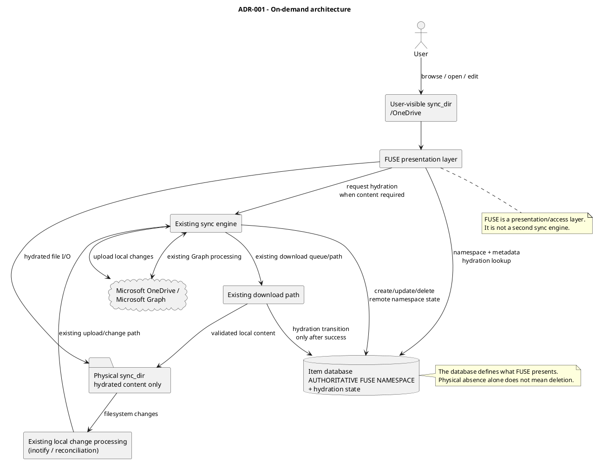
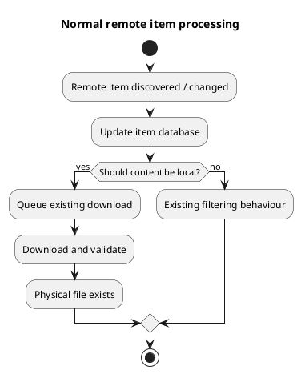
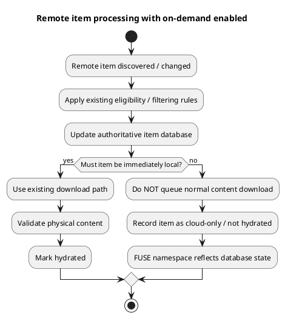
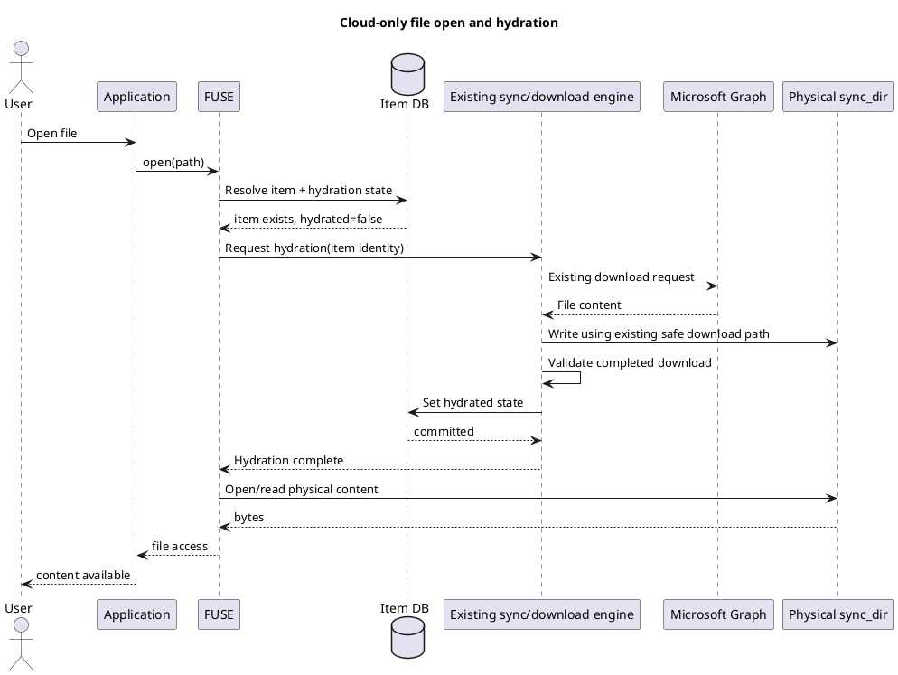
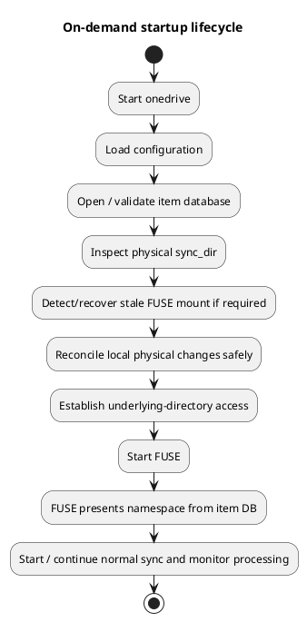

# ADR-001: FUSE Overlay, Authoritative Namespace and Local Storage

**Status:** Proposed\
**Feature:** On-Demand Files\
**Configuration flag:** `on_demand`\
**Scope:** FUSE namespace presentation, database authority, hydration
state, physical storage, existing sync-engine integration, local change
detection, lifecycle and recovery\
**Target:** `implement-on-demand-capability`

> This ADR defines the intended architecture and safety invariants for
> the on-demand filesystem. It deliberately separates the architectural
> direction from mechanisms that still require prototype validation.

------------------------------------------------------------------------

## 1. Context

The existing `onedrive` client maintains an item database containing the
online OneDrive state known to the client and synchronises selected
content into a normal local `sync_dir`, normally:

``` text
~/OneDrive
```

or a path explicitly configured by the user.

On-demand support must allow the complete eligible online namespace to
be visible at `sync_dir` without requiring every remote file to consume
local storage.

The feature must retain the existing synchronisation engine. It must not
introduce a second implementation of remote change processing,
downloading, uploading, conflict handling or local change detection.

The core model is:

> **The item database is the authoritative namespace presented by
> FUSE.**

The database should continue to contain the complete eligible online
state as it does today. On-demand support extends that state with
sufficient information to determine whether file content is currently
hydrated locally.

FUSE then presents the filesystem namespace from database state.

For a hydrated item, the FUSE entry is backed by real physical content
in the existing `sync_dir`.

For a cloud-only item, the FUSE entry exists because the database says
it exists, even though no physical file content is present underneath
the mount.

When `on_demand = "false"`, existing behaviour must remain
unchanged.

------------------------------------------------------------------------

## 2. Decision

When `on_demand = "true"`:

1.  The existing item database remains the complete client-side
    representation of the eligible online OneDrive namespace.
2.  The database gains explicit hydration state for applicable items.
3.  FUSE is mounted over the existing `sync_dir`.
4.  FUSE builds and maintains the visible filesystem namespace from the
    item database.
5.  A database item marked as not hydrated is presented as a cloud-only
    filesystem entry without requiring physical file content.
6.  A hydrated database item is presented at the same namespace location
    and backed by its real file content in the physical `sync_dir`.
7.  The existing remote synchronisation engine continues to enumerate
    and process Microsoft Graph changes.
8.  In on-demand mode, eligible remote files that would normally be
    queued for immediate download are instead recorded in the database
    as cloud-only and are not placed on the normal download queue.
9.  FUSE observes filesystem access. Content access to a cloud-only file
    requests hydration.
10. Hydration uses the existing download machinery.
11. After hydration completes safely, database hydration state is
    updated and FUSE services the file from physical content.
12. Once physical content exists, normal local filesystem change
    detection should continue to use the existing inotify/local-change
    pipeline wherever possible.
13. Normal uploads remain owned by the existing synchronisation engine
    rather than by FUSE.
14. On clean shutdown, FUSE is unmounted and the existing physical files
    in `sync_dir` become directly visible.
15. On restart, local physical changes are reconciled through the
    existing startup/synchronisation logic before the authoritative FUSE
    view is safely re-established.

------------------------------------------------------------------------

## 3. Architecture overview



### Authority boundaries

  -----------------------------------------------------------------------
  Component                           Authority / responsibility
  ----------------------------------- -----------------------------------
  Microsoft OneDrive / Graph          Remote service state and remote
                                      file content

  Existing sync engine                Synchronisation decisions and Graph
                                      interaction

  Item database                       **Authoritative namespace presented
                                      by FUSE**, remote identity/metadata
                                      and hydration state

  Physical `sync_dir`                 Local backing content for hydrated
                                      items

  FUSE                                Namespace presentation and demand
                                      signal for content access

  inotify / existing local            Detection of local changes to
  reconciliation                      physical hydrated content
  -----------------------------------------------------------------------

------------------------------------------------------------------------

## 4. Database as the authoritative FUSE namespace

FUSE must not independently discover its namespace by merging a
filesystem scan with database entries.

The namespace FUSE presents is derived from the database.

Conceptually, if the database contains:

``` text
Documents/
    report.pdf       hydrated=true
    budget.xlsx      hydrated=false

Photos/
    holiday.jpg      hydrated=true
    archive.zip      hydrated=false

Projects/
    plan.docx        hydrated=false
    notes.txt        hydrated=true
```

then FUSE presents:

``` text
~/OneDrive/
├── Documents/
│   ├── report.pdf
│   └── budget.xlsx
├── Photos/
│   ├── holiday.jpg
│   └── archive.zip
└── Projects/
    ├── plan.docx
    └── notes.txt
```

regardless of whether the cloud-only items have physical files.

The physical directory contains only hydrated content:

``` text
~/OneDrive/
├── Documents/
│   └── report.pdf
├── Photos/
│   └── holiday.jpg
└── Projects/
    └── notes.txt
```

When FUSE is unmounted, only those real files are visible through the
operating system. The cloud-only entries remain represented in the
database and remotely in OneDrive.

### Consequence

The physical directory is **not** the source from which FUSE decides
whether a remote namespace item exists.

The database is.

The physical directory answers a different question:

> Does this database item currently have local backing content, and has
> that local content changed?

------------------------------------------------------------------------

## 5. Hydration state

The database schema requires new state indicating whether applicable
file content is hydrated.

The exact schema is a later implementation decision, but the
architecture requires a distinction equivalent to:

``` text
hydrated = false
hydrated = true
```

A boolean may ultimately be sufficient, or implementation work may
demonstrate that a richer state model is required for transient
operations such as hydration in progress, dehydration in progress,
failure or dirty local content.

The architectural requirement is therefore **explicit hydration state**,
not specifically a single boolean column.

### State ownership

Hydration state must not be casually toggled by multiple independent
components.

A transition to hydrated should occur only when valid physical content
has been successfully materialised.

A transition to cloud-only should occur only when removal of local
backing content has been proven safe.

------------------------------------------------------------------------

## 6. Remote synchronisation in on-demand mode

The existing sync engine remains responsible for processing remote
changes.

The important on-demand change occurs where remote content would
normally be queued for download.

### Existing behaviour



### On-demand behaviour



The intent is to make the smallest safe change to the existing
remote-processing pipeline:

> **In on-demand mode, eligible content that does not currently need to
> be local is represented in the database instead of automatically
> entering the download queue.**

This allows the existing Graph enumeration, metadata processing,
filtering, item identity and database logic to remain in use.

------------------------------------------------------------------------

## 7. FUSE namespace updates

FUSE must reflect database namespace changes produced by the sync
engine.

Examples include:

-   new remote item;
-   remote rename;
-   remote move;
-   remote deletion;
-   metadata change;
-   hydration transition;
-   future pin/always-local transition.

The implementation mechanism remains open. Possible approaches include
FUSE resolving current state from the database on demand, explicit
invalidation/notification from the engine, an in-process cache with
invalidation, or a combination.

The architectural requirement is:

> FUSE-visible namespace state must converge on the authoritative item
> database and must not maintain an independent competing namespace.

------------------------------------------------------------------------

## 8. Hydration on user access

FUSE listens for filesystem operations against the namespace.

Operations that only inspect namespace/metadata should not automatically
hydrate content.

When an operation genuinely requires file content and the database says
the item is cloud-only, FUSE requests hydration through the existing
engine/download path.



### Hydration requirements

Hydration must:

-   identify the correct remote item;
-   reuse existing download logic wherever practical;
-   avoid exposing partial content as complete;
-   handle network failure;
-   handle insufficient disk space;
-   handle remote change during hydration;
-   coordinate simultaneous requests for the same item;
-   update hydration state only after safe completion; and
-   return an appropriate filesystem error if hydration cannot complete.

FUSE must not implement a separate Microsoft Graph download stack.

------------------------------------------------------------------------

## 9. Hydrated local edits and the existing inotify path

Once hydrated, a file is real physical content underneath the FUSE
mount.

The intended architecture is that ordinary user modifications continue
through the existing local-change pipeline.

``` plantuml
@startuml
title Hydrated file edit and existing upload path

actor User
participant "Application" as App
participant "FUSE" as Fuse
folder "Physical sync_dir" as Disk
participant "Existing inotify /\nlocal change processing" as Notify
participant "Existing sync engine" as Sync
cloud "Microsoft Graph" as Graph
database "Item DB" as DB

User -> App : Edit hydrated file
App -> Fuse : write / rename / save
Fuse -> Disk : Apply operation to physical content
Disk -> Notify : Filesystem change event
Notify -> Sync : Existing local change processing
Sync -> Graph : Existing upload/update
Graph --> Sync : Remote result
Sync -> DB : Update metadata/state
@enduml
```

This is an important architectural objective:

> **FUSE should not create a special on-demand upload engine. Once
> content is physical, normal local change detection and synchronisation
> should continue to operate through the existing engine wherever
> possible.**

### Prototype requirement: inotify

This behaviour must be experimentally proven.

Mounting FUSE over `sync_dir` changes pathname resolution, and the exact
behaviour of watches and events against the underlying physical
directory must not be assumed.

Stage 2 testing must establish:

-   where the existing inotify watches are attached;
-   whether operations performed through FUSE produce the required
    events on the underlying physical tree;
-   whether the client can distinguish its own hydration writes from
    user changes;
-   whether mount timing affects existing watches; and
-   whether any watch must be established against the underlying
    directory through a different access mechanism.

If existing inotify semantics cannot be preserved safely, the ADR must
be revised before introducing a parallel local-change mechanism.

------------------------------------------------------------------------

## 10. Underlying physical directory access

Mounting FUSE over `sync_dir` means normal path lookup at that path
enters FUSE.

The existing sync engine still needs access to the real backing files
underneath the mount for downloads, uploads, metadata operations and
reconciliation.

### Proposed mechanism to validate

Before mounting FUSE, retain a handle/file descriptor to the physical
`sync_dir` and use directory-relative operations where appropriate, for
example:

``` text
openat()
fstatat()
mkdirat()
unlinkat()
renameat()
```

This remains a **prototype hypothesis**, not a final architectural
commitment.

The prototype must determine:

-   whether retained directory access remains valid after mount;
-   how much current path-based D code would require adaptation;
-   atomic rename/replacement behaviour;
-   symlink and traversal safety;
-   avoidance of recursion back into FUSE;
-   Linux behaviour;
-   FreeBSD behaviour; and
-   whether a simpler mechanism can provide the same safety.

------------------------------------------------------------------------

## 11. Local state versus namespace authority

Saying that the database is authoritative for FUSE does **not** mean the
database may erase contradictory physical evidence.

Example:

1.  `report.pdf` is hydrated.
2.  The client stops.
3.  The user edits the physical `report.pdf`.
4.  The database still contains metadata from before that edit.
5.  The client restarts.

The correct response is not to overwrite the local file merely because
the database is the FUSE namespace authority.

The database determines that `report.pdf` belongs in the namespace.

The physical filesystem provides evidence that its local backing content
changed and requires normal reconciliation.

Therefore:

> **Database authority governs namespace presentation. It does not
> override unsynchronised local content.**

This distinction is central to data preservation.

------------------------------------------------------------------------

## 12. Critical invariant: cloud-only is not deletion

A database-known item with `hydrated=false` is intentionally absent from
the physical filesystem.

Its absence must never be interpreted as a local deletion.

``` text
DB item exists + hydrated=false + no physical file
                         =
                 expected cloud-only state
```

not:

``` text
missing physical file
        =
local deletion request
```

This is a release-blocking safety property.

------------------------------------------------------------------------

## 13. Local deletion of a hydrated item

A user deleting a hydrated file through the FUSE view is different from
dehydration.

### User deletion

The user intends the item itself to be deleted.

The operation must enter the existing local deletion/synchronisation
path and eventually affect the remote item according to existing
behaviour and configuration.

### Dehydration

The user or policy intends only to remove local file content while
retaining the remote item.

The database namespace entry remains.

These two operations must have separate state transitions and must never
be inferred solely from physical-file absence.

------------------------------------------------------------------------

## 14. Dehydration boundary

Dehydration removes physical backing content while preserving the
database item and remote object.

A file must not be dehydrated when it is:

-   locally modified and unsynchronised;
-   being uploaded;
-   being hydrated/downloaded;
-   unsafe to remove while in active use;
-   required by future `always_local` policy; or
-   not proven to have a valid remote copy.

The safe conceptual transition is:

``` text
hydrated database item
        +
valid synced physical content
        |
safety checks
        |
remove physical backing content
        |
commit hydration state = false
        |
FUSE namespace entry remains
```

The exact ordering must be designed to survive a crash between steps.

Manual "free up space", cache limits and automatic expiry are later
policy layers.

Automatic expiry must be disabled by default.

------------------------------------------------------------------------

## 15. `always_local`

The architecture must support a future `sync_list`-style policy
describing content that should always remain hydrated.

Conceptually:

``` text
always_local match
       |
       +-- cloud-only -> request hydration
       |
       +-- hydrated -> retain local content
       |
       +-- automatic dehydration -> prohibited
```

Matching syntax, precedence and interaction with `sync_list` remain
separate design decisions.

------------------------------------------------------------------------

## 16. Startup lifecycle

A proposed high-level startup sequence is:



The exact ordering remains subject to prototype testing, especially
around:

-   first local reconciliation;
-   first remote delta;
-   mount visibility;
-   inotify watch establishment; and
-   stale database state after the client has been stopped.

------------------------------------------------------------------------

## 17. Clean shutdown and crash recovery

### Clean shutdown

The client should:

1.  stop accepting new FUSE operations;
2.  complete or safely cancel in-flight hydration/filesystem work;
3.  stop the FUSE session;
4.  unmount FUSE;
5.  release FUSE resources; and
6.  reveal the original physical `sync_dir`.

Hydrated files remain ordinary accessible files.

Cloud-only items disappear from the filesystem view while FUSE is absent
but remain in the database and online.

### Crash recovery

A crash must not make hydrated data dependent on FUSE.

On restart:

``` text
detect mount state
      |
recover stale/unusable mount safely
      |
inspect physical hydrated content
      |
reconcile local changes
      |
re-establish FUSE
      |
rebuild visible namespace from database
```

Recovery must never require destructive deletion of the physical
`sync_dir`.

------------------------------------------------------------------------

## 18. Remote change behaviour

### New remote file

Existing sync processing creates/updates the database item.

In on-demand mode, if no policy requires immediate local content:

``` text
database item created
hydrated = false
no normal download queued
FUSE presents entry
```

### Remote change to cloud-only file

Update database metadata/state. No content download is required merely
to update the namespace.

### Remote change to hydrated file

Use existing synchronisation logic to determine whether local content
should be updated, including existing conflict behaviour.

### Remote rename/move

Update the authoritative database namespace. FUSE must reflect the new
path. Any physical hydrated backing content must be moved consistently
using safe existing/local mechanisms.

### Remote deletion

Remove/update the authoritative database item according to existing
deletion/conflict rules. FUSE removes the namespace entry.

Remote deletion must never be confused with dehydration.

------------------------------------------------------------------------

## 19. FUSE3 foundation

Recovered groundwork contains D FUSE bindings using FUSE2-style callback
signatures while the project build configuration targets FUSE3.

The bindings must therefore be reconciled with the supported FUSE3 API
before production integration.

This is an appropriate isolated implementation task.

Updating bindings does not itself decide database state, hydration
semantics or engine integration.

------------------------------------------------------------------------

## 20. Architectural invariants

**INV-001 --- Disabled means existing behaviour.**\
`on_demand = "false"` retains current non-FUSE behaviour.

**INV-002 --- Database is the FUSE namespace authority.**\
FUSE presents eligible items because they exist in the item database,
not because placeholder files exist physically.

**INV-003 --- `sync_dir` remains the user-facing path.**\
No second visible OneDrive directory is introduced.

**INV-004 --- Hydrated means real local backing content.**\
Hydrated files remain accessible when FUSE is absent.

**INV-005 --- Cloud-only physical absence is not deletion.**\
`hydrated=false` plus no physical file is an expected state.

**INV-006 --- FUSE is not a sync engine.**\
Graph operations, download/upload policy and conflict processing remain
owned by the existing engine.

**INV-007 --- Hydration uses the existing download path.**\
FUSE requests content; it does not implement an independent Graph
downloader.

**INV-008 --- Hydrated edits use the existing local-change path wherever
possible.**\
FUSE must not introduce a parallel upload engine unless prototype
evidence proves existing change detection cannot be retained.

**INV-009 --- Unsynchronised local data wins over reclamation.**\
No dehydration/cache/expiry mechanism may discard dirty local content.

**INV-010 --- Ambiguity favours preservation.**\
If state cannot be proven safe, preserve physical content.

**INV-011 --- Namespace enumeration must not cause mass hydration.**\
Directory listing and ordinary metadata lookup do not inherently
download file content.

**INV-012 --- User deletion and dehydration are distinct operations.**\
Removing local backing content must not imply deletion of the remote
namespace item.

**INV-013 --- Hydration state changes only after the corresponding
storage transition is safe.**\
Database state must not claim hydrated content exists before valid
content is available, or claim cloud-only state before local removal is
safely complete.

------------------------------------------------------------------------

## 21. Initial implementation stages

### Stage 1 --- FUSE3 foundation

-   update/reconcile FUSE bindings;
-   create the on-demand/FUSE lifecycle object;
-   connect lifecycle to `on_demand`;
-   keep feature disabled by default.

### Stage 2 --- Physical overlay and local-change prototype

Using a disposable directory:

-   mount FUSE over existing physical content;
-   expose real files;
-   test read/write/create/rename/delete;
-   prove content survives unmount;
-   prove safe access to the underlying directory;
-   prove or disprove existing inotify behaviour;
-   test clean and forced termination.

**No Graph hydration required.**

### Stage 3 --- Database-authoritative namespace

-   expose namespace directly from item database;
-   introduce minimum hydration state;
-   present cloud-only entries without physical placeholders;
-   update namespace after DB create/rename/move/delete;
-   prove physical absence of cloud-only items cannot generate local
    deletion.

### Stage 4 --- Sync-engine on-demand decision

-   retain existing remote enumeration and DB update paths;
-   intercept the point where eligible content would normally enter the
    download queue;
-   leave ordinary on-demand items cloud-only;
-   retain immediate download for policy cases that require local
    content.

### Stage 5 --- Hydration on content access

-   request hydration from FUSE;
-   reuse existing download path;
-   coordinate concurrent requests;
-   handle network/disk failures;
-   atomically transition hydration state.

### Stage 6 --- Full mutation semantics

Validate:

-   write/save;
-   create;
-   truncate;
-   rename;
-   move;
-   delete;
-   local edits while client is stopped;
-   remote changes to hydrated items;
-   conflict handling.

### Stage 7 --- Retention policy

After correctness:

-   `always_local`;
-   manual free-up-space;
-   optional cache limit;
-   optional expiry-based dehydration.

### Stage 8 --- Desktop integration

Only after filesystem correctness:

-   status representation;
-   thumbnails;
-   file-manager-specific behaviour;
-   additional usability integration.

------------------------------------------------------------------------

## 22. Validation strategy

This feature has a high data-loss impact if state transitions are wrong.
Testing must therefore include both normal E2E behaviour and deliberate
fault injection.

### Prototype tests

Before Graph integration, prove:

-   overlay mount/unmount;
-   underlying directory access;
-   physical persistence;
-   inotify behaviour;
-   FUSE3 callback behaviour;
-   stale mount recovery.

### Database/FUSE tests

Prove:

-   DB item appears in FUSE;
-   DB rename/move updates FUSE;
-   DB deletion removes FUSE entry;
-   `hydrated=false` requires no physical placeholder;
-   cloud-only absence is never treated as deletion;
-   enumeration does not hydrate.

### Hydration tests

Prove:

-   first content access hydrates;
-   multiple concurrent opens do not produce duplicate/corrupt
    downloads;
-   failed hydration leaves cloud-only state safe;
-   disk-full leaves state safe;
-   process termination during hydration is recoverable;
-   completed hydration results in valid physical content and correct DB
    state.

### Local edit tests

Prove:

-   save through FUSE reaches physical content;
-   expected inotify/local-change event occurs;
-   existing upload path processes the change;
-   client restart detects edits made while FUSE/client was absent.

### Account coverage

At minimum:

-   OneDrive Personal;
-   OneDrive Business;
-   SharePoint where applicable;
-   shared folders where applicable.

------------------------------------------------------------------------

## 23. Open decisions

1.  What exact DB schema represents hydration state safely?
2.  Is a boolean sufficient at rest, with transient state held
    elsewhere, or is a richer persisted state required?
3.  How should FUSE observe/receive DB namespace changes?
4.  Is retained-directory access plus `*at()` the correct
    underlying-filesystem mechanism?
5.  Does existing inotify behave correctly when writes are routed
    through FUSE to the hidden physical tree?
6.  At what point in startup should inotify and FUSE be established?
7.  How are concurrent hydration requests serialised?
8.  What is the crash-safe ordering for hydration-state commits?
9.  What is the crash-safe ordering for dehydration?
10. Which existing configuration combinations are initially unsupported?
11. What Linux/FreeBSD differences require abstraction?
12. Which file-manager probes should count as true content demand?
13. How should thumbnail generation work without mass hydration?
14. How should `always_local` interact with `sync_list` and exclusions?

These are deliberate design/prototype questions.

------------------------------------------------------------------------

## 24. Contributor guidance

The purpose of this ADR is to give contributors a concrete architectural
target without prematurely dictating mechanisms that have not been
proven.

A proposed change should identify:

-   which implementation stage it addresses;
-   which invariants it preserves;
-   any invariant it believes should change;
-   prototype/test evidence;
-   intentionally unsupported behaviour; and
-   any architectural assumption disproven by implementation.

If experimental work demonstrates that an assumption in this ADR is
wrong, the correct outcome is to update the ADR and design consciously
rather than hide the contradiction in implementation code.

------------------------------------------------------------------------

## 25. Decision summary

The architecture is:

``` text
Microsoft Graph
      |
      v
existing sync engine
      |
      v
ITEM DATABASE
authoritative FUSE namespace
+ hydration state
      |
      v
FUSE presentation at sync_dir
      |
      +---- cloud-only item -> namespace/metadata only
      |
      +---- hydrated item --> physical backing content
                                  |
                                  v
                          existing local change
                          detection / inotify
                                  |
                                  v
                          existing sync engine
                                  |
                                  v
                           Microsoft Graph
```

The key implementation principle is:

> **Do not replace working synchronisation paths. Change when content is
> materialised.**

Remote enumeration and database maintenance continue through the
existing engine.

In on-demand mode, ordinary eligible remote items stop at the
authoritative database instead of automatically entering the download
queue.

FUSE presents those database items.

When the user actually requires cloud-only content, FUSE requests
hydration through the existing download machinery.

Once hydrated, the file becomes normal physical content and should
return to the existing local-change/inotify/upload path.

This preserves the existing engine as the centre of synchronisation
while adding on-demand storage as a controlled change in **when file
content exists locally**.
