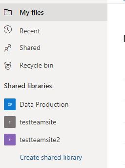

# How to configure OneDrive SharePoint Shared Library sync
Syncing a OneDrive SharePoint library requires additional configuration for your 'onedrive' client:
1.  Login to OneDrive and under 'Shared Libraries' obtain the shared library name
2.  Query that shared library name using the client to obtain the required configuration details
3.  Create a unique local folder which will be the SharePoint Library 'root'
4.  Configure the client's config file with the required 'drive_id'
5.  Test the configuration using '--dry-run'
6.  Sync the SharePoint Library as required

**Note:** The `--get-O365-drive-id` process below requires a fully configured 'onedrive' configuration so that the applicable Drive ID for the given Office 365 SharePoint Shared Library can be determined. It is highly recommended that you do not use the application 'default' configuration directory for any SharePoint Site, and configure separate items for each site you wish to use.

## 1. Listing available OneDrive SharePoint Libraries
Login to the OneDrive web interface and determine which shared library you wish to configure the client for:


## 2. Query OneDrive API to obtain required configuration details
Run the following command using the 'onedrive' client to query the OneDrive API to obtain the required 'drive_id' of the SharePoint Library that you wish to sync:
```text
onedrive --get-O365-drive-id '<your site name to search>'
```
This will return something similar to the following:
```text
Configuration file successfully loaded
Configuring Global Azure AD Endpoints
Initializing the Synchronization Engine ...
Office 365 Library Name Query: <your site name to search>
-----------------------------------------------
Site Name:    <your site name>
Library Name: <your library name>
drive_id:     b!6H_y8B...xU5
Library URL:  <your library URL>
-----------------------------------------------
```
If there are no matches to the site you are attempting to search, the following will be displayed:
```text
Configuration file successfully loaded
Configuring Global Azure AD Endpoints
Initializing the Synchronization Engine ...
Office 365 Library Name Query: blah

ERROR: The requested SharePoint site could not be found. Please check it's name and your permissions to access the site.

The following SharePoint site names were returned:
 * <site name 1>
 * <site name 2>
 ...
 * <site name X>
```
This list of site names can be used as a basis to search for the correct site for which you are searching

## 3. Create a new configuration directory and sync location for this SharePoint Library
Create a new configuration directory for this SharePoint Library in the following manner:
```text
mkdir ~/.config/SharePoint_My_Library_Name
```

Create a new local folder to store the SharePoint Library data in:
```text
mkdir ~/SharePoint_My_Library_Name
```

**Note:** Do not use spaces in the directory name, use '_' as a replacement

## 4. Configure SharePoint Library config file with the required 'drive_id' & 'sync_dir' options
Download a copy of the default configuration file by downloading this file from GitHub and saving this file in the directory created above:
```text
wget https://raw.githubusercontent.com/abraunegg/onedrive/master/config -O ~/.config/SharePoint_My_Library_Name/config
```

Update your 'onedrive' configuration file (`~/.config/SharePoint_My_Library_Name/config`) with the local folder where you will store your data:
```text
sync_dir = "~/SharePoint_My_Library_Name"
```

Update your 'onedrive' configuration file(`~/.config/SharePoint_My_Library_Name/config`) with the 'drive_id' value obtained in the steps above:
```text
drive_id = "insert the drive_id value from above here"
```
The OneDrive client will now be configured to sync this SharePoint shared library to your local system and the location you have configured.

**Note:** After changing `drive_id`, you must perform a full re-synchronization by adding `--resync` to your existing command line.

## 5. Validate and Test the configuration
Validate your new configuration using the `--display-config` option to validate you have configured the application correctly:
```text
onedrive --confdir="~/.config/SharePoint_My_Library_Name" --display-config
```

Test your new configuration using the `--dry-run` option to validate the application configuration:
```text
onedrive --confdir="~/.config/SharePoint_My_Library_Name" --synchronize --verbose --dry-run
```

**Note:** As this is a *new* configuration, the application will be required to be re-authorised the first time this command is run with the new configuration.

## 6. Sync the SharePoint Library as required
Sync the SharePoint Library to your system with either `--synchronize` or `--monitor` operations:
```text
onedrive --confdir="~/.config/SharePoint_My_Library_Name" --synchronize --verbose
```

```text
onedrive --confdir="~/.config/SharePoint_My_Library_Name" --monitor --verbose
```

**Note:** As this is a *new* configuration, the application will be required to be re-authorised the first time this command is run with the new configuration.

## 7. Enable custom systemd service for SharePoint Library
Systemd can be used to automatically run this configuration in the background, however, a unique systemd service will need to be setup for this SharePoint Library instance

In order to automatically start syncing each SharePoint Library, you will need to create a service file for each SharePoint Library. From the applicable 'systemd folder' where the applicable systemd service file exists:
*   RHEL / CentOS: `/usr/lib/systemd/system`
*   Others: `/usr/lib/systemd/user` and `/lib/systemd/system`

### Step1: Create a new systemd service file
#### Red Hat Enterprise Linux, CentOS Linux
Copy the required service file to a new name:
```text
sudo cp /usr/lib/systemd/system/onedrive.service /usr/lib/systemd/system/onedrive-SharePoint_My_Library_Name.service
```
or 
```text
sudo cp /usr/lib/systemd/system/onedrive@.service /usr/lib/systemd/system/onedrive-SharePoint_My_Library_Name@.service
```

#### Others such as Arch, Ubuntu, Debian, OpenSuSE, Fedora
Copy the required service file to a new name:
```text
sudo cp /usr/lib/systemd/user/onedrive.service /usr/lib/systemd/user/onedrive-SharePoint_My_Library_Name.service
```
or 
```text
sudo cp /lib/systemd/system/onedrive@.service /lib/systemd/system/onedrive-SharePoint_My_Library_Name@.service
```

### Step 2: Edit new systemd service file
Edit the new systemd file, updating the line beginning with `ExecStart` so that the confdir mirrors the one you used above:
```text
ExecStart=/usr/local/bin/onedrive --monitor --confdir="/full/path/to/config/dir"
```

Example:
```text
ExecStart=/usr/local/bin/onedrive --monitor --confdir="/home/myusername/.config/my-new-config"
```

**Note:** When running the client manually, `--confdir="~/.config/......` is acceptable. In a systemd configuration file, the full path must be used. The `~` must be expanded.

### Step 3: Enable the new systemd service
Once the file is correctly editied, you can enable the new systemd service using the following commands.

#### Red Hat Enterprise Linux, CentOS Linux
```text
systemctl enable onedrive-SharePoint_My_Library_Name
systemctl start onedrive-SharePoint_My_Library_Name
```

#### Others such as Arch, Ubuntu, Debian, OpenSuSE, Fedora
```text
systemctl --user enable onedrive-SharePoint_My_Library_Name
systemctl --user start onedrive-SharePoint_My_Library_Name
```
or
```text
systemctl --user enable onedrive-SharePoint_My_Library_Name@myusername.service
systemctl --user start onedrive-SharePoint_My_Library_Name@myusername.service
```

### Step 4: Viewing systemd status and logs for the custom service
#### Viewing systemd service status - Red Hat Enterprise Linux, CentOS Linux
```text
systemctl status onedrive-SharePoint_My_Library_Name
```

#### Viewing systemd service status - Others such as Arch, Ubuntu, Debian, OpenSuSE, Fedora
```text
systemctl --user status onedrive-SharePoint_My_Library_Name
```

#### Viewing journalctl systemd logs - Red Hat Enterprise Linux, CentOS Linux
```text
journalctl --unit=onedrive-SharePoint_My_Library_Name -f
```

#### Viewing journalctl systemd logs - Others such as Arch, Ubuntu, Debian, OpenSuSE, Fedora
```text
journalctl --user --unit=onedrive-SharePoint_My_Library_Name -f
```

### Step 5: (Optional) Run custom systemd service at boot without login
In some cases it may be desirable for the systemd service to start without having to login as your 'user'

All the systemd steps above that utilise the `--user` option, will run the systemd service as your particular user. As such, the systemd service will not start unless you actually login to your system.

To avoid this issue, you need to reconfigure your 'user' account so that the systemd services you have created will startup without you having to login to your system:
```text
loginctl enable-linger <your_user_name>
```

Example:
```text
alex@ubuntu-headless:~$ loginctl enable-linger alex
```

## 8. Configuration for a SharePoint Library is complete
The 'onedrive' client configuration for this particular SharePoint Library is now complete.

# How to configure multiple OneDrive SharePoint Shared Library sync
Create a new configuration as per the process above. Repeat these steps for each SharePoint Library that you wish to use.
