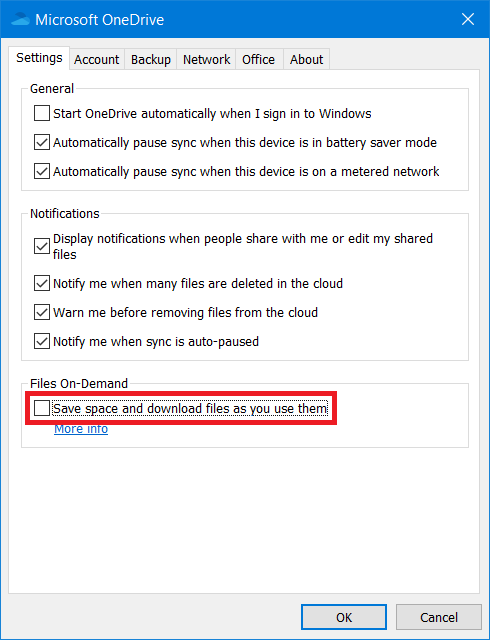
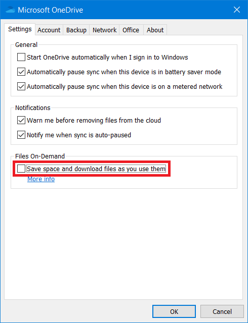

# Advanced Configuration of the OneDrive Free Client
This document covers the following scenarios:
*   [Configuring the client to use multiple OneDrive accounts / configurations](#configuring-the-client-to-use-multiple-onedrive-accounts--configurations)
*   [Configuring the client to use multiple OneDrive accounts / configurations using Docker](#configuring-the-client-to-use-multiple-onedrive-accounts--configurations-using-docker)
*   [Configuring the client for use in dual-boot (Windows / Linux) situations](#configuring-the-client-for-use-in-dual-boot-windows--linux-situations)
*   [Configuring the client for use when 'sync_dir' is a mounted directory](#configuring-the-client-for-use-when-sync_dir-is-a-mounted-directory)
*   [Upload data from the local ~/OneDrive folder to a specific location on OneDrive](#upload-data-from-the-local-onedrive-folder-to-a-specific-location-on-onedrive)

## Configuring the client to use multiple OneDrive accounts / configurations
Essentially, each OneDrive account or SharePoint Shared Library which you require to be synced needs to have its own and unique configuration, local sync directory and service files. To do this, the following steps are needed:
1.  Create a unique configuration folder for each onedrive client configuration that you need
2.  Copy to this folder a copy of the default configuration file
3.  Update the default configuration file as required, changing the required minimum config options and any additional options as needed to support your multi-account configuration
4.  Authenticate the client using the new configuration directory
5.  Test the configuration using '--display-config' and '--dry-run'
6.  Sync the OneDrive account data as required using `--synchronize` or `--monitor`
7.  Configure a unique systemd service file for this account configuration

### 1. Create a unique configuration folder for each onedrive client configuration that you need
Make the configuration folder as required for this new configuration, for example:
```text
mkdir ~/.config/my-new-config
```

### 2. Copy to this folder a copy of the default configuration file
Copy to this folder a copy of the default configuration file by downloading this file from GitHub and saving this file in the directory created above:
```text
wget https://raw.githubusercontent.com/abraunegg/onedrive/master/config -O ~/.config/my-new-config/config
```

### 3. Update the default configuration file
The following config options *must* be updated to ensure that individual account data is not cross populated with other OneDrive accounts or other configurations:
* sync_dir

Other options that may require to be updated, depending on the OneDrive account that is being configured:
*   drive_id
*   application_id
*   sync_business_shared_folders
*   skip_dir
*   skip_file
*   Creation of a 'sync_list' file if required
*   Creation of a 'business_shared_folders' file if required

### 4. Authenticate the client
Authenticate the client using the specific configuration file:
```text
onedrive --confdir="~/.config/my-new-config"
```
You will be asked to open a specific URL by using your web browser where you will have to login into your Microsoft Account and give the application the permission to access your files. After giving permission to the application, you will be redirected to a blank page. Copy the URI of the blank page into the application.
```text
[user@hostname ~]$ onedrive --confdir="~/.config/my-new-config"
Configuration file successfully loaded
Configuring Global Azure AD Endpoints
Authorize this app visiting:

https://.....

Enter the response uri: 

```

### 5. Display and Test the configuration
Test the configuration using '--display-config' and '--dry-run'. By doing so, this allows you to test any configuration that you have currently made, enabling you to fix this configuration before using the configuration.

#### Display the configuration
```text
onedrive --confdir="~/.config/my-new-config" --display-config
```

#### Test the configuration by performing a dry-run
```text
onedrive --confdir="~/.config/my-new-config" --synchronize --verbose --dry-run
```

If both of these operate as per your expectation, the configuration of this client setup is complete and validated. If not, amend your configuration as required.

### 6. Sync the OneDrive account data as required
Sync the data for the new account configuration as required:
```text
onedrive --confdir="~/.config/my-new-config" --synchronize --verbose
```
or 
```text
onedrive --confdir="~/.config/my-new-config" --monitor --verbose
```

*   `--synchronize` does a one-time sync
*   `--monitor` keeps the application running and monitoring for changes both local and remote

### 7. Automatic syncing of new OneDrive configuration
In order to automatically start syncing your OneDrive accounts, you will need to create a service file for each account. From the applicable 'systemd folder' where the applicable systemd service file exists:
*   RHEL / CentOS: `/usr/lib/systemd/system`
*   Others: `/usr/lib/systemd/user` and `/lib/systemd/system`

**Note:** The `onedrive.service` runs the service as the 'root' user, whereas the `onedrive@.service` runs the service as your user account.

Copy the required service file to a new name:
```text
cp onedrive.service onedrive-my-new-config.service
```
or 
```text
cp onedrive@.service onedrive-my-new-config@.service
```

Edit the line beginning with `ExecStart` so that the confdir mirrors the one you used above:
```text
ExecStart=/usr/local/bin/onedrive --monitor --confdir="/full/path/to/config/dir"
```

Example:
```text
ExecStart=/usr/local/bin/onedrive --monitor --confdir="/home/myusername/.config/my-new-config"
```

Then you can safely run these commands:
#### Custom systemd service on Red Hat Enterprise Linux, CentOS Linux
```text
systemctl enable onedrive-my-new-config
systemctl start onedrive-my-new-config
```

#### Custom systemd service on Arch, Ubuntu, Debian, OpenSuSE, Fedora
```text
systemctl --user enable onedrive-my-new-config
systemctl --user start onedrive-my-new-config
```
or
```text
systemctl --user enable onedrive-my-new-config@myusername.service
systemctl --user start onedrive-my-new-config@myusername.service
```

#### Viewing systemd logs for the custom service
```text
journalctl --unit=onedrive-my-new-config -f
```

Repeat these steps for each OneDrive new account that you wish to use.

## Configuring the client to use multiple OneDrive accounts / configurations using Docker
In some situations it may be desirable to run multiple Docker containers at the same time, each with their own configuration.

To run the Docker container successfully, it needs two unique Docker volumes to operate:
*   Your configuration Docker volumes
*   Your data Docker volume

When running multiple Docker containers, this is no different - each Docker container must have it's own configuration and data volume.

### High level steps:
1.   Create the required unique Docker volumes for the configuration volume
2.   Create the required unique local path used for the Docker data volume
3.   Start the multiple Docker containers with the required configuration for each container

#### Create the required unique Docker volumes for the configuration volume
Create the required unique Docker volumes for the configuration volume(s):
```text
docker volume create onedrive_conf_sharepoint_site1
docker volume create onedrive_conf_sharepoint_site2
docker volume create onedrive_conf_sharepoint_site3
...
docker volume create onedrive_conf_sharepoint_site50
```

#### Create the required unique local path used for the Docker data volume
Create the required unique local path used for the Docker data volume
```text
mkdir -p /use/full/local/path/no/tilda/SharePointSite1
mkdir -p /use/full/local/path/no/tilda/SharePointSite2
mkdir -p /use/full/local/path/no/tilda/SharePointSite3
...
mkdir -p /use/full/local/path/no/tilda/SharePointSite50
```

#### Start the Docker container with the required configuration (example)
```text
docker run -it --name onedrive -v onedrive_conf_sharepoint_site1:/onedrive/conf -v "/use/full/local/path/no/tilda/SharePointSite1:/onedrive/data" driveone/onedrive:latest
docker run -it --name onedrive -v onedrive_conf_sharepoint_site2:/onedrive/conf -v "/use/full/local/path/no/tilda/SharePointSite2:/onedrive/data" driveone/onedrive:latest
docker run -it --name onedrive -v onedrive_conf_sharepoint_site3:/onedrive/conf -v "/use/full/local/path/no/tilda/SharePointSite3:/onedrive/data" driveone/onedrive:latest
...
docker run -it --name onedrive -v onedrive_conf_sharepoint_site50:/onedrive/conf -v "/use/full/local/path/no/tilda/SharePointSite50:/onedrive/data" driveone/onedrive:latest
```

#### TIP
To avoid 're-authenticating' and 'authorising' each individual Docker container, if all the Docker containers are using the 'same' OneDrive credentials, you can re-use the 'refresh_token' from one Docker container to another by copying this file to the configuration Docker volume of each Docker container.

If the account credentials are different .. you will need to re-authenticate each Docker container individually.

## Configuring the client for use in dual-boot (Windows / Linux) situations
When dual booting Windows and Linux, depending on the Windows OneDrive account configuration, the 'Files On-Demand' option may be enabled when running OneDrive within your Windows environment.

When this option is enabled in Windows, if you are sharing this location between your Windows  and Linux systems, all files will be a 0 byte link, and cannot be used under Linux.

To fix the problem of windows turning all files (that should be kept offline) into links, you have to uncheck a specific option in the onedrive settings window. The option in question is `Save space and download files as you use them`.

To find this setting, open the onedrive pop-up window from the taskbar, click "Help & Settings" > "Settings". This opens a new window. Go to the tab "Settings" and look for the section "Files On-Demand".

After unchecking the option and clicking "OK", the Windows OneDrive client should restart itself and start actually downloading your files so they will truely be available on your disk when offline. These files will then be fully accessible under Linux and the Linux OneDrive client.

| OneDrive Personal | Onedrive Business<br>SharePoint |
|---|---|
|  |  |

## Configuring the client for use when 'sync_dir' is a mounted directory
In some environments, your setup might be that your configured 'sync_dir' is pointing to another mounted file system - a NFS|CIFS location, an external drive (USB stuc, eSATA etc). As such, you configure your 'sync_dir' as follows:
```text
sync_dir = "/path/to/mountpoint/OneDrive" 
```

The issue here is - how does the client react if the mount point gets removed - network loss, device removal?

The client has zero knowledge of any event that causes a mountpoint to become unavailable, thus, the client (if you are running as a service) will assume that you deleted the files, thus, will go ahead and delete all your files on OneDrive. This is most certainly an undesirable action.

There are a few options here which you can configure in your 'config' file to assist you to prevent this sort of item from occuring:
1. classify_as_big_delete
2. check_nomount
3. check_nosync

**Note:** Before making any change to your configuration, stop any sync process & stop any onedrive systemd service from running.

### classify_as_big_delete
By default, this uses a value of 1000 files|folders. An undesirable unmount if you have more than 1000 files, this default level will prevent the client from executing the online delete. Modify this value up or down as desired

### check_nomount & check_nosync
These two options are really the right safe guards to use.

In your 'mount point', *before* you mount your external folder|device, create empty `.nosync` file, so that this is the *only* file present in the mount location before you mount your data to your mount point. When you mount your data, this '.nosync' file will not be visible, but, if the device you are mounting goes away - this '.nosync' file is the only file visible.

Next, in your 'config' file, configure the following options: `check_nomount = "true"` and `check_nosync = "true"`

What this will do is tell the client, if at *any* point you see this file - stop syncing - thus, protecting your online data from being deleted by the mounted device being suddenly unavailable.

After making this sort of change - test with `--dry-run` so you can see the impacts of your mount point being unavailable, and how the client is now reacting. Once you are happy with how the system will react, restart your sync processes.


## Upload data from the local ~/OneDrive folder to a specific location on OneDrive
In some environments, you may not want your local ~/OneDrive folder to be uploaded directly to the root of your OneDrive account online.

Unfortunatly, the OneDrive API lacks any facility to perform a re-direction of data during upload.

The workaround for this is to structure your local filesystem and reconfigure your client to achieve the desired goal.

### High level steps:
1.   Create a new folder, for example `/opt/OneDrive`
2.   Configure your application config 'sync_dir' to look at this folder
3.   Inside `/opt/OneDrive` create the folder you wish to sync the data online to, for example: `/opt/OneDrive/RemoteOnlineDestination`
4.   Configure the application to only sync `/opt/OneDrive/RemoteDestination` via 'sync_list'
5.   Symbolically link `~/OneDrive` -> `/opt/OneDrive/RemoteOnlineDestination`

### Outcome:
*   Your `~/OneDrive` will look / feel as per normal
*   The data will be stored online under `/RemoteOnlineDestination`

### Testing:
*   Validate your configuration with `onedrive --display-config`
*   Test your configuration with `onedrive --dry-run`
