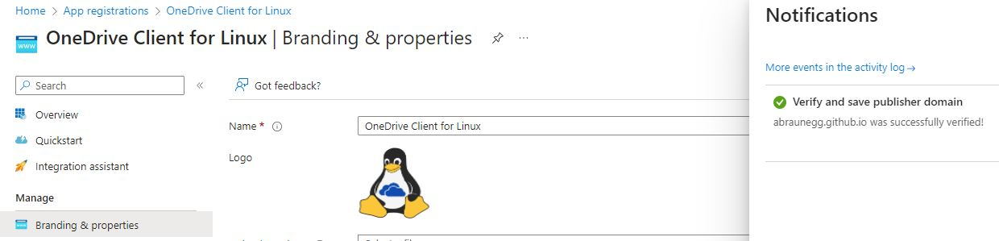
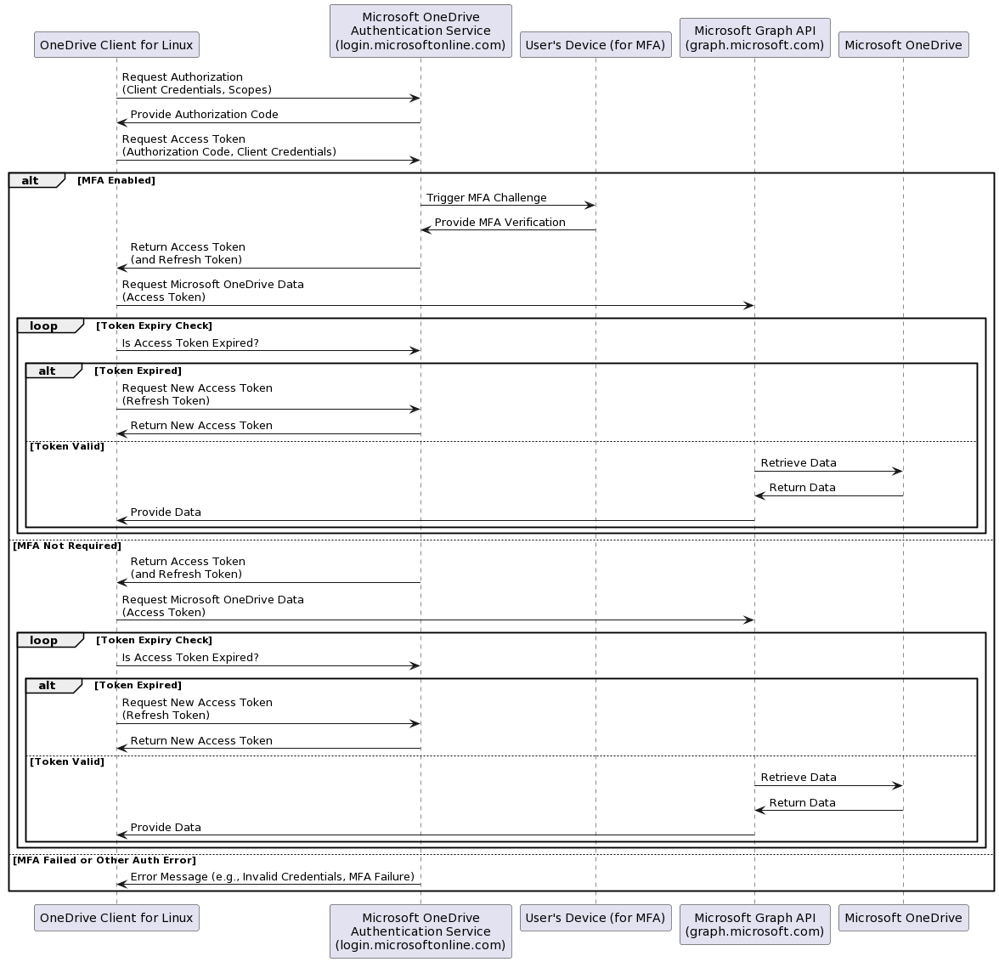
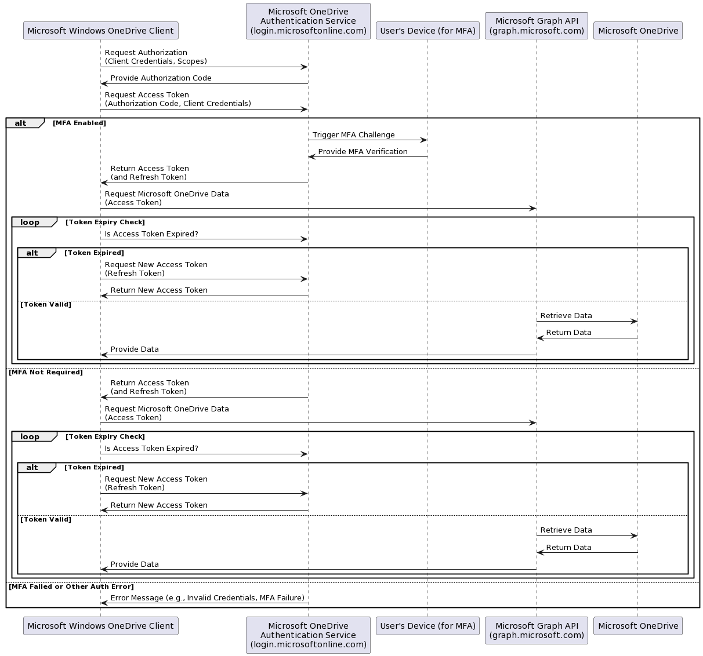

# OneDrive Client for Linux Application Security
This document details the following information:

* Why is this application an 'unverified publisher'?
* Application Security and Permission Scopes
* How to change Permission Scopes
* How to review your existing application access consent

## Why is this application an 'unverified publisher'?
Publisher Verification, as per the Microsoft [process](https://learn.microsoft.com/en-us/azure/active-directory/develop/publisher-verification-overview) has actually been configured, and, actually has been verified!

### Verified Publisher Configuration Evidence
As per the image below, the Azure portal shows that the 'Publisher Domain' has actually been verified:


* The 'Publisher Domain' is: https://abraunegg.github.io/
* The required 'Microsoft Identity Association' is: https://abraunegg.github.io/.well-known/microsoft-identity-association.json

## Application Security and Permission Scopes
There are 2 main components regarding security for this application:
* Azure Application Permissions
* User Authentication Permissions

Keeping this in mind, security options should follow the security principal of 'least privilege':
> The principle that a security architecture should be designed so that each entity 
> is granted the minimum system resources and authorizations that the entity needs 
> to perform its function.

Reference: [https://csrc.nist.gov/glossary/term/least_privilege](https://csrc.nist.gov/glossary/term/least_privilege)

As such, the following API permissions are used by default:

### Default Azure Application Permissions

| API / Permissions name | Type | Description | Admin consent required |
|---|---|---|---|
| Files.Read | Delegated | Have read-only access to user files | No |
| Files.Read.All  | Delegated | Have read-only access to all files user can access | No |
| Sites.Read.All   | Delegated | Have read-only access to all items in all site collections | No |
| offline_access   | Delegated | Maintain access to data you have given it access to | No |


### Default User Authentication Permissions

When a user authenticates with Microsoft OneDrive, additional account permissions are provided by service to give the user specific access to their data. These are delegated permissions provided by the platform:

| API / Permissions name | Type | Description | Admin consent required |
|---|---|---|---|
| Files.ReadWrite | Delegated | Have full access to user files | No |
| Files.ReadWrite.All  | Delegated | Have full access to all files user can access | No |
| Sites.ReadWrite.All   | Delegated | Have full access to all items in all site collections | No |
| offline_access   | Delegated | Maintain access to data you have given it access to | No |

When these delegated API permissions are combined, these provide the effective authentication scope for the OneDrive Client for Linux to access your data. The resulting effective 'default' permissions will be:

| API / Permissions name | Type | Description | Admin consent required |
|---|---|---|---|
| Files.ReadWrite | Delegated | Have full access to user files | No |
| Files.ReadWrite.All  | Delegated | Have full access to all files user can access | No |
| Sites.ReadWrite.All   | Delegated | Have full access to all items in all site collections | No |
| offline_access   | Delegated | Maintain access to data you have given it access to | No |

These 'default' permissions will allow the OneDrive Client for Linux to read, write and delete data associated with your OneDrive Account.

## How are the Authentication Scopes used?

When using the OneDrive Client for Linux, the above authentication scopes will be presented to the Microsoft Authentication Service (login.microsoftonline.com), where the service will validate the request and provide an applicable token to access Microsoft OneDrive with. This can be illustrated as the following:



This is similar to the Microsoft Windows OneDrive Client:



In a business environment, where IT Staff need to 'approve' the OneDrive Client for Linux, can do so knowing that the client is safe to use. The only concernt that the IT Staff should have is how is the client device, where the OneDrive Client for Linux is running, is being secured, as in a corporate setting, Windows would be controlled by Active Directory and applicable Group Policy Objects (GPO's) to ensure the security of corporate data on the client device. It is out of scope for this client to handle how Linux devices are being secure.

## Configuring read-only access to your OneDrive data
In some situations, it may be desirable to configure the OneDrive Client for Linux totally in read-only operation.

To change the application to 'read-only' access, add the following to your configuration file:
```text
read_only_auth_scope = "true"
```
This will change the user authentication scope request to use read-only access.

**Note:** When changing this value, you *must* re-authenticate the client using the `--reauth` option to utilise the change in authentication scopes.

When using read-only authentication scopes, the uploading of any data or local change to OneDrive will fail with the following error:
```
2022-Aug-06 13:16:45.3349625    ERROR: Microsoft OneDrive API returned an error with the following message:
2022-Aug-06 13:16:45.3351661      Error Message:    HTTP request returned status code 403 (Forbidden)
2022-Aug-06 13:16:45.3352467      Error Reason:     Access denied
2022-Aug-06 13:16:45.3352838      Error Timestamp:  2022-06-12T13:16:45
2022-Aug-06 13:16:45.3353171      API Request ID:   <redacted>
```

As such, it is also advisable for you to add the following to your configuration file so that 'uploads' are prevented:
```text
download_only = "true"
```

**Important:** Additionally when using 'read_only_auth_scope' you also will need to remove your existing application access consent otherwise old authentication consent will be valid and will be used. This will mean the application will technically have the consent to upload data. See below on how to remove your prior application consent.
 
## Reviewing your existing application access consent

To review your existing application access consent, you need to access the following URL: https://account.live.com/consent/Manage

From here, you are able to review what applications have been given what access to your data, and remove application access as required.
