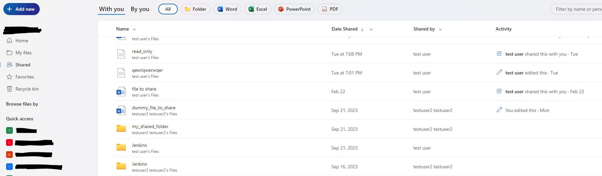
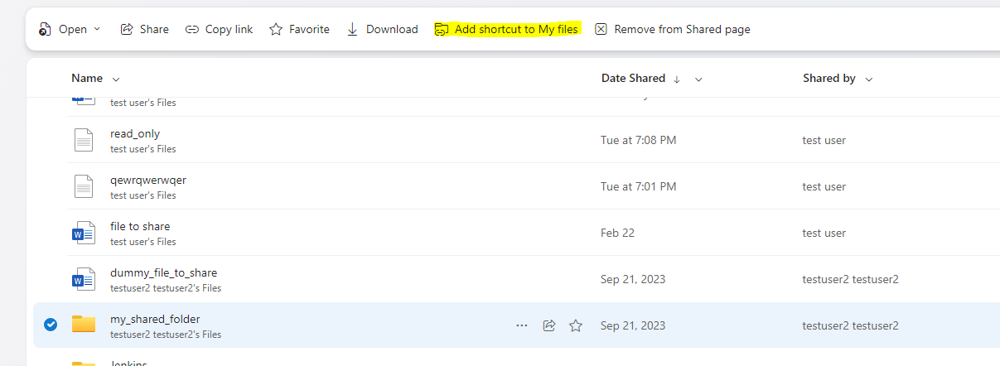
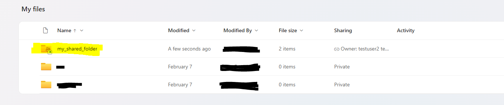
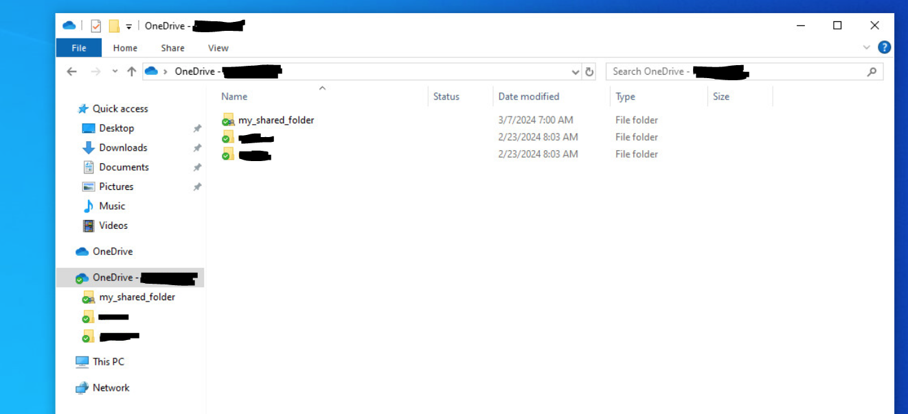
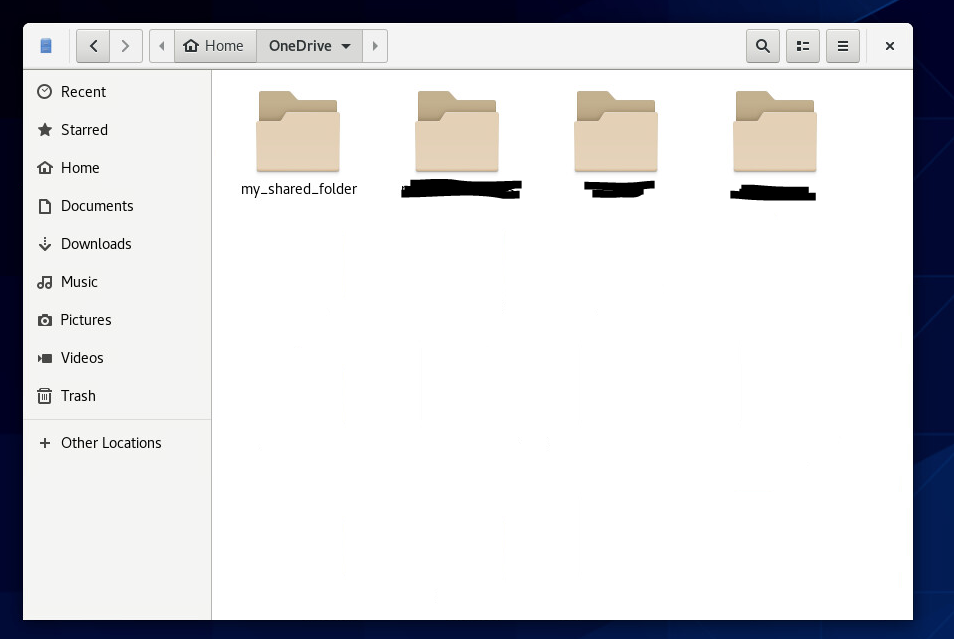
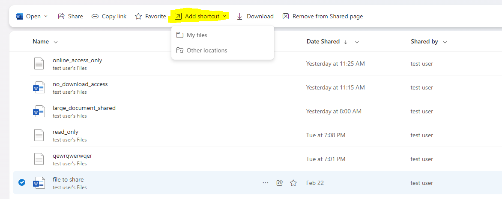
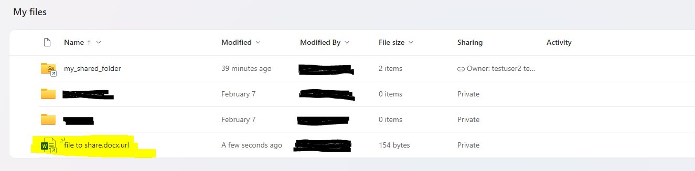
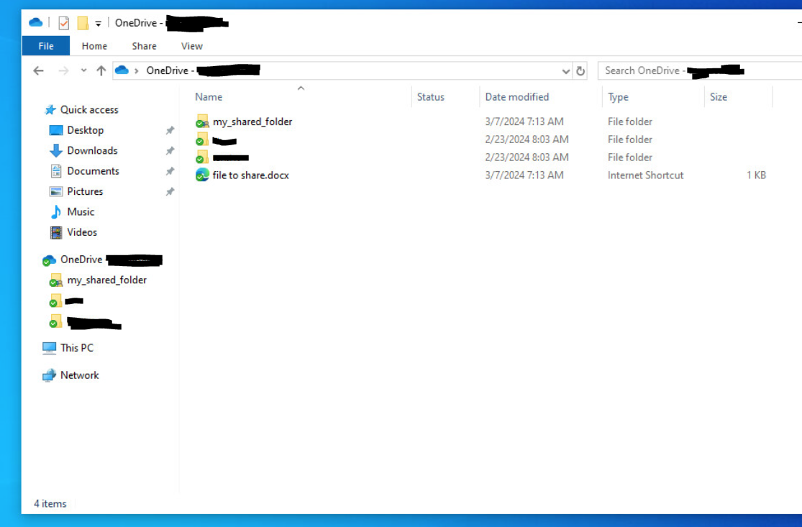
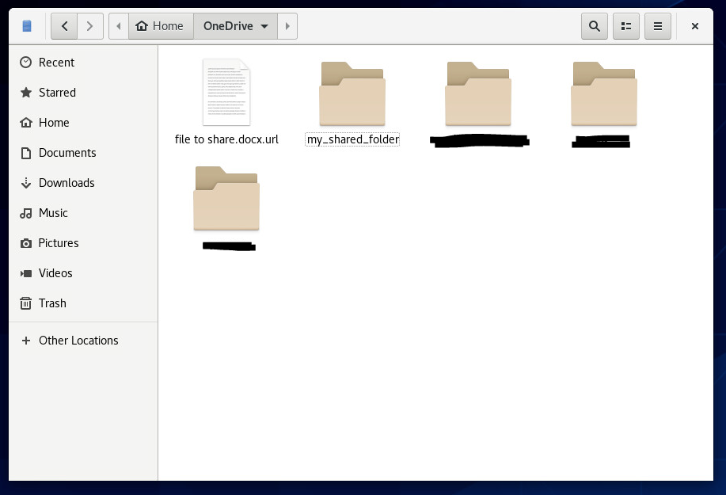
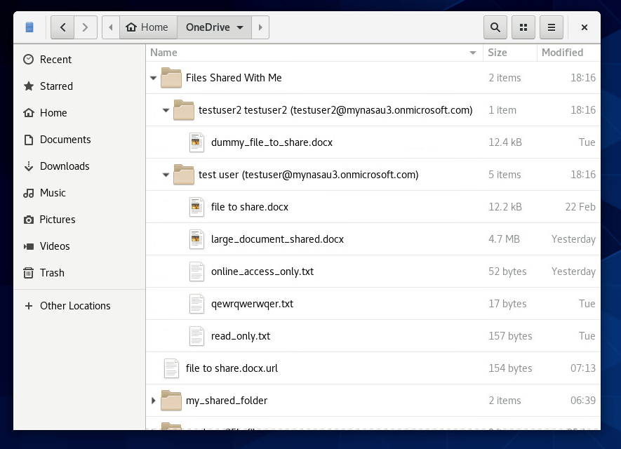

# How to sync OneDrive Business Shared Items

> [!CAUTION]
> Before reading this document, please ensure you are running application version [](https://github.com/abraunegg/onedrive/releases) or greater. Use `onedrive --version` to determine what application version you are using and upgrade your client if required.

> [!CAUTION]
> This feature has been 100% re-written from v2.5.0 onwards and is not backwards compatible with v2.4.x client versions. If enabling this feature, you must upgrade to v2.5.0 or above on all systems that are running this client.
> 
> An additional pre-requisite before using this capability in v2.5.0 and above is for you to revert any v2.4.x Shared Business Folder configuration you may be currently using, including, but not limited to:
> * Removing `sync_business_shared_folders = "true|false"` from your 'config' file
> * Removing the 'business_shared_folders' file 
> * Removing any local data | shared folder data from your configured 'sync_dir' to ensure that there are no conflicts or issues.
> * Removing any configuration online that might be related to using this feature prior to v2.5.0

## Process Overview
Syncing OneDrive Business Shared Folders requires additional configuration for your 'onedrive' client:
1.  From the OneDrive web interface, review the 'Shared' objects that have been shared with you.
2.  Select the applicable folder, and click the 'Add shortcut to My files', which will then add this to your 'My files' folder
3.  Update your OneDrive Client for Linux 'config' file to enable the feature by adding `sync_business_shared_items = "true"`. Adding this option will trigger a `--resync` requirement.
4.  Test the configuration using '--dry-run'
5.  Remove the use of '--dry-run' and sync the OneDrive Business Shared folders as required

### Enable syncing of OneDrive Business Shared Items via config file
```text
sync_business_shared_items = "true"
```

### Disable syncing of OneDrive Business Shared Items via config file
```text
sync_business_shared_items = "false"
```

## Syncing OneDrive Business Shared Folders
Use the following steps to add a OneDrive Business Shared Folder to your account:
1. Login to Microsoft OneDrive online, and navigate to 'Shared' from the left hand side pane



2. Select the respective folder you wish to sync, and click the 'Add shortcut to My files' at the top of the page



3. The final result online will look like this:



When using Microsoft Windows, this shared folder will appear as the following:



4. Sync your data using `onedrive --sync --verbose`. If you have just enabled the `sync_business_shared_items = "true"` configuration option, you will be required to perform a resync. During the sync, the selected shared folder will be downloaded:

```
...
Processing API Response Bundle: 1 - Quantity of 'changes|items' in this bundle to process: 4
Finished processing /delta JSON response from the OneDrive API
Processing 3 applicable changes and items received from Microsoft OneDrive
Processing OneDrive JSON item batch [1/1] to ensure consistent local state
Creating local directory: ./my_shared_folder
Quota information is restricted or not available for this drive.
Syncing this OneDrive Business Shared Folder: my_shared_folder
Fetching /delta response from the OneDrive API for Drive ID: b!BhWyqa7K_kqXqHtSIlsqjR5iJogxpWxDradnpVGTU2VxBOJh82Y6S4he4rdnGPBT
Processing API Response Bundle: 1 - Quantity of 'changes|items' in this bundle to process: 6
Finished processing /delta JSON response from the OneDrive API
Processing 6 applicable changes and items received from Microsoft OneDrive
Processing OneDrive JSON item batch [1/1] to ensure consistent local state
Creating local directory: ./my_shared_folder/asdf
Creating local directory: ./my_shared_folder/original_data
Number of items to download from OneDrive: 3
Downloading file: my_shared_folder/my_folder/file_one.txt ... done
Downloading file: my_shared_folder/my_folder/file_two.txt ... done
Downloading file: my_shared_folder/original_data/file1.data ... done
Performing a database consistency and integrity check on locally stored data
...
```

When this is viewed locally, on Linux, this shared folder is seen as the following:



Any shared folder you add can utilise any 'client side filtering' rules that you have created.


## Syncing OneDrive Business Shared Files
There are two methods to support the syncing OneDrive Business Shared Files with the OneDrive Application
1. Add a 'shortcut' to your 'My Files' for the file, which creates a URL shortcut to the file which can be followed when using a Linux Window Manager (Gnome, KDE etc) and the link will open up in a browser. Microsoft Windows only supports this option.
2. Use `--sync-shared-files` option to sync all files shared with you to your local disk. If you use this method, you can utilise any 'client side filtering' rules that you have created to filter out files you do not want locally. This option will create a new folder locally, with sub-folders named after the person who shared the data with you.

### Syncing OneDrive Business Shared Files using Option 1
1. As per the above method for adding folders, select the shared file, then select to 'Add shortcut' to the file



2. The final result online will look like this:



When using Microsoft Windows, this shared file will appear as the following:



3. Sync your data using `onedrive --sync --verbose`. If you have just enabled the `sync_business_shared_items = "true"` configuration option, you will be required to perform a resync.
```
...
All application operations will be performed in the configured local 'sync_dir' directory: /home/alex/OneDrive
Fetching /delta response from the OneDrive API for Drive ID: b!bO8V7s9SSk6r7mWHpIjURotN33W1W2tEv3OXV_oFIdQimEdOHR-1So7CqeT1MfHA
Processing API Response Bundle: 1 - Quantity of 'changes|items' in this bundle to process: 2
Finished processing /delta JSON response from the OneDrive API
Processing 1 applicable changes and items received from Microsoft OneDrive
Processing OneDrive JSON item batch [1/1] to ensure consistent local state
Number of items to download from OneDrive: 1
Downloading file: ./file to share.docx.url ... done
Syncing this OneDrive Business Shared Folder: my_shared_folder
Fetching /delta response from the OneDrive API for Drive ID: b!BhWyqa7K_kqXqHtSIlsqjR5iJogxpWxDradnpVGTU2VxBOJh82Y6S4he4rdnGPBT
Processing API Response Bundle: 1 - Quantity of 'changes|items' in this bundle to process: 0
Finished processing /delta JSON response from the OneDrive API
No additional changes or items that can be applied were discovered while processing the data received from Microsoft OneDrive
Quota information is restricted or not available for this drive.
Performing a database consistency and integrity check on locally stored data
Processing DB entries for this Drive ID: b!BhWyqa7K_kqXqHtSIlsqjR5iJogxpWxDradnpVGTU2VxBOJh82Y6S4he4rdnGPBT
Quota information is restricted or not available for this drive.
...
```

When this is viewed locally, on Linux, this shared folder is seen as the following:



Any shared file link you add can utilise any 'client side filtering' rules that you have created.


### Syncing OneDrive Business Shared Files using Option 2

> [!IMPORTANT]
> When using option 2, all files that have been shared with you will be downloaded by default. To reduce this, first use `--list-shared-items` to list all shared items with your account, then use 'client side filtering' rules such as 'sync_list' configuration to selectively sync all the files to your local system.

1. Review all items that have been shared with you by using `onedrive --list-shared-items`. This should display output similar to the following:
```
...
Listing available OneDrive Business Shared Items:

-----------------------------------------------------------------------------------
Shared File:     large_document_shared.docx
Shared By:       test user (testuser@mynasau3.onmicrosoft.com)
-----------------------------------------------------------------------------------
Shared File:     no_download_access.docx
Shared By:       test user (testuser@mynasau3.onmicrosoft.com)
-----------------------------------------------------------------------------------
Shared File:     online_access_only.txt
Shared By:       test user (testuser@mynasau3.onmicrosoft.com)
-----------------------------------------------------------------------------------
Shared File:     read_only.txt
Shared By:       test user (testuser@mynasau3.onmicrosoft.com)
-----------------------------------------------------------------------------------
Shared File:     qewrqwerwqer.txt
Shared By:       test user (testuser@mynasau3.onmicrosoft.com)
-----------------------------------------------------------------------------------
Shared File:     dummy_file_to_share.docx
Shared By:       testuser2 testuser2 (testuser2@mynasau3.onmicrosoft.com)
-----------------------------------------------------------------------------------
Shared Folder:   Sub Folder 2
Shared By:       test user (testuser@mynasau3.onmicrosoft.com)
-----------------------------------------------------------------------------------
Shared File:     file to share.docx
Shared By:       test user (testuser@mynasau3.onmicrosoft.com)
-----------------------------------------------------------------------------------
Shared Folder:   Top Folder
Shared By:       test user (testuser@mynasau3.onmicrosoft.com)
-----------------------------------------------------------------------------------
Shared Folder:   my_shared_folder
Shared By:       testuser2 testuser2 (testuser2@mynasau3.onmicrosoft.com)
-----------------------------------------------------------------------------------
Shared Folder:   Jenkins
Shared By:       test user (testuser@mynasau3.onmicrosoft.com)
-----------------------------------------------------------------------------------
...
```

2. If applicable, add entries to a 'sync_list' file, to only sync the shared files that are of importance to you.

3. Run the command `onedrive --sync --verbose --sync-shared-files` to sync the shared files to your local file system. This will create a new local folder called 'Files Shared With Me', and will contain sub-directories named after the entity account that has shared the file with you. In that folder will reside the shared file:

```
...
Finished processing /delta JSON response from the OneDrive API
No additional changes or items that can be applied were discovered while processing the data received from Microsoft OneDrive
Syncing this OneDrive Business Shared Folder: my_shared_folder
Fetching /delta response from the OneDrive API for Drive ID: b!BhWyqa7K_kqXqHtSIlsqjR5iJogxpWxDradnpVGTU2VxBOJh82Y6S4he4rdnGPBT
Processing API Response Bundle: 1 - Quantity of 'changes|items' in this bundle to process: 0
Finished processing /delta JSON response from the OneDrive API
No additional changes or items that can be applied were discovered while processing the data received from Microsoft OneDrive
Quota information is restricted or not available for this drive.
Creating the OneDrive Business Shared Files Local Directory: /home/alex/OneDrive/Files Shared With Me
Checking for any applicable OneDrive Business Shared Files which need to be synced locally
Creating the OneDrive Business Shared File Users Local Directory: /home/alex/OneDrive/Files Shared With Me/test user (testuser@mynasau3.onmicrosoft.com)
Creating the OneDrive Business Shared File Users Local Directory: /home/alex/OneDrive/Files Shared With Me/testuser2 testuser2 (testuser2@mynasau3.onmicrosoft.com)
Number of items to download from OneDrive: 7
Downloading file: Files Shared With Me/test user (testuser@mynasau3.onmicrosoft.com)/file to share.docx ... done
OneDrive returned a 'HTTP 403 - Forbidden' - gracefully handling error
Unable to download this file as this was shared as read-only without download permission: Files Shared With Me/test user (testuser@mynasau3.onmicrosoft.com)/no_download_access.docx
ERROR: File failed to download. Increase logging verbosity to determine why.
Downloading file: Files Shared With Me/test user (testuser@mynasau3.onmicrosoft.com)/no_download_access.docx ... failed!
Downloading file: Files Shared With Me/testuser2 testuser2 (testuser2@mynasau3.onmicrosoft.com)/dummy_file_to_share.docx ... done
Downloading: Files Shared With Me/test user (testuser@mynasau3.onmicrosoft.com)/large_document_shared.docx ... 0%   |  ETA    --:--:--
Downloading file: Files Shared With Me/test user (testuser@mynasau3.onmicrosoft.com)/online_access_only.txt ... done
Downloading file: Files Shared With Me/test user (testuser@mynasau3.onmicrosoft.com)/read_only.txt ... done
Downloading file: Files Shared With Me/test user (testuser@mynasau3.onmicrosoft.com)/qewrqwerwqer.txt ... done
Downloading: Files Shared With Me/test user (testuser@mynasau3.onmicrosoft.com)/large_document_shared.docx ... 5%   |  ETA    00:00:00
Downloading: Files Shared With Me/test user (testuser@mynasau3.onmicrosoft.com)/large_document_shared.docx ... 10%  |  ETA    00:00:00
Downloading: Files Shared With Me/test user (testuser@mynasau3.onmicrosoft.com)/large_document_shared.docx ... 15%  |  ETA    00:00:00
Downloading: Files Shared With Me/test user (testuser@mynasau3.onmicrosoft.com)/large_document_shared.docx ... 20%  |  ETA    00:00:00
Downloading: Files Shared With Me/test user (testuser@mynasau3.onmicrosoft.com)/large_document_shared.docx ... 25%  |  ETA    00:00:00
Downloading: Files Shared With Me/test user (testuser@mynasau3.onmicrosoft.com)/large_document_shared.docx ... 30%  |  ETA    00:00:00
Downloading: Files Shared With Me/test user (testuser@mynasau3.onmicrosoft.com)/large_document_shared.docx ... 35%  |  ETA    00:00:00
Downloading: Files Shared With Me/test user (testuser@mynasau3.onmicrosoft.com)/large_document_shared.docx ... 40%  |  ETA    00:00:00
Downloading: Files Shared With Me/test user (testuser@mynasau3.onmicrosoft.com)/large_document_shared.docx ... 45%  |  ETA    00:00:00
Downloading: Files Shared With Me/test user (testuser@mynasau3.onmicrosoft.com)/large_document_shared.docx ... 50%  |  ETA    00:00:00
Downloading: Files Shared With Me/test user (testuser@mynasau3.onmicrosoft.com)/large_document_shared.docx ... 55%  |  ETA    00:00:00
Downloading: Files Shared With Me/test user (testuser@mynasau3.onmicrosoft.com)/large_document_shared.docx ... 60%  |  ETA    00:00:00
Downloading: Files Shared With Me/test user (testuser@mynasau3.onmicrosoft.com)/large_document_shared.docx ... 65%  |  ETA    00:00:00
Downloading: Files Shared With Me/test user (testuser@mynasau3.onmicrosoft.com)/large_document_shared.docx ... 70%  |  ETA    00:00:00
Downloading: Files Shared With Me/test user (testuser@mynasau3.onmicrosoft.com)/large_document_shared.docx ... 75%  |  ETA    00:00:00
Downloading: Files Shared With Me/test user (testuser@mynasau3.onmicrosoft.com)/large_document_shared.docx ... 80%  |  ETA    00:00:00
Downloading: Files Shared With Me/test user (testuser@mynasau3.onmicrosoft.com)/large_document_shared.docx ... 85%  |  ETA    00:00:00
Downloading: Files Shared With Me/test user (testuser@mynasau3.onmicrosoft.com)/large_document_shared.docx ... 90%  |  ETA    00:00:00
Downloading: Files Shared With Me/test user (testuser@mynasau3.onmicrosoft.com)/large_document_shared.docx ... 95%  |  ETA    00:00:00
Downloading: Files Shared With Me/test user (testuser@mynasau3.onmicrosoft.com)/large_document_shared.docx ... 100% | DONE in 00:00:00
Quota information is restricted or not available for this drive.
Downloading file: Files Shared With Me/test user (testuser@mynasau3.onmicrosoft.com)/large_document_shared.docx ... done
Quota information is restricted or not available for this drive.
Quota information is restricted or not available for this drive.
Performing a database consistency and integrity check on locally stored data
Processing DB entries for this Drive ID: b!BhWyqa7K_kqXqHtSIlsqjR5iJogxpWxDradnpVGTU2VxBOJh82Y6S4he4rdnGPBT
Quota information is restricted or not available for this drive.
...
```

When this is viewed locally, on Linux, this 'Files Shared With Me' and content is seen as the following:



Unfortunately there is no Microsoft Windows equivalent for this capability.

## Known Issues
Shared folders, shared with you from people outside of your 'organisation' are unable to be synced. This is due to the Microsoft Graph API not presenting these folders.

Shared folders that match this scenario, when you view 'Shared' via OneDrive online, will have a 'world' symbol as per below:


This issue is being tracked by: [#966](https://github.com/abraunegg/onedrive/issues/966)
