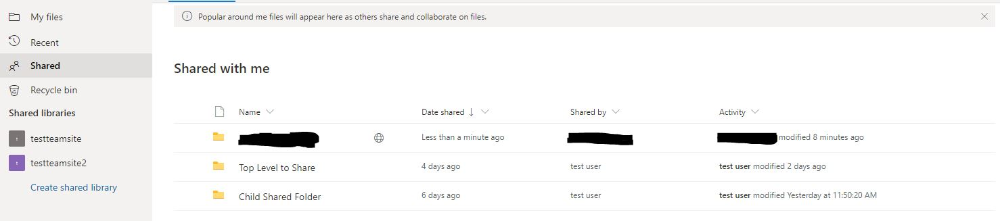

# How to sync OneDrive Business Shared Items
## Application Version
Before reading this document, please ensure you are running application version [](https://github.com/abraunegg/onedrive/releases) or greater. Use `onedrive --version` to determine what application version you are using and upgrade your client if required.

## Important Note
This feature has been 100% re-written from v2.5.0 onwards. A pre-requesite before using this capability in v2.5.0 and above is for you to revert any Shared Business Folder configuration you may be currently using, including, but not limited to:
* Removing `sync_business_shared_folders = "true|false"` from your 'config' file
* Removing the 'business_shared_folders' file 
* Removing any local data | shared folder data from your configured 'sync_dir' to ensure that there are no conflicts or issues.
* Removing any configuration online that might be related to using this feature prior to v2.5.0

## Process Overview
Syncing OneDrive Business Shared Folders requires additional configuration for your 'onedrive' client:
1.  From the OneDrive web interface, review the 'Shared' objects that have been shared with you.
2.  Select the applicable folder, and click the 'Add shortcut to My files', which will then add this to your 'My files' folder
3.  Update your OneDrive Client for Linux 'config' file to enable the feature by adding `sync_business_shared_items = "true"`. Adding this option will trigger a `--resync` requirement.
4.  Test the configuration using '--dry-run'
5.  Remove the use of '--dry-run' and sync the OneDrive Business Shared folders as required


**NOTE:** This documentation will be updated as this feature progresses.


### Enable syncing of OneDrive Business Shared Items via config file
```text
sync_business_shared_items = "true"
```

### Disable syncing of OneDrive Business Shared Items via config file
```text
sync_business_shared_items = "false"
```

## Syncing OneDrive Business Shared Folders
Use the following steps to add a OneDrive Business Shared Folder to your account:
1. Login to Microsoft OneDrive online, and navigate to 'Shared' from the left hand side pane


2. Select the respective folder you wish to sync, and click the 'Add shortcut to My files' at the top of the page


3. The final result online will look like this


When using Microsoft Windows, this shared folder will appear as the following:


4. Sync your data using `onedrive --sync --verbose`. If you have just enabled the `sync_business_shared_items = "true"` configuration option, you will be required to perform a resync. During the sync, the selected shared folder will be downloaded:

```
...
Processing API Response Bundle: 1 - Quantity of 'changes|items' in this bundle to process: 4
Finished processing /delta JSON response from the OneDrive API
Processing 3 applicable changes and items received from Microsoft OneDrive
Processing OneDrive JSON item batch [1/1] to ensure consistent local state
Creating local directory: ./my_shared_folder
Quota information is restricted or not available for this drive.
Syncing this OneDrive Business Shared Folder: my_shared_folder
Fetching /delta response from the OneDrive API for Drive ID: b!BhWyqa7K_kqXqHtSIlsqjR5iJogxpWxDradnpVGTU2VxBOJh82Y6S4he4rdnGPBT
Processing API Response Bundle: 1 - Quantity of 'changes|items' in this bundle to process: 6
Finished processing /delta JSON response from the OneDrive API
Processing 6 applicable changes and items received from Microsoft OneDrive
Processing OneDrive JSON item batch [1/1] to ensure consistent local state
Creating local directory: ./my_shared_folder/asdf
Creating local directory: ./my_shared_folder/original_data
Number of items to download from OneDrive: 3
Downloading file: my_shared_folder/asdf/asdfasdfhashdkfasdf.txt ... done
Downloading file: my_shared_folder/asdf/asdfasdf.txt ... done
Downloading file: my_shared_folder/original_data/file1.data ... done
Performing a database consistency and integrity check on locally stored data
...
```

When this is viewed locally, on Linux, this shared folder is seen as the following:


Any shared folder you add can utilise any 'client side filtering' rules that you have created.


## Syncing OneDrive Business Shared Files
There are two methods to support the syncing OneDrive Business Shared Files with the OneDrive Application
1. Add a 'shortcut' to your 'My Files' for the file, which creates a URL shortcut to the file which can be followed when using a Linux Window Manager (Gnome, KDE etc) and the link will open up in a browser. Microsoft Windows only supports this option.
2. Use `--sync-shared-files` to sync all files shared with you to your local disk. If you use this method, you can utilise any 'client side filtering' rules that you have created to filter out files you do not want locally. This option will create a new folder locally, with sub-folders named after the person who shared the data with you.


## Known Issues
Shared folders, shared with you from people outside of your 'organisation' are unable to be synced. This is due to the Microsoft Graph API not presenting these folders.

Shared folders that match this scenario, when you view 'Shared' via OneDrive online, will have a 'world' symbol as per below:



This issue is being tracked by: [#966](https://github.com/abraunegg/onedrive/issues/966)
