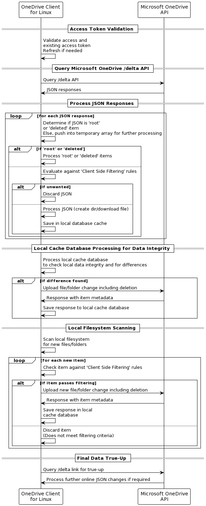
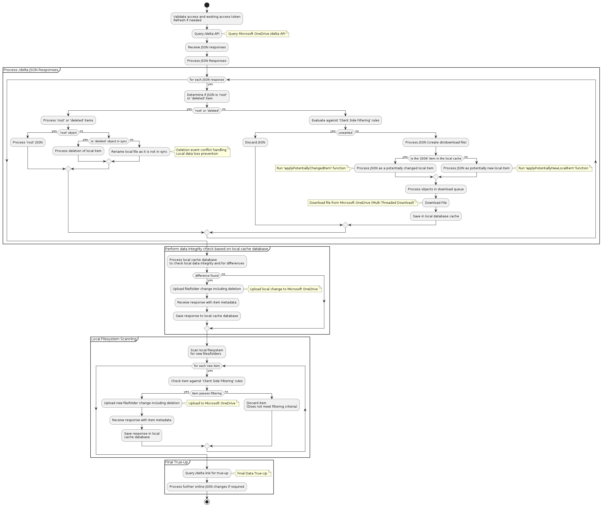
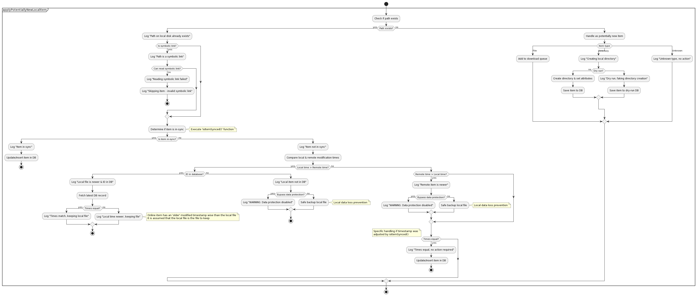
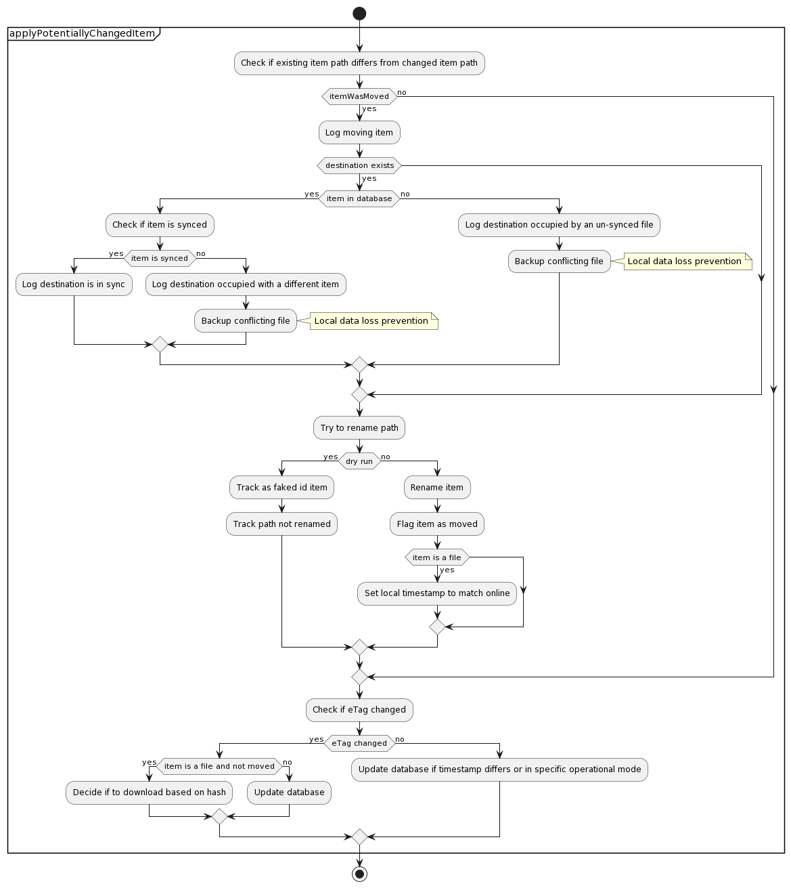
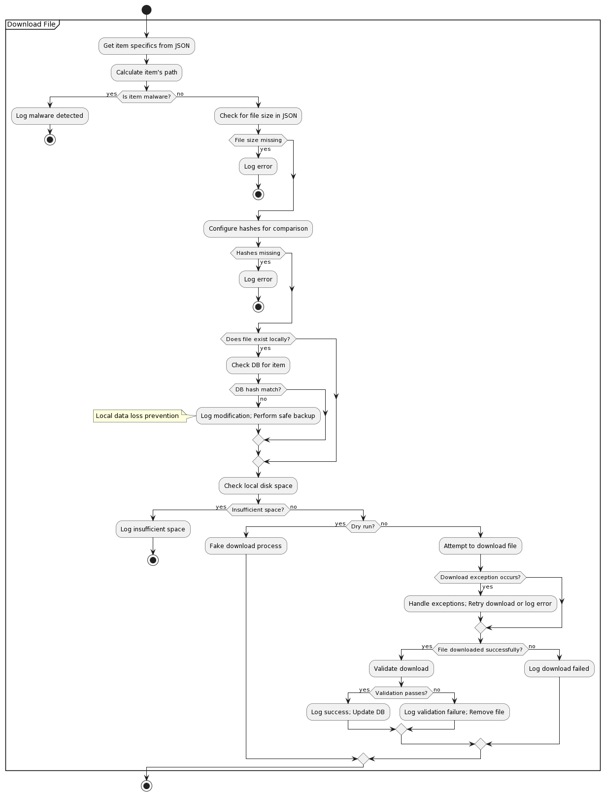
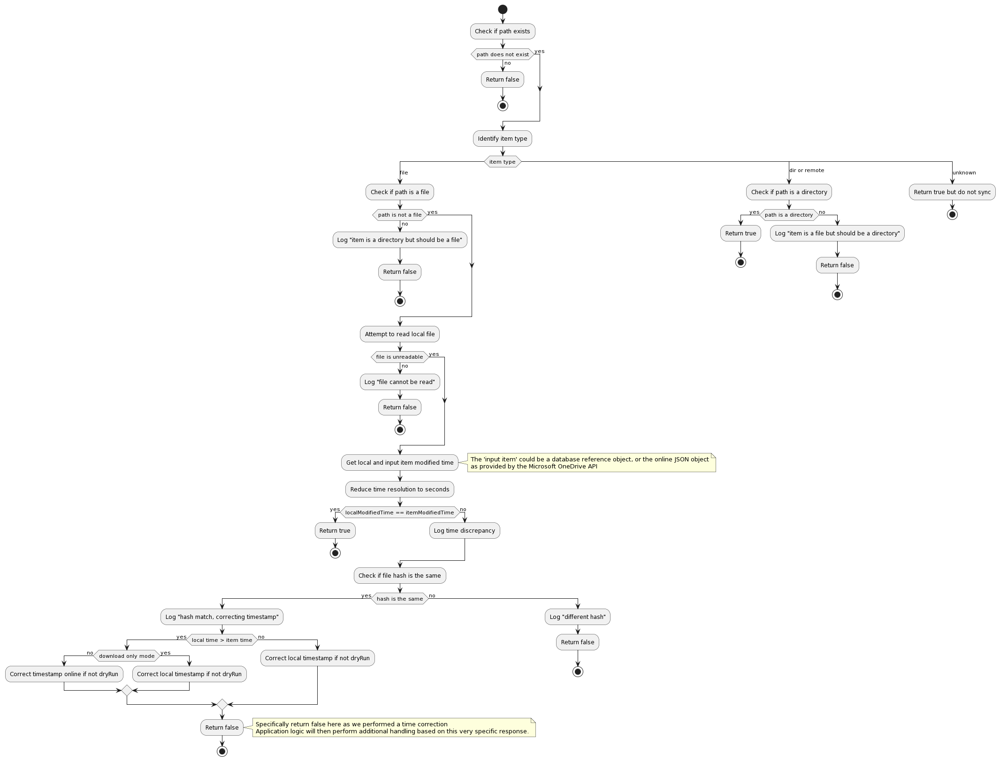
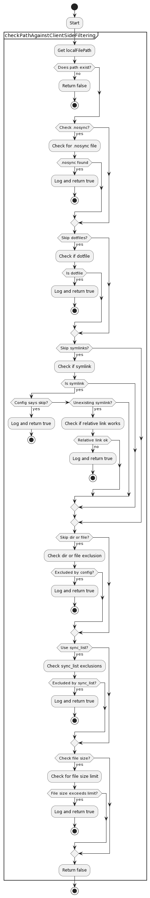
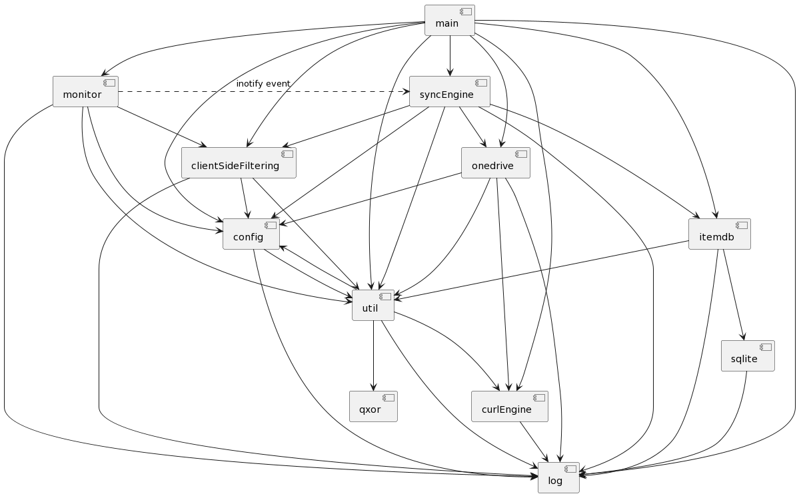
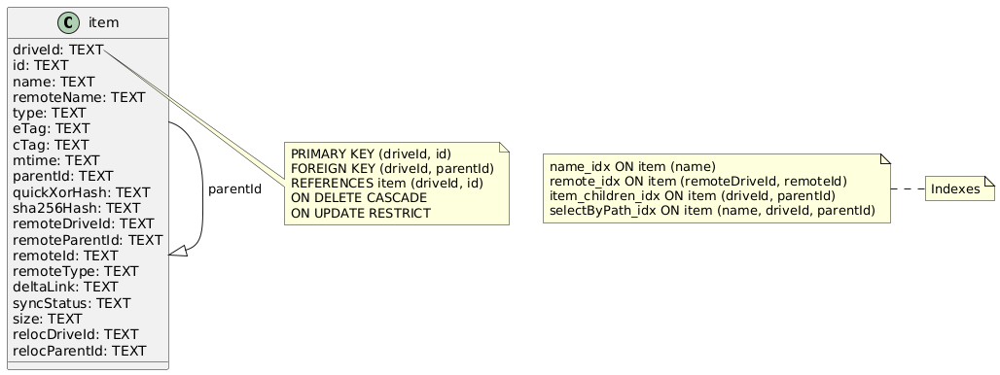

# OneDrive Client for Linux Application Architecture

## How does the client work at a high level?

The diagram below outlines at a high level the operational workflow of the OneDrive Client for Linux, demonstrating how it interacts with the OneDrive API to maintain synchronisation, manage local and cloud data integrity, and ensure that user data is accurately mirrored between the local filesystem and OneDrive cloud storage.

The above process involves several high level key stages:

1. **Access Token Validation:** Initially, the client validates its access and the existing access token, refreshing it if necessary. This step ensures that the client has the required permissions to interact with the OneDrive API.

2. **Query Microsoft OneDrive API:** The client queries the /delta API endpoint of Microsoft OneDrive, which returns JSON responses. The /delta endpoint is particularly used for syncing changes, helping the client to identify any updates in the OneDrive storage.

3. **Process JSON Responses:** The client processes each JSON response to determine if it represents a 'root' or 'deleted' item. Items not marked as 'root' or 'deleted' are temporarily stored for further processing. For 'root' or 'deleted' items, the client processes them immediately, otherwise, the client evaluates the items against client-side filtering rules to decide whether to discard them or to process and save them in the local database cache for actions like creating directories or downloading files.

4. **Local Cache Database Processing for Data Integrity:** The client processes its local cache database to check for data integrity and differences compared to the OneDrive storage. If differences are found, such as a file or folder change including deletions, the client uploads these changes to OneDrive. Responses from the API, including item metadata, are saved to the local cache database.

5. **Local Filesystem Scanning:** The client scans the local filesystem for new files or folders. Each new item is checked against client-side filtering rules. If an item passes the filtering, it is uploaded to OneDrive. Otherwise, it is discarded if it doesn't meet the filtering criteria.

6. **Final Data True-Up:** Lastly, the client queries the /delta link for a final true-up, processing any further online JSON changes if required. This ensures that the local and OneDrive storages are fully synchronised.

## What are the operational modes of the client?

There are 2 main operational modes that the client can utilise:

1. Standalone sync mode that performs a single sync action against Microsoft OneDrive. This method is used when you utilise `--sync`.
2. Ongoing sync mode that continuously syncs your data with Microsoft OneDrive and utilises 'inotify' to watch for local system changes. This method is used when you utilise `--monitor`.

By default, both modes consider all data stored online within Microsoft OneDrive as the 'source-of-truth' - that is, what is online, is the correct data (file version, file content, file timestamp, folder structure and so on). This consideration also matches how the Microsoft OneDrive Client for Windows operates.

However, in standalone mode (`--sync`), you can *change* what reference the client will use as the 'source-of-truth' for your data by using the `--local-first` option so that the application will look at your local files *first* and consider your local files as your 'source-of-truth' to replicate that directory structure to Microsoft OneDrive.

**Critical Advisory:** Please be aware that if you designate a network mount point (such as NFS, Windows Network Share, or Samba Network Share) as your `sync_dir`, this setup inherently lacks 'inotify' support. Support for 'inotify' is essential for real-time tracking of file changes, which means that the client's 'Monitor Mode' cannot immediately detect changes in files located on these network shares. Instead, synchronisation between your local filesystem and Microsoft OneDrive will occur at intervals specified by the `monitor_interval` setting. This limitation regarding 'inotify' support on network mount points like NFS or Samba is beyond the control of this client.

## OneDrive Client for Linux High Level Activity Flows

The diagrams below show the high level process flow and decision making when running the application

### Main functional activity flows

### Processing a potentially new local item

### Processing a potentially changed local item

### Download a file

### Determining if an 'item' is syncronised between Microsoft OneDrive and the local file system

### Determining if an 'item' is excluded due to 'Client Side Filtering' rules

By default, the OneDrive Client for Linux will sync all files and folders between Microsoft OneDrive and the local filesystem.

Client Side Filtering in the context of this client refers to user-configured rules that determine what files and directories the client should upload or download from Microsoft OneDrive. These rules are crucial for optimising synchronisation, especially when dealing with large numbers of files or specific file types. The OneDrive Client for Linux offers several configuration options to facilitate this:

* **skip_dir:** This option allows the user to specify directories that should not be synchronised with OneDrive. It's particularly useful for omitting large or irrelevant directories from the sync process.

* **skip_dotfiles:** Dotfiles, usually configuration files or scripts, can be excluded from the sync. This is useful for users who prefer to keep these files local.

* **skip_file:** Specific files can be excluded from synchronisation using this option. It provides flexibility in selecting which files are essential for cloud storage.

* **skip_symlinks:** Symlinks often point to files outside the OneDrive directory or to locations that are not relevant for cloud storage. This option prevents them from being included in the sync.

This exclusion process can be illustrated by the following activity diagram. A 'true' return value means that the path being evaluated needs to be excluded:

## File conflict handling - default operational modes

When using the default operational modes (`--sync` or `--monitor`) the client application is conforming to how the Microsoft Windows OneDrive client operates in terms of resolving conflicts for files.

Additionally, when using `--resync` this conflict resolution can differ slightly, as, when using `--resync` you are *deleting* the known application state, thus, the application has zero reference as to what was previously in sync with the local file system.

Due to this factor, when using `--resync` the online source is always going to be considered accurate and the source-of-truth, regardless of the local file state.

### Default Operational Modes - Conflict Handling

### Default Operational Modes - Conflict Handling with --resync

## File conflict handling - local-first operational mode

### Local First Operational Modes - Conflict Handling

### Local First Operational Modes - Conflict Handling with --resync

## Client Functional Component Architecture Relationships

The diagram below shows the main functional relationship of application code components, and how these relate to each relevant code module within this application:

## Database Schema

The diagram below shows the database schema that is used within the application

