# OneDrive Client for Linux Application Architecture

This document describes the major runtime components and synchronisation architecture of the OneDrive Client for Linux. It focuses on how the client establishes authentication, obtains Microsoft OneDrive state, compares that state with its local database and filesystem, transfers data, protects conflicting local content, and operates in `--sync` and `--monitor` modes.

The architecture is built around three distinct state domains:

1. **Microsoft OneDrive online state** - the current DriveItem metadata and file content exposed through Microsoft Graph.
2. **The local SQLite database** - the client's last known and successfully applied synchronisation state, including item identity, parent relationships, hashes, timestamps and delta cursors.
3. **The live local filesystem** - the files and directories that currently exist beneath the configured `sync_dir`.

These three domains must not be treated as interchangeable. The database is a reconciliation baseline, not a second copy of the filesystem; Microsoft metadata is not considered locally applied until the corresponding local operation succeeds; and a local pathname may contain data that differs from both the database baseline and the current online object.

A central architectural goal is therefore to advance the local database only when the client can accurately describe the state that has actually been applied locally or successfully committed online.

## External communication and use of libcurl

The client uses `libcurl` for HTTPS communication with Microsoft services and for the GitHub version check. Microsoft OneDrive data operations are performed through Microsoft Graph, while authentication uses the applicable Microsoft identity endpoints for the configured cloud environment.

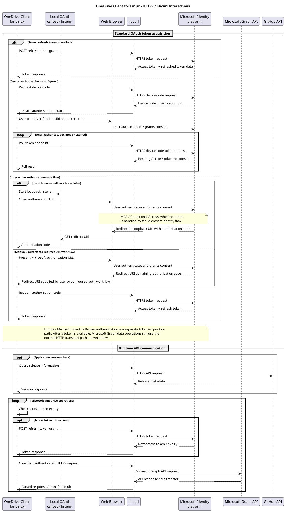

Several configuration options change how the HTTP transport behaves:

* `force_http_11` - force HTTPS operations to use HTTP/1.1.
* `operation_timeout` - control how long an operation may remain too slow before it is aborted.
* `dns_timeout` - control libcurl DNS cache timeout handling.
* `connect_timeout` - control the maximum time allowed to establish a connection.
* `data_timeout` - control inactivity timeout on an established HTTPS connection.
* `ip_protocol_version` - control which IP protocol version is used.
* `user_agent` - control the User-Agent presented to Microsoft services.

> [!IMPORTANT]
> The default `user_agent` identifies this client in accordance with Microsoft traffic-decoration expectations for an ISV application. Changing it may affect how Microsoft classifies and throttles the traffic. See Microsoft's guidance on [avoiding throttling or being blocked in SharePoint Online](https://learn.microsoft.com/en-us/sharepoint/dev/general-development/how-to-avoid-getting-throttled-or-blocked-in-sharepoint-online).

## Authentication architecture

The normal OAuth flow uses an authorisation-code exchange. Where a graphical browser environment is available, the client can start a temporary loopback listener, open the Microsoft authorisation URL in the browser and receive the returned authorisation code on the local callback. If that workflow cannot be used, the existing manual redirect-URI workflow remains available.

The client also supports the OAuth device-authorisation flow when configured, and Microsoft Intune broker authentication where applicable.

MFA and Conditional Access are handled by the Microsoft identity flow. They are not implemented as a separate authentication protocol inside this client.

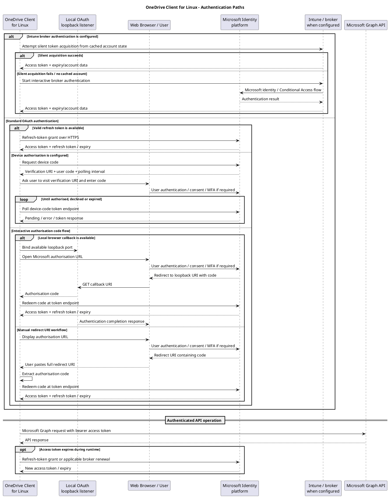

After initial authorisation, the client normally uses the stored refresh token to acquire new access tokens as required. Access tokens are used as bearer credentials for Microsoft Graph requests.

For the permissions and security model, see [application-security.md](./application-security.md).

## High-level synchronisation process

At a high level, synchronisation is a reconciliation process rather than a direct file-copy operation.

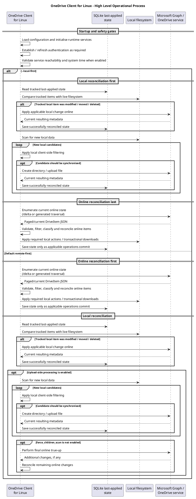

The major stages are:

1. **Initialisation and safety checks** - load configuration, initialise logging and database state, authenticate, and validate service reachability and system time when the time-safety check is enabled.
2. **Online state enumeration** - obtain Microsoft OneDrive state either through Microsoft Graph `/delta` or through a generated hierarchy traversal when `/delta` is not the correct mechanism for the active scope or mode.
3. **Online item reconciliation** - validate and classify returned JSON, apply client-side scope/filter rules, reconcile new or changed items against database and local state, and process online deletions.
4. **Transactional downloads** - download required file content privately, validate it and preserve unique local content before committing the online replacement.
5. **Database consistency processing** - compare known database items with the live local filesystem to identify locally modified or deleted tracked content.
6. **Local filesystem discovery** - scan for new local files and directories which do not yet have tracked database identity.
7. **Final true-up where applicable** - perform a final online reconciliation pass after upload-side work so changes that occurred during the cycle can be observed.

The order of these operations changes with `--local-first`, but the same three state domains and data-protection rules continue to apply.

## Synchronisation modes

There are two primary execution modes:

1. `--sync` performs a synchronisation cycle and exits.
2. `--monitor` remains running and performs repeated synchronisation cycles, using local filesystem events and optional Microsoft remote-change notifications to trigger earlier work.

### Default remote-first ordering

The default bidirectional flow processes Microsoft OneDrive state before processing local changes.

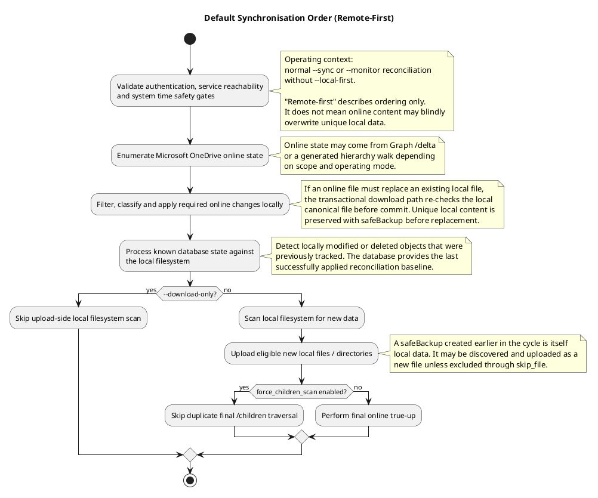

The order is approximately:

1. reconcile current online state;
2. apply online changes locally;
3. process the database consistency pass to detect changes to tracked local items;
4. scan the local filesystem for new local data;
5. upload applicable local changes; and
6. perform the final online true-up when that pass is applicable.

This is best understood as **remote-first reconciliation ordering**, rather than as a claim that online data always wins every conflict. Unique local content is protected by the conflict and `safeBackup` logic described later in this document.

### Local-first ordering

With `--local-first`, local reconciliation is intentionally performed before the normal online pass.

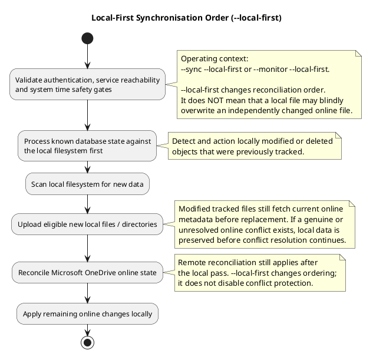

The order becomes approximately:

1. process the database consistency pass to detect modified or deleted tracked local items;
2. scan the local filesystem for new local data;
3. upload applicable local changes; and
4. reconcile current online state and apply remaining online changes locally.

`--local-first` changes ordering and conflict intent. It does not disable remote conflict detection or local data-preservation behaviour.

> [!IMPORTANT]
> When using `--sync --local-first`, a locally deleted file can only be reliably propagated as an online deletion when the client has a tracked database identity for that item. A file that was never previously tracked cannot be inferred to represent the deletion of a specific online DriveItem.
>
> `--resync` deliberately removes the previous database baseline, so this distinction is especially important during the rebuilt-state cycle.

### Upload-only and download-only modes

`--upload-only` performs the local database consistency pass and local filesystem scan but deliberately does not apply normal online-to-local reconciliation.

`--download-only` applies online changes locally but suppresses the normal upload-side filesystem scan. The database consistency pass still has a role because it validates known local state and may correct metadata without treating the mode as a normal bidirectional upload cycle.

Other options can further modify reconciliation policy, but they do not collapse the distinction between online state, database state and live filesystem state.

## Monitor mode event architecture

Monitor mode can be triggered from several independent sources:

* local filesystem activity observed through `inotify`;
* a configured Microsoft Graph webhook signal;
* a Microsoft Graph WebSocket/Socket.IO signal when supported by the linked libcurl build and webhook mode is not selected; or
* expiry of the scheduled `monitor_interval`.

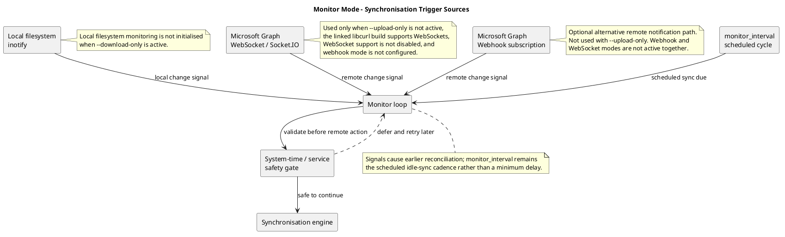

`monitor_interval` is the scheduled idle-sync cadence. It does not prevent synchronisation from occurring earlier when a local or remote signal is received.

The client also tracks expected local filesystem effects generated by its own remote-apply operations. This is important because a download, local rename, directory creation or deletion performed by the client can itself generate `inotify` events. Those expected effects are correlated with observed events so the client can distinguish its own work from genuine new local activity.

### Remote notification mechanisms

Only one Microsoft remote-change notification mechanism is active at a time:

* **WebSocket/Socket.IO** is preferred when the linked libcurl implementation provides the required WebSocket support and webhook mode is not configured.
* **Webhook** is an explicitly configured alternative which requires a publicly reachable HTTPS endpoint and a reverse-proxy or equivalent forwarding path to the client's local listener.

The webhook architecture is illustrated below:

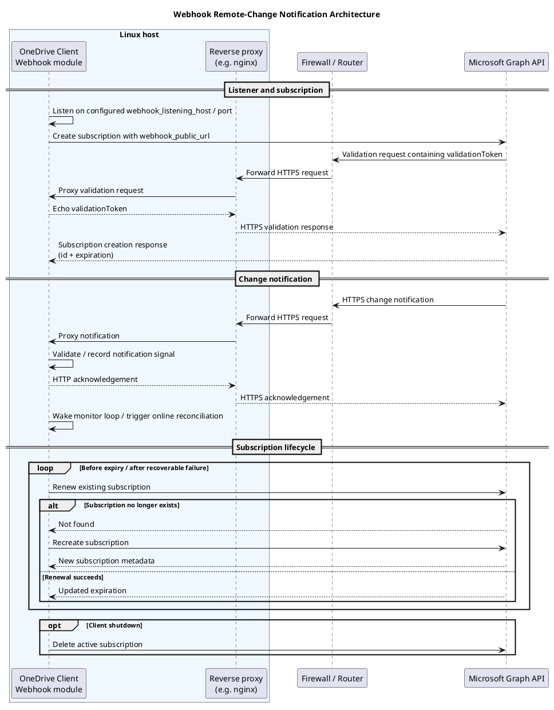

Remote notifications are signals that data may have changed. They do not carry enough state to replace normal Microsoft Graph reconciliation. A received signal wakes the normal online reconciliation process.

### Network-backed sync directories

> [!IMPORTANT]
> A network mount such as NFS, CIFS, SMB, a Windows network share or Samba share should not be assumed to provide complete or reliable `inotify` behaviour for this client.
>
> A locally initiated write may appear to generate events while a change made directly on the NAS, server or another client may not generate any event on the Linux host running this application. In that situation monitor mode must rely on its scheduled reconciliation cycle rather than immediate local event detection.
>
> Large network-backed trees can also make database consistency and filesystem scans significantly more expensive because these operations are metadata intensive. Local storage is strongly preferred for large unattended synchronisation trees.

## How online state is obtained

### Microsoft Graph `/delta`

For normal supported drive scopes, Microsoft Graph `/delta` is the efficient source of incremental online changes. Microsoft Graph returns paged responses using `@odata.nextLink` until the client reaches a stable point, at which time `@odata.deltaLink` is retained for a subsequent pass.

A delta token describes the service's change cursor. It does **not** prove that every corresponding local action has already succeeded. The client therefore advances local applied state carefully around file downloads, local filesystem operations and database updates.

### Generated reconciliation responses

Some workflows cannot safely use a normal drive-level `/delta` response for the required logical scope. In those cases the client walks the applicable online hierarchy and generates the reconciliation input itself.

Examples include:

* account/cloud circumstances where the required `/delta` behaviour is unavailable;
* `--single-directory`, where drive-wide delta changes can fall outside the configured scope;
* authoritative `--download-only --cleanup-local-files` passes;
* shared-folder traversal where the logical local path must be normalised around the shared/remote DriveItem relationship.

Generated responses are deliberately more expensive than incremental `/delta`, but they let the same reconciliation engine operate against an explicitly bounded current-state view.

### Online full-scan true-up versus local scans

The following operations are different and should not all be described as a "full scan":

* an online full-scan true-up;
* a local database consistency and integrity check; and
* a local filesystem scan for new data.

In monitor mode, `monitor_fullscan_frequency` controls the scheduled online full-scan true-up cadence. It does not disable the database consistency pass or the local filesystem scan.

When authoritative cleanup is configured for monitor mode, `monitor_authoritative_sync` determines how authoritative cleanup passes are scheduled. Fast raw-delta monitor passes can therefore defer destructive cleanup until the appropriate authoritative pass.

## Main reconciliation activity flows

The diagrams below map the major high-level code paths used during reconciliation.

### Main functional activity flow

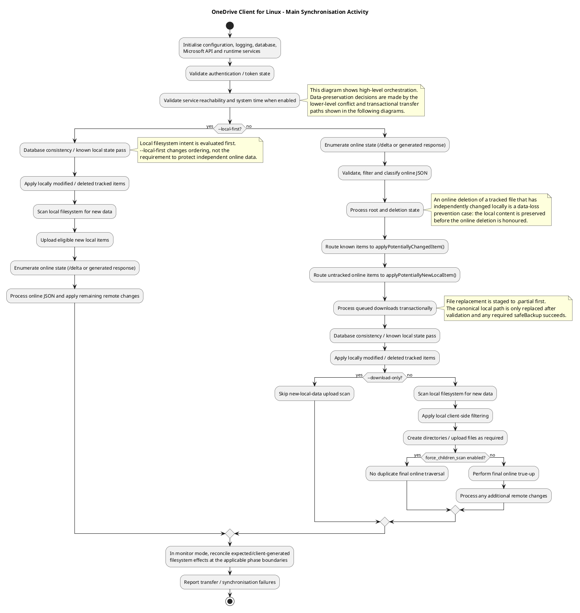

### Processing a potentially new online item

`applyPotentiallyNewLocalItem()` handles an online identity that is not currently represented as that tracked item in the local database. A local pathname may nevertheless already exist, so the function must reconcile the incoming online identity with live local content before it can safely bind the two together.

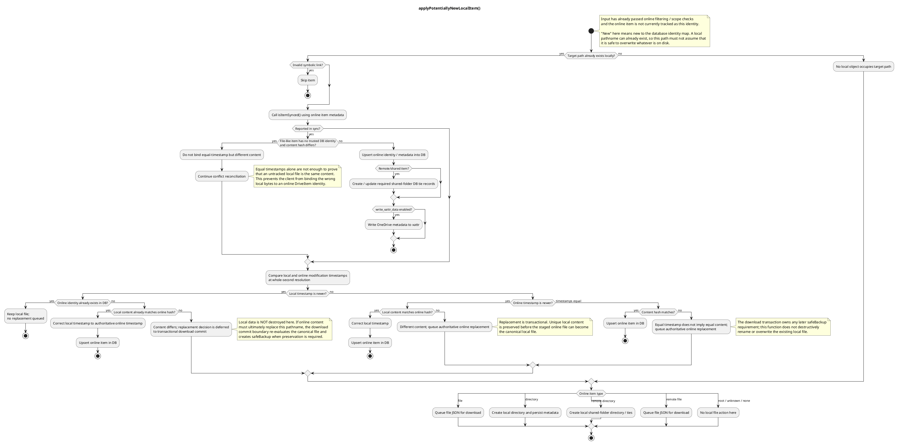

### Processing a changed tracked online item

`applyPotentiallyChangedItem()` handles an incoming online item whose identity is already known. It detects path/name changes separately from file-content changes so an online move and an online content update in the same change can be applied correctly.

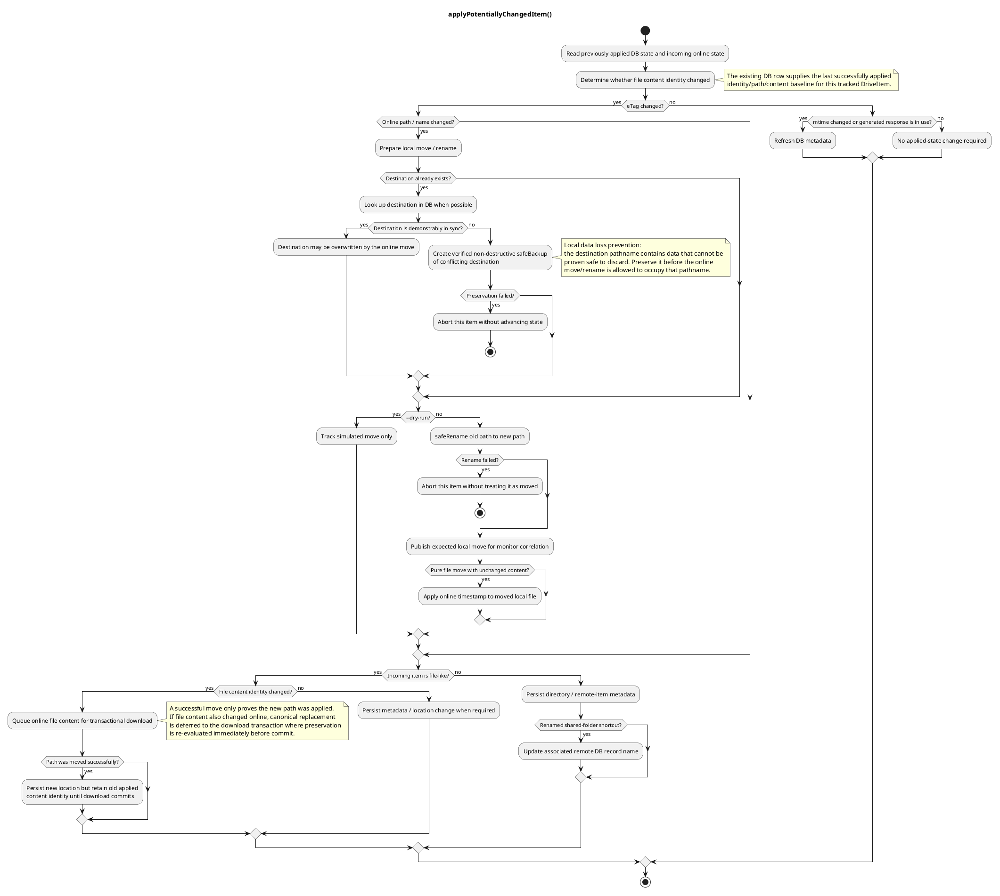

An important property of this path is that a successful local rename only proves the path change has been applied. If the same online item also contains new file content, the previous content identity remains the applied database baseline until the new content has been downloaded and committed.

## Client-side filtering architecture

Client-side filtering exists in two related but different forms:

* evaluation of an actual **local filesystem path**; and
* evaluation of an **online JSON DriveItem** before the corresponding local path may exist.

These paths cannot perform exactly the same checks because online JSON does not provide local filesystem facts such as the presence of a `.nosync` marker or whether a local path is a symbolic link.

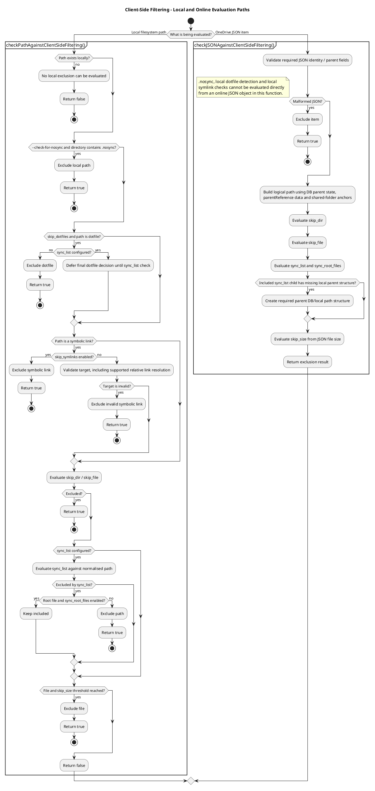

The processing order is summarised here:

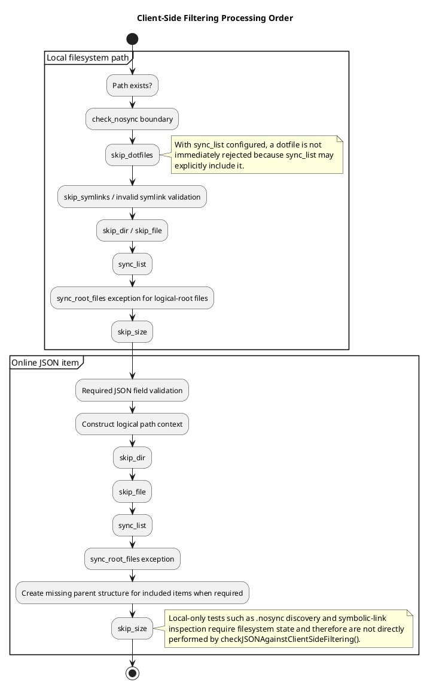

The main client-side filtering controls include:

* `check_nosync` / `--check-for-nosync` - establish a local synchronisation boundary when a directory contains `.nosync`;
* `skip_dotfiles` - exclude dot-prefixed local paths, with the `sync_list` inclusion logic allowed to decide explicitly configured paths;
* `skip_symlinks` - exclude symbolic links; invalid links are rejected even when symlinks are otherwise allowed;
* `skip_dir` - exclude matching directories and file paths beneath excluded directories;
* `skip_file` - exclude matching files;
* `sync_list` - restrict synchronisation to explicitly included logical paths;
* `sync_root_files` - allow logical-root files even when `sync_list` would otherwise exclude them; and
* `skip_size` - exclude files at or above the configured size threshold.

When an online item is explicitly included through `sync_list` but its local parent structure does not yet exist, the client can construct the required parent database and local directory structure so the included object can be materialised consistently.

## Determining whether a tracked item is in sync

`isItemSynced()` provides a focused comparison used by several reconciliation paths.

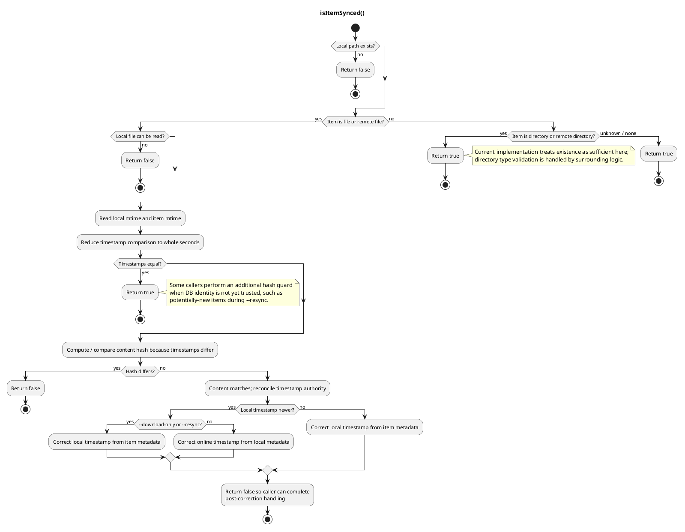

For file-like items, timestamp comparison is intentionally cheap and occurs before hashing. If whole-second timestamps match, the function returns `true`. Callers that do not yet have a trusted database identity can add a stricter content-hash guard before binding an untracked local file to an online identity.

If timestamps differ, the client compares content hashes. Matching content with different timestamps is treated as a metadata/timestamp reconciliation problem rather than a file-content conflict. The function returns `false` after performing the timestamp correction so the caller can continue its specific post-correction handling.

For directory and remote-directory items, the current implementation treats an existing path as synchronised in this function; surrounding reconciliation logic owns the broader path/type handling.

## Transactional download architecture

Downloads that can replace an existing canonical file are transactional.

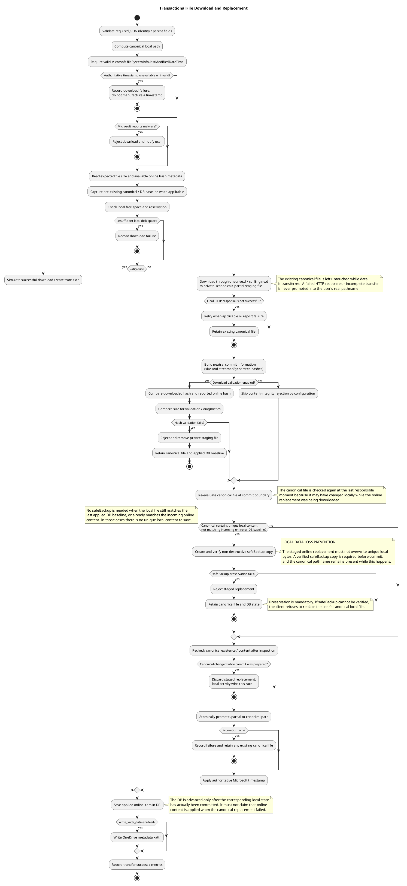

The important boundary is that the transfer layer owns a private `.partial` staging file and does **not** overwrite the canonical pathname simply because the HTTP transfer completed.

The transaction is:

1. validate the incoming DriveItem and require an authoritative `fileSystemInfo.lastModifiedDateTime`;
2. download to a private `.partial` file;
3. validate the final HTTP result and the configured content-integrity policy;
4. re-evaluate the current canonical local file at the commit boundary;
5. create and verify a non-destructive `safeBackup` copy if the canonical file contains unique local content;
6. recheck that the canonical path did not change while the replacement was being prepared;
7. atomically promote the validated `.partial` file to the canonical pathname;
8. apply the authoritative Microsoft timestamp; and
9. save the now-applied online state to the database.

If transfer, validation, required preservation or final promotion fails, the existing canonical file is retained. The database must not claim that the incoming online content has been applied when the canonical replacement did not commit.

### `safeBackup` data preservation

A replacement-style `safeBackup` is required when the existing canonical file contains content that is different from both:

* the incoming authoritative online file; and
* the last successfully applied database baseline, where such a baseline exists.

If the canonical file still matches the database baseline, it has not been independently modified and does not require a preservation copy before a valid online replacement. If it already matches the incoming online content, no preservation is required either.

The replacement workflow uses a **copy**, not a destructive rename, so the canonical pathname remains present until the validated replacement is ready to commit.

The deliberate exception is an online deletion of a tracked file that has independently changed locally. There is no incoming replacement to promote in that workflow, so the changed local data can be moved to a `safeBackup` name while the online deletion is honoured.

A generated backup uses the form:

```text
filename-hostname-safeBackup-number.file_extension
```

If an existing same-device `safeBackup` already represents the same preserved content and metadata, the client can reuse that preservation rather than generating unnecessary numbered duplicates.

> [!CAUTION]
> `bypass_data_preservation` disables `safeBackup` protection where preservation would normally be required. Local data can therefore be overwritten or removed during reconciliation.

If generated `safeBackup` files should remain local and must not subsequently be discovered as new files for upload, add an appropriate `skip_file` rule, for example:

```text
skip_file = "~*|.~*|*.tmp|*.swp|*.partial|*-safeBackup-*"
```

## Upload architecture

New and modified file uploads share the same transport mechanisms but have different reconciliation responsibilities.

### Uploading a new local file

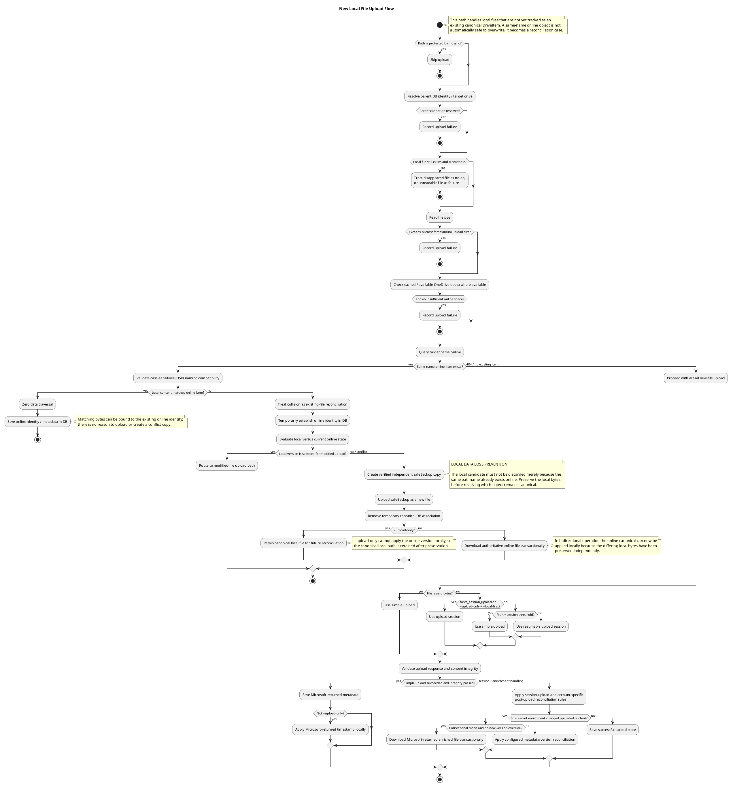

Before transferring data, the client resolves the target parent identity, validates file readability and size, considers available online quota where that information is available, and checks whether the target name already exists online.

If the target already exists:

* matching local and online content can be bound without transferring bytes;
* a different existing online object is routed into existing-file conflict/reconciliation logic rather than blindly overwritten as a new file; and
* case-insensitive Microsoft namespace collisions are rejected rather than treated as independent POSIX names.

If the target does not exist, the client selects simple upload or an upload session according to file size and configuration.

### Uploading a modified tracked file

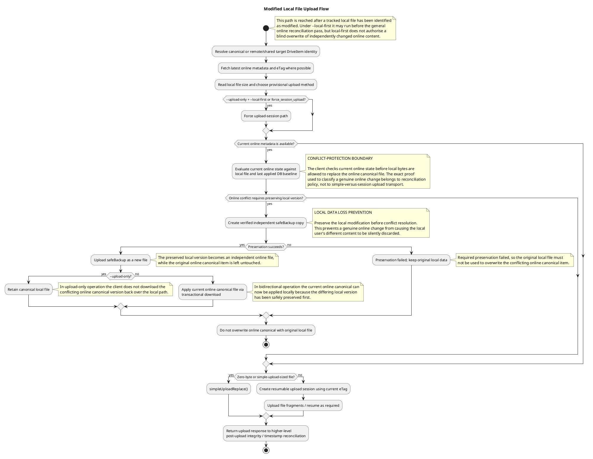

A modified-file upload first resolves the true target DriveItem, including remote/shared-item targeting, and fetches the current online metadata where possible. This provides both a current eTag for conditional/session operations and a conflict-protection boundary before the local bytes are allowed to replace the online canonical file.

The architectural rule is that upload transport selection occurs **after** the client has decided that a normal modified-file upload is safe to perform. If current online state represents a genuine or unresolved conflict, the local version is preserved instead of being used to silently overwrite that online state.

This separation is important: conflict classification is reconciliation policy; simple upload versus resumable session upload is transport policy.

### Simple upload versus upload session

The client can use:

* **simple upload** for zero-byte files and ordinary files below the configured session threshold; or
* a **resumable upload session** for larger files and when session upload is explicitly required.

`force_session_upload` forces the session path. The `--upload-only --local-first` combination also forces session upload where required by the current timestamp-preservation policy.

Upload sessions retain resumable state so interrupted transfers can be recovered when the source file still matches the state from which the session was created.

### Post-upload metadata and SharePoint enrichment

A successful transfer is not assumed to be complete merely because bytes were accepted by Microsoft. The client validates the upload response and performs post-upload integrity and timestamp reconciliation.

For successful simple uploads, Microsoft assigns the resulting online filesystem timestamp. The client saves that returned metadata and, in normal bidirectional operation, aligns the local timestamp to the Microsoft-returned value.

Session uploads can preserve additional source metadata as part of the upload process.

SharePoint-backed account types can also modify supported file formats after upload through Microsoft's enrichment behaviour. If the online content no longer matches the uploaded local content, the client follows its configured enrichment reconciliation policy, which can include downloading the Microsoft-returned file or creating a new online version through metadata reconciliation.

## Conflict handling by operating mode

### Default remote-first conflict handling

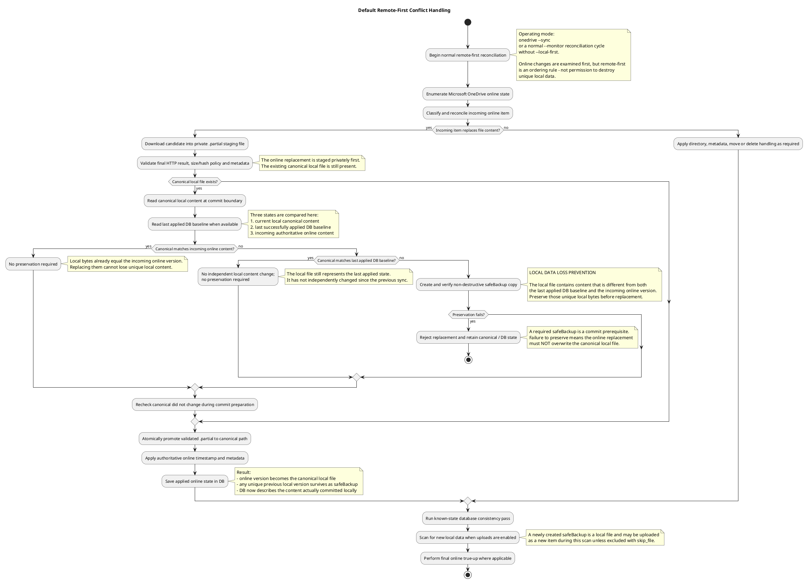

In default mode, an incoming online replacement is validated before the canonical local file is changed. The last applied DB baseline is used where available to distinguish an unchanged tracked local file from independently modified local content.

### Default remote-first conflict handling with `--resync`

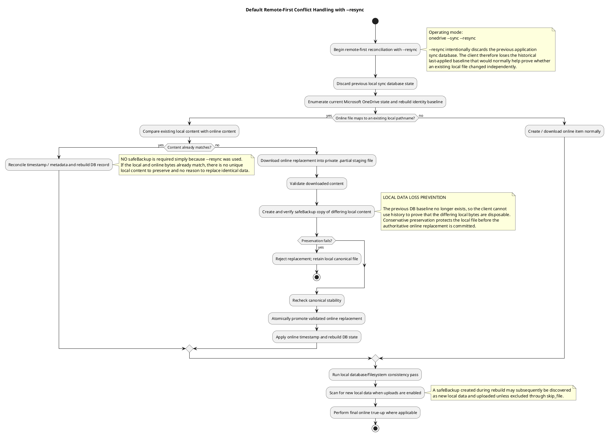

`--resync` deliberately discards the previous database baseline. It does not by itself mean that every existing local file must become a `safeBackup`. If local content already matches the current online content, metadata and DB identity can be rebuilt without replacing identical bytes.

Where same-path content differs and there is no trusted prior baseline, the client must use conservative preservation before committing an authoritative online replacement.

### Local-first conflict handling

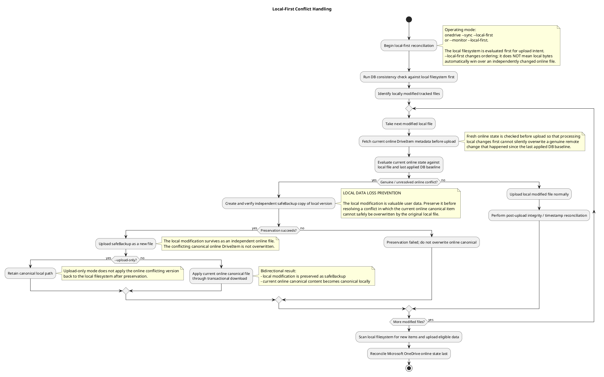

With `--local-first`, locally modified tracked items are considered before the general online reconciliation pass. Before a modified file is uploaded, the client obtains current online metadata and applies its conflict-protection policy against the local file and last applied database state.

If the current online state cannot safely be replaced by the original local modified file, the local content is preserved before the client proceeds with conflict resolution.

### Local-first conflict handling with `--resync`

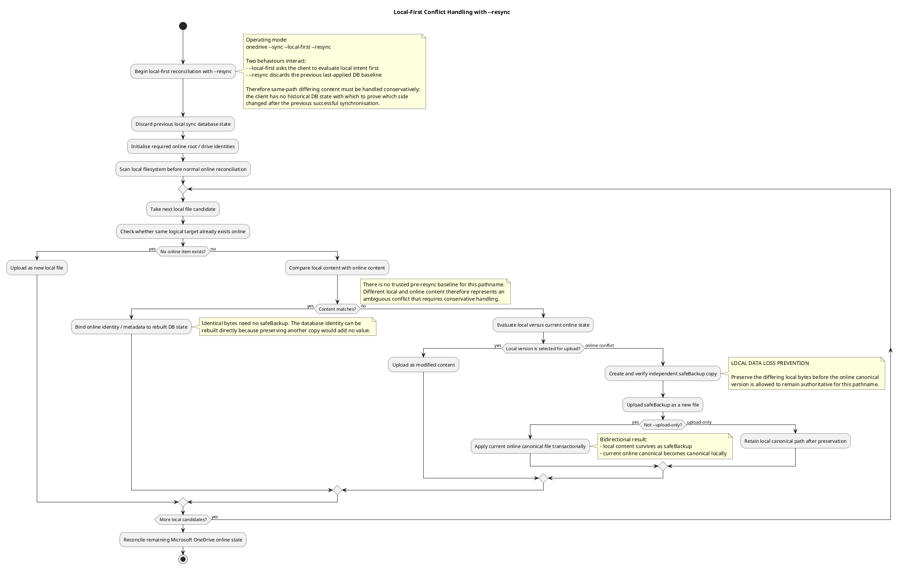

Combining `--local-first` with `--resync` removes the previous database baseline while simultaneously asking the client to process local state first. Same-path differing content must therefore be treated conservatively because the client cannot use the deleted database to prove which side changed after the previous successful synchronisation.

## Performance characteristics

The dominant performance factors are generally:

* **item count and hierarchy shape** - large numbers of DriveItems increase metadata and database work;
* **network latency and throughput** - affects Graph paging and data transfer;
* **local storage latency** - database consistency and filesystem discovery are metadata-heavy operations;
* **network-backed filesystems** - magnify local metadata latency and cannot be assumed to provide reliable `inotify` coverage;
* **file indexing and other filesystem observers** - can add local I/O and can also alter timestamps in some environments;
* **hashing** - intentionally avoided when a cheaper timestamp comparison is sufficient, but required at important reconciliation and integrity boundaries; and
* **CPU and memory availability** - affect hashing, JSON processing, parallel transfers and database work.

A first synchronisation or `--resync` is expected to be more expensive because there is no reusable incremental/applied baseline. Later normal cycles can use stored delta state and database identity to limit work.

## Client functional component relationships

The main source modules and their functional dependencies are shown below:

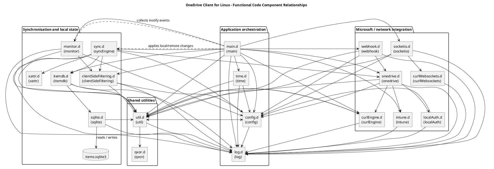

The broad ownership boundaries are:

* `main.d` - runtime orchestration, mode selection, monitor loop and sequencing;
* `sync.d` / `syncEngine` - reconciliation policy, filtering integration, database/filesystem comparison, transfer decisions and applied-state management;
* `onedrive.d` - Microsoft API implementation, authentication and lower-level OneDrive transfer operations;
* `curlEngine.d` - HTTP transport handling;
* `monitor.d` - local `inotify` event collection;
* `socketio.d` + `curlWebsockets.d` - Microsoft WebSocket/Socket.IO remote notification path;
* `webhook.d` - webhook listener and subscription lifecycle;
* `itemdb.d` + `sqlite.d` - persistent synchronisation state;
* `clientSideFiltering.d` - reusable skip/sync-list matching logic;
* `localAuth.d` - loopback OAuth callback handling;
* `time.d` - Microsoft service time validation and safety gating;
* `intune.d` - Intune/broker integration;
* `xattr.d` - optional local extended-attribute metadata; and
* `util.d`, `qxor.d`, `log.d` and `config.d` - shared support services.

## Database schema

The local SQLite database records the last known/applied synchronisation state and the item relationships needed to reconstruct logical paths and shared/remote item mappings.

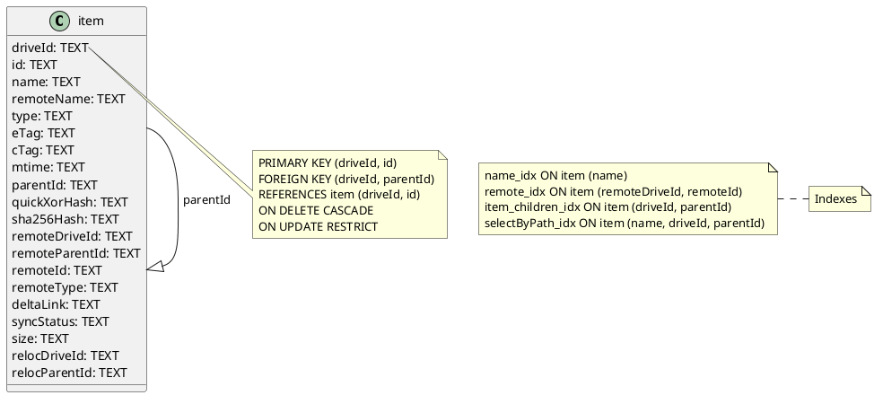

The primary item identity is the `(driveId, id)` pair. Parent relationships are stored by DriveItem identity rather than only by pathname. This allows the client to recognise a tracked item across online rename and move operations instead of treating every path change as delete-and-create.

The database also stores remote/shared-item identifiers, hashes, timestamps, delta state, synchronisation status and relocation data used by generated/shared-folder reconciliation.
