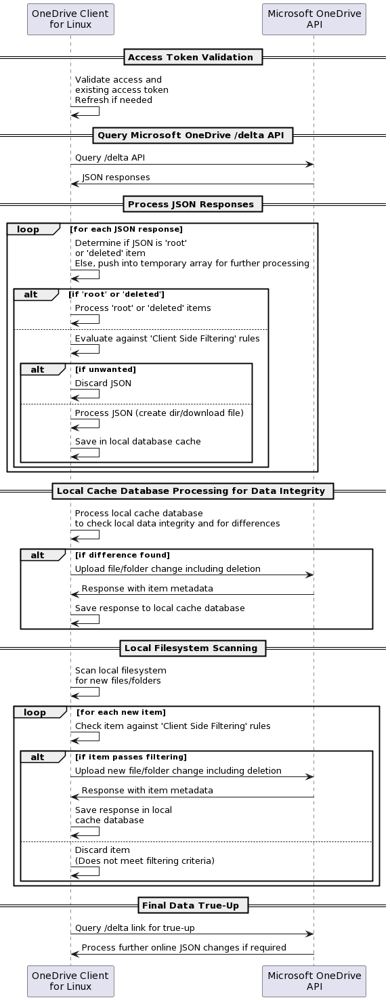
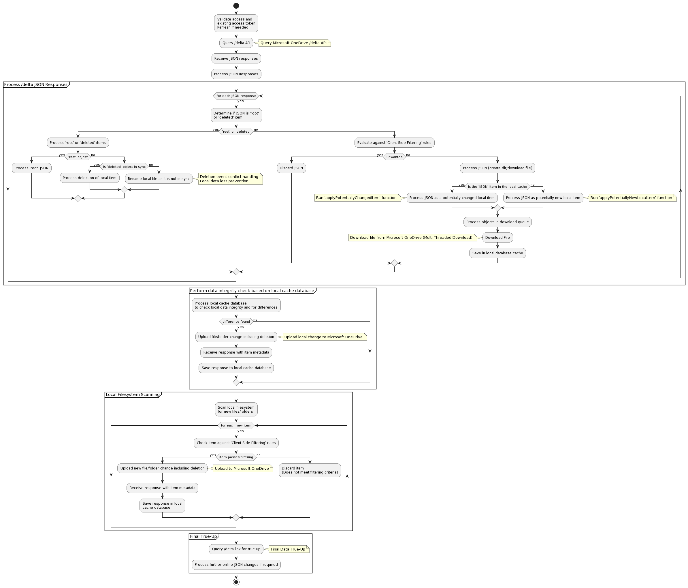
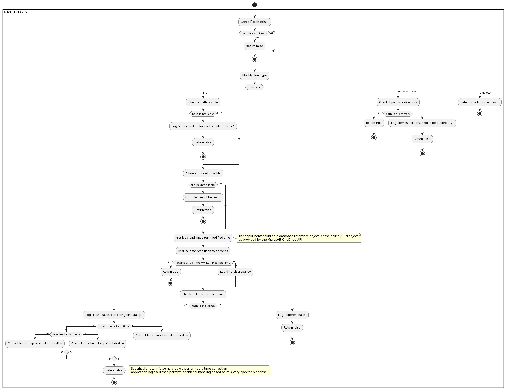
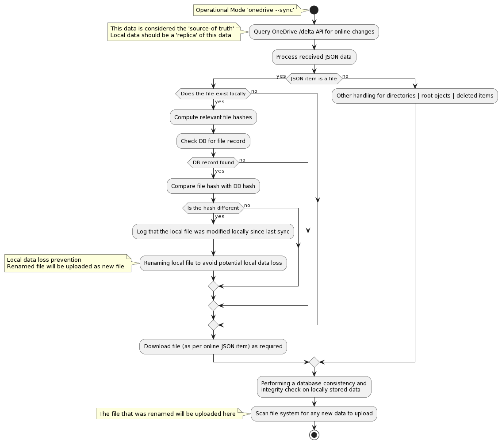

# OneDrive Client for Linux Application Architecture

## How does the client work at a high level?

The diagram below outlines at a high level the operational workflow of the OneDrive Client for Linux, demonstrating how it interacts with the OneDrive API to maintain synchronisation, manage local and cloud data integrity, and ensure that user data is accurately mirrored between the local filesystem and OneDrive cloud storage.



The above process involves several high level key stages:

1. **Access Token Validation:** Initially, the client validates its access and the existing access token, refreshing it if necessary. This step ensures that the client has the required permissions to interact with the OneDrive API.

2. **Query Microsoft OneDrive API:** The client queries the /delta API endpoint of Microsoft OneDrive, which returns JSON responses. The /delta endpoint is particularly used for syncing changes, helping the client to identify any updates in the OneDrive storage.

3. **Process JSON Responses:** The client processes each JSON response to determine if it represents a 'root' or 'deleted' item. Items not marked as 'root' or 'deleted' are temporarily stored for further processing. For 'root' or 'deleted' items, the client processes them immediately, otherwise, the client evaluates the items against client-side filtering rules to decide whether to discard them or to process and save them in the local database cache for actions like creating directories or downloading files.

4. **Local Cache Database Processing for Data Integrity:** The client processes its local cache database to check for data integrity and differences compared to the OneDrive storage. If differences are found, such as a file or folder change including deletions, the client uploads these changes to OneDrive. Responses from the API, including item metadata, are saved to the local cache database.

5. **Local Filesystem Scanning:** The client scans the local filesystem for new files or folders. Each new item is checked against client-side filtering rules. If an item passes the filtering, it is uploaded to OneDrive. Otherwise, it is discarded if it doesn't meet the filtering criteria.

6. **Final Data True-Up:** Lastly, the client queries the /delta link for a final true-up, processing any further online JSON changes if required. This ensures that the local and OneDrive storages are fully synchronised.

## What are the operational modes of the client?

There are 2 main operational modes that the client can utilise:

1. Standalone sync mode that performs a single sync action against Microsoft OneDrive. This method is used when you utilise `--sync`.
2. Ongoing sync mode that continuously syncs your data with Microsoft OneDrive and utilises 'inotify' to watch for local system changes. This method is used when you utilise `--monitor`.

By default, both modes consider all data stored online within Microsoft OneDrive as the 'source-of-truth' - that is, what is online, is the correct data (file version, file content, file timestamp, folder structure and so on). This consideration also matches how the Microsoft OneDrive Client for Windows operates.

However, in standalone mode (`--sync`), you can *change* what reference the client will use as the 'source-of-truth' for your data by using the `--local-first` option so that the application will look at your local files *first* and consider your local files as your 'source-of-truth' to replicate that directory structure to Microsoft OneDrive.

**Critical Advisory:** Please be aware that if you designate a network mount point (such as NFS, Windows Network Share, or Samba Network Share) as your `sync_dir`, this setup inherently lacks 'inotify' support. Support for 'inotify' is essential for real-time tracking of file changes, which means that the client's 'Monitor Mode' cannot immediately detect changes in files located on these network shares. Instead, synchronisation between your local filesystem and Microsoft OneDrive will occur at intervals specified by the `monitor_interval` setting. This limitation regarding 'inotify' support on network mount points like NFS or Samba is beyond the control of this client.

## OneDrive Client for Linux High Level Activity Flows

The diagrams below show the high level process flow and decision making when running the application

### Main functional activity flows


### Processing a potentially new local item


### Processing a potentially changed local item


### Download a file from Microsoft OneDrive


### Upload a modified file to Microsoft OneDrive


### Upload a new local file to Microsoft OneDrive


### Determining if an 'item' is syncronised between Microsoft OneDrive and the local file system


### Determining if an 'item' is excluded due to 'Client Side Filtering' rules

By default, the OneDrive Client for Linux will sync all files and folders between Microsoft OneDrive and the local filesystem.

Client Side Filtering in the context of this client refers to user-configured rules that determine what files and directories the client should upload or download from Microsoft OneDrive. These rules are crucial for optimising synchronisation, especially when dealing with large numbers of files or specific file types. The OneDrive Client for Linux offers several configuration options to facilitate this:

* **skip_dir:** This option allows the user to specify directories that should not be synchronised with OneDrive. It's particularly useful for omitting large or irrelevant directories from the sync process.

* **skip_dotfiles:** Dotfiles, usually configuration files or scripts, can be excluded from the sync. This is useful for users who prefer to keep these files local.

* **skip_file:** Specific files can be excluded from synchronisation using this option. It provides flexibility in selecting which files are essential for cloud storage.

* **skip_symlinks:** Symlinks often point to files outside the OneDrive directory or to locations that are not relevant for cloud storage. This option prevents them from being included in the sync.

This exclusion process can be illustrated by the following activity diagram. A 'true' return value means that the path being evaluated needs to be excluded:


## File conflict handling - default operational modes

When using the default operational modes (`--sync` or `--monitor`) the client application is conforming to how the Microsoft Windows OneDrive client operates in terms of resolving conflicts for files.

Additionally, when using `--resync` this conflict resolution can differ slightly, as, when using `--resync` you are *deleting* the known application state, thus, the application has zero reference as to what was previously in sync with the local file system.

Due to this factor, when using `--resync` the online source is always going to be considered accurate and the source-of-truth, regardless of the local file state, file timestamp or file hash.

### Default Operational Modes - Conflict Handling

#### Scenario
1. Create a local file
2. Perform a sync with Microsoft OneDrive using `onedrive --sync`
3. Modify file online
4. Modify file locally with different data|contents
5. Perform a sync with Microsoft OneDrive using `onedrive --sync`



#### Evidence of Conflict Handling
```
...
Processing API Response Bundle: 1 - Quantity of 'changes|items' in this bundle to process: 2
Finished processing /delta JSON response from the OneDrive API
Processing 1 applicable changes and items received from Microsoft OneDrive
Processing OneDrive JSON item batch [1/1] to ensure consistent local state
Number of items to download from OneDrive: 1
The local file to replace (./1.txt) has been modified locally since the last download. Renaming it to avoid potential local data loss.
The local item is out-of-sync with OneDrive, renaming to preserve existing file and prevent local data loss: ./1.txt -> ./1-onedrive-client-dev.txt
Downloading file ./1.txt ... done
Performing a database consistency and integrity check on locally stored data
Processing DB entries for this Drive ID: b!bO8V7s9SSk6r7mWHpIjURotN33W1W2tEv3OXV_oFIdQimEdOHR-1So7CqeT1MfHA
Processing ~/OneDrive
The directory has not changed
Processing α
...
The file has not changed
Processing เอกสาร
The directory has not changed
Processing 1.txt
The file has not changed
Scanning the local file system '~/OneDrive' for new data to upload
...
New items to upload to OneDrive: 1
Total New Data to Upload:        52 Bytes
Uploading new file ./1-onedrive-client-dev.txt ... done.
Performing a last examination of the most recent online data within Microsoft OneDrive to complete the reconciliation process
Fetching /delta response from the OneDrive API for Drive ID: b!bO8V7s9SSk6r7mWHpIjURotN33W1W2tEv3OXV_oFIdQimEdOHR-1So7CqeT1MfHA
Processing API Response Bundle: 1 - Quantity of 'changes|items' in this bundle to process: 2
Finished processing /delta JSON response from the OneDrive API
Processing 1 applicable changes and items received from Microsoft OneDrive
Processing OneDrive JSON item batch [1/1] to ensure consistent local state

Sync with Microsoft OneDrive is complete
Waiting for all internal threads to complete before exiting application
```

### Default Operational Modes - Conflict Handling with --resync

#### Scenario
1. Create a local file
2. Perform a sync with Microsoft OneDrive using `onedrive --sync`
3. Modify file online
4. Modify file locally with different data|contents
5. Perform a sync with Microsoft OneDrive using `onedrive --sync --resync`


#### Evidence of Conflict Handling
```
...
Deleting the saved application sync status ...
Using IPv4 and IPv6 (if configured) for all network operations
Checking Application Version ...
...
Processing API Response Bundle: 1 - Quantity of 'changes|items' in this bundle to process: 14
Finished processing /delta JSON response from the OneDrive API
Processing 13 applicable changes and items received from Microsoft OneDrive
Processing OneDrive JSON item batch [1/1] to ensure consistent local state
Local file time discrepancy detected: ./1.txt
This local file has a different modified time 2024-Feb-19 19:32:55Z (UTC) when compared to remote modified time 2024-Feb-19 19:32:36Z (UTC)
The local file has a different hash when compared to remote file hash
Local item does not exist in local database - replacing with file from OneDrive - failed download?
The local item is out-of-sync with OneDrive, renaming to preserve existing file and prevent local data loss: ./1.txt -> ./1-onedrive-client-dev.txt
Number of items to download from OneDrive: 1
Downloading file ./1.txt ... done
Performing a database consistency and integrity check on locally stored data
Processing DB entries for this Drive ID: b!bO8V7s9SSk6r7mWHpIjURotN33W1W2tEv3OXV_oFIdQimEdOHR-1So7CqeT1MfHA
Processing ~/OneDrive
The directory has not changed
Processing α
...
Processing เอกสาร
The directory has not changed
Processing 1.txt
The file has not changed
Scanning the local file system '~/OneDrive' for new data to upload
...
New items to upload to OneDrive: 1
Total New Data to Upload:        52 Bytes
Uploading new file ./1-onedrive-client-dev.txt ... done.
Performing a last examination of the most recent online data within Microsoft OneDrive to complete the reconciliation process
Fetching /delta response from the OneDrive API for Drive ID: b!bO8V7s9SSk6r7mWHpIjURotN33W1W2tEv3OXV_oFIdQimEdOHR-1So7CqeT1MfHA
Processing API Response Bundle: 1 - Quantity of 'changes|items' in this bundle to process: 2
Finished processing /delta JSON response from the OneDrive API
Processing 1 applicable changes and items received from Microsoft OneDrive
Processing OneDrive JSON item batch [1/1] to ensure consistent local state

Sync with Microsoft OneDrive is complete
Waiting for all internal threads to complete before exiting application
```

## File conflict handling - local-first operational mode

When using `--local-first` as your operational parameter the client application is now using your local filesystem data as the 'source-of-truth' as to what should be stored online.

However - Microsoft OneDrive itself, has *zero* acknowledgement of this concept, thus, conflict handling needs to be aligned to how Microsoft OneDrive on other platforms operate, that is, rename the local offending file.

Additionally, when using `--resync` you are *deleting* the known application state, thus, the application has zero reference as to what was previously in sync with the local file system.

Due to this factor, when using `--resync` the online source is always going to be considered accurate and the source-of-truth, regardless of the local file state, file timestamp or file hash or use of `--local-first`.

### Local First Operational Modes - Conflict Handling

#### Scenario
1. Create a local file
2. Perform a sync with Microsoft OneDrive using `onedrive --sync --local-first`
3. Modify file locally with different data|contents
4. Modify file online with different data|contents
5. Perform a sync with Microsoft OneDrive using `onedrive --sync --local-first`


#### Evidence of Conflict Handling
```
Reading configuration file: /home/alex/.config/onedrive/config
...
Using IPv4 and IPv6 (if configured) for all network operations
Checking Application Version ...
...
Sync Engine Initialised with new Onedrive API instance
All application operations will be performed in the configured local 'sync_dir' directory: /home/alex/OneDrive
Performing a database consistency and integrity check on locally stored data
Processing DB entries for this Drive ID: b!bO8V7s9SSk6r7mWHpIjURotN33W1W2tEv3OXV_oFIdQimEdOHR-1So7CqeT1MfHA
Processing ~/OneDrive
The directory has not changed
Processing α
The directory has not changed
...
The file has not changed
Processing เอกสาร
The directory has not changed
Processing 1.txt
Local file time discrepancy detected: 1.txt
The file content has changed locally and has a newer timestamp, thus needs to be uploaded to OneDrive
Changed local items to upload to OneDrive: 1
The local item is out-of-sync with OneDrive, renaming to preserve existing file and prevent local data loss: 1.txt -> 1-onedrive-client-dev.txt
Uploading new file 1-onedrive-client-dev.txt ... done.
Scanning the local file system '~/OneDrive' for new data to upload
...
Fetching /delta response from the OneDrive API for Drive ID: b!bO8V7s9SSk6r7mWHpIjURotN33W1W2tEv3OXV_oFIdQimEdOHR-1So7CqeT1MfHA
Processing API Response Bundle: 1 - Quantity of 'changes|items' in this bundle to process: 3
Finished processing /delta JSON response from the OneDrive API
Processing 2 applicable changes and items received from Microsoft OneDrive
Processing OneDrive JSON item batch [1/1] to ensure consistent local state
Number of items to download from OneDrive: 1
Downloading file ./1.txt ... done

Sync with Microsoft OneDrive is complete
Waiting for all internal threads to complete before exiting application
```


### Local First Operational Modes - Conflict Handling with --resync

#### Scenario
1. Create a local file
2. Perform a sync with Microsoft OneDrive using `onedrive --sync --local-first`
3. Modify file locally with different data|contents
4. Modify file online with different data|contents
5. Perform a sync with Microsoft OneDrive using `onedrive --sync --local-first --resync`

#### Evidence of Conflict Handling
```
...

The usage of --resync will delete your local 'onedrive' client state, thus no record of your current 'sync status' will exist.
This has the potential to overwrite local versions of files with perhaps older versions of documents downloaded from OneDrive, resulting in local data loss.
If in doubt, backup your local data before using --resync

Are you sure you wish to proceed with --resync? [Y/N] y

Deleting the saved application sync status ...
Using IPv4 and IPv6 (if configured) for all network operations
...
Sync Engine Initialised with new Onedrive API instance
All application operations will be performed in the configured local 'sync_dir' directory: /home/alex/OneDrive
Performing a database consistency and integrity check on locally stored data
Processing DB entries for this Drive ID: b!bO8V7s9SSk6r7mWHpIjURotN33W1W2tEv3OXV_oFIdQimEdOHR-1So7CqeT1MfHA
Processing ~/OneDrive
The directory has not changed
Scanning the local file system '~/OneDrive' for new data to upload
Skipping item - excluded by sync_list config: ./random_25k_files
OneDrive Client requested to create this directory online: ./α
The requested directory to create was found on OneDrive - skipping creating the directory: ./α
...
New items to upload to OneDrive: 9
Total New Data to Upload:        49 KB
...
The file we are attemtping to upload as a new file already exists on Microsoft OneDrive: ./1.txt
Skipping uploading this item as a new file, will upload as a modified file (online file already exists): ./1.txt
The local item is out-of-sync with OneDrive, renaming to preserve existing file and prevent local data loss: ./1.txt -> ./1-onedrive-client-dev.txt
Uploading new file ./1-onedrive-client-dev.txt ... done.
Fetching /delta response from the OneDrive API for Drive ID: b!bO8V7s9SSk6r7mWHpIjURotN33W1W2tEv3OXV_oFIdQimEdOHR-1So7CqeT1MfHA
Processing API Response Bundle: 1 - Quantity of 'changes|items' in this bundle to process: 15
Finished processing /delta JSON response from the OneDrive API
Processing 14 applicable changes and items received from Microsoft OneDrive
Processing OneDrive JSON item batch [1/1] to ensure consistent local state
Number of items to download from OneDrive: 1
Downloading file ./1.txt ... done

Sync with Microsoft OneDrive is complete
Waiting for all internal threads to complete before exiting application
```

## Client Functional Component Architecture Relationships

The diagram below shows the main functional relationship of application code components, and how these relate to each relevant code module within this application:


## Database Schema

The diagram below shows the database schema that is used within the application


