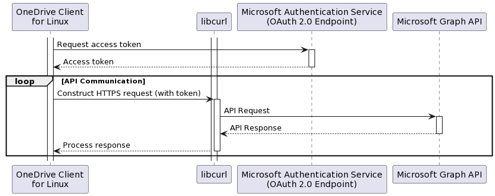
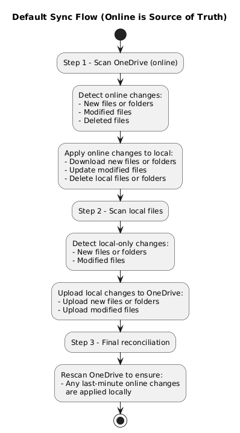
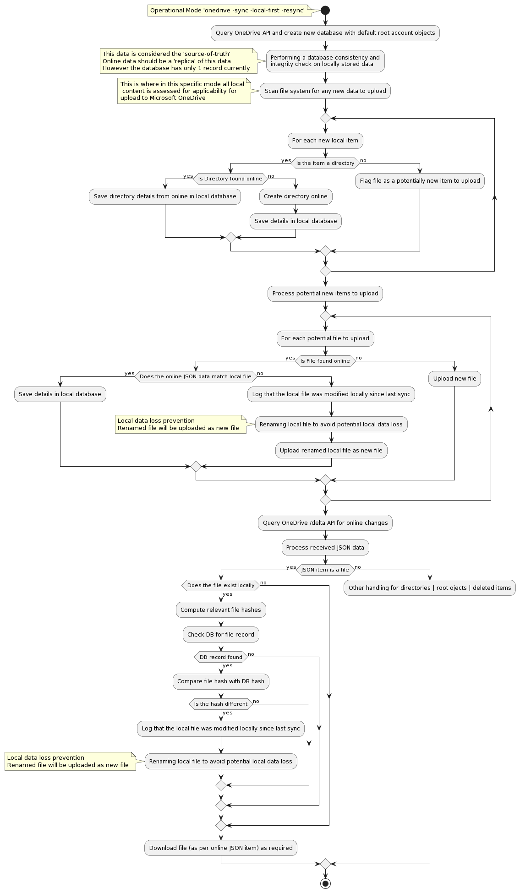
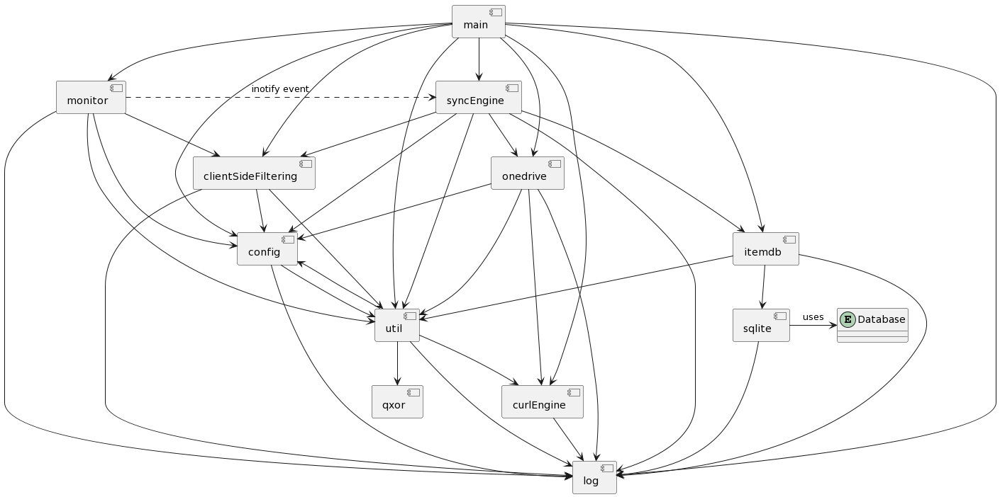

# OneDrive Client for Linux Application Architecture

## How does the client work at a high level?
The client utilises the 'libcurl' library to communicate with Microsoft OneDrive via the Microsoft Graph API. The diagram below shows this high level interaction with the Microsoft and GitHub API services online:



Depending on your operational environment, it is possible to 'tweak' the following options which will modify how libcurl operates with it's interaction with Microsoft OneDrive services:

*  Downgrade all HTTPS operations to use HTTP1.1 (Config Option: `force_http_11`)
*  Control how long a specific transfer should take before it is considered too slow and aborted (Config Option: `operation_timeout`)
*  Control libcurl handling of DNS Cache Timeout (Config Option: `dns_timeout`)
*  Control the maximum time allowed for the connection to be established (Config Option: `connect_timeout`)
*  Control the timeout for activity on an established HTTPS connection (Config Option: `data_timeout`)
*  Control what IP protocol version should be used when communicating with OneDrive (Config Option: `ip_protocol_version`)
*  Control what User Agent is presented to Microsoft services (Config Option: `user_agent`)

> [!IMPORTANT]
> The default 'user_agent' value conforms to specific Microsoft requirements to identify as an ISV that complies with OneDrive traffic decoration requirements. Changing this value potentially will impact how Microsoft see's your client, thus your traffic may get throttled. For further information please read: https://learn.microsoft.com/en-us/sharepoint/dev/general-development/how-to-avoid-getting-throttled-or-blocked-in-sharepoint-online

Diving a little deeper into how the client operates, the diagram below outlines at a high level the operational workflow of the OneDrive Client for Linux, demonstrating how it interacts with the OneDrive API to maintain synchronisation, manage local and cloud data integrity, and ensure that user data is accurately mirrored between the local filesystem and OneDrive cloud storage.


The application operational processes have several high level key stages:

1. **Access Token Validation:** Initially, the client validates its access and the existing access token, refreshing it if necessary. This step ensures that the client has the required permissions to interact with the OneDrive API.

2. **Query Microsoft OneDrive API:** The client queries the /delta API endpoint of Microsoft OneDrive, which returns JSON responses. The /delta endpoint is particularly used for syncing changes, helping the client to identify any updates in the OneDrive storage.

3. **Process JSON Responses:** The client processes each JSON response to determine if it represents a 'root' or 'deleted' item. Items not marked as 'root' or 'deleted' are temporarily stored for further processing. For 'root' or 'deleted' items, the client processes them immediately, otherwise, the client evaluates the items against client-side filtering rules to decide whether to discard them or to process and save them in the local database cache for actions like creating directories or downloading files.

4. **Local Cache Database Processing for Data Integrity:** The client processes its local cache database to check for data integrity and differences compared to the OneDrive storage. If differences are found, such as a file or folder change including deletions, the client uploads these changes to OneDrive. Responses from the API, including item metadata, are saved to the local cache database.

5. **Local Filesystem Scanning:** The client scans the local filesystem for new files or folders. Each new item is checked against client-side filtering rules. If an item passes the filtering, it is uploaded to OneDrive. Otherwise, it is discarded if it doesn't meet the filtering criteria.

6. **Final Data True-Up:** Lastly, the client queries the /delta link for a final true-up, processing any further online JSON changes if required. This ensures that the local and OneDrive storages are fully synchronised.

## What are the operational modes of the client?

There are 2 main operational modes that the client can utilise:

1. Standalone sync mode that performs a single sync action against Microsoft OneDrive. This method is used when you utilise `--sync`.
2. Ongoing sync mode that continuously syncs your data with Microsoft OneDrive and utilises 'inotify' to watch for local system changes. This method is used when you utilise `--monitor`.

By default, both sync modes (`--sync` and `--monitor`)treat the data stored online in Microsoft OneDrive as the 'source-of-truth'. This means the client will first examine your OneDrive account for any changes (additions, modifications, deletions) and apply those changes to your local file system. After this, any local changes are uploaded, and finally, a second check ensures your local state matches the online state. This mirrors the behaviour of the Microsoft OneDrive Client for Windows.



When using the client with the `--local-first` option, the sync flow is reversed. The client treats your local files as the 'source-of-truth'. Local changes are processed first and pushed to Microsoft OneDrive online. Only after local changes have been uploaded will the client check for any remote changes (this includes online additions, modifications and deletions) and apply those to your local system as needed, ensuring the final local state is consistent with that what is now online.


> [!IMPORTANT]
> When using `--sync --local-first`, a locally deleted file will only be deleted online if it was already in sync with its online counterpart.
> * If the file was never synced, the client cannot know that the corresponding online file should be removed. In this case, the online file may be downloaded again
> * Using `--resync` makes this behaviour more likely because it wipes all local knowledge of what was previously synced, so local deletions will not be recognised
>
> When using `--monitor --local-first`, file system watches (via inotify) will detect local deletions. This event will automatically trigger removal of the online file, and if exists and matches the local data, the file online will be removed.

> [!IMPORTANT]
> Please be aware that if you designate a network mount point (such as NFS, Windows Network Share, or Samba Network Share) as your `sync_dir`, this setup inherently lacks 'inotify' support. Support for 'inotify' is essential for real-time tracking of file changes, which means that the client's 'Monitor Mode' cannot immediately detect changes in files located on these network shares. Instead, synchronisation between your local filesystem and Microsoft OneDrive will occur at intervals specified by the `monitor_interval` setting. This limitation regarding 'inotify' support on network mount points like NFS or Samba is beyond the control of this client.

## OneDrive Client for Linux High Level Activity Flows

The diagrams below show the high level process flow and decision making when running the application

### Main functional activity flows


### Processing a potentially new local item


### Processing a potentially changed local item


### Download a file from Microsoft OneDrive


### Upload a modified file to Microsoft OneDrive


### Upload a new local file to Microsoft OneDrive


### Determining if an 'item' is synchronised between Microsoft OneDrive and the local file system


### Determining if an 'item' is excluded due to 'Client Side Filtering' rules

By default, the OneDrive Client for Linux will sync all files and folders between Microsoft OneDrive and the local filesystem.

Client Side Filtering in the context of this client refers to user-configured rules that determine what files and directories the client should upload or download from Microsoft OneDrive. These rules are crucial for optimising synchronisation, especially when dealing with large numbers of files or specific file types. The OneDrive Client for Linux offers several configuration options to facilitate this:

* **skip_dir:** This option allows the user to specify directories that should not be synchronised with OneDrive. It's particularly useful for omitting large or irrelevant directories from the sync process.

* **skip_dotfiles:** Dotfiles, usually configuration files or scripts, can be excluded from the sync. This is useful for users who prefer to keep these files local.

* **skip_file:** Specific files can be excluded from synchronisation using this option. It provides flexibility in selecting which files are essential for cloud storage.

* **skip_symlinks:** Symlinks often point to files outside the OneDrive directory or to locations that are not relevant for cloud storage. This option prevents them from being included in the sync.

This exclusion process can be illustrated by the following activity diagram. A 'true' return value means that the path being evaluated needs to be excluded:


## Understanding the Client Processing Process of Online State
When the client is processing your online data state, the application will generate the following output:

#### Fetching a Delta Response Example
```text
Fetching items from the OneDrive API for Drive ID: xxxxxx ..............................................
```
#### Generating a Delta Response Example
```text
Generating a /delta response from the OneDrive API for this Drive ID: xxxxxx and Item ID: xxxxxx .......
```
This section explains what’s happening under the hood, why it can take time on large libraries, and what you can do to make it faster and more predictable.

### High Level Explanation
* Microsoft Graph returns changes in paged bundles (~200 items per bundle). The client must iterate every bundle to reconcile your online state; you’ll therefore see repeated processing dots (`.`) messages while it works through each page. This page size is **set by Microsoft and not configurable.**
* A full scan (first run, use of `--resync`) will always take longer than an incremental scan because the client must enumerate all items online and locally. Subsequent runs are much faster once the /delta token is established.
* Overall speed is bounded by a mix of network throughput, CPU, filesystem and disk I/O, and how many items (files + folders) you have. A complex online state with deep trees cost more metadata operations than simple directory structures and file counts.
* To review exactly what the client is doing, consider adding `--verbose` to your client input options to review exactly what the client is doing.

### Application Processing Steps: Where the time goes (phase-by-phase)
The flow diagrams above show the main application decision points. The log lines below correspond to the key phases you’ll see during a typical run (standalone or monitor).

1. **Fetch current changes from Microsoft Graph**
    * **Application Output:** `Fetching items from the OneDrive API for Drive ID: …`
    * **What happens:** The client requests change bundles (≈200 items per bundle) using your current delta token. If the token is invalid or it’s a first run, it performs a broader enumeration.
    * **Why it can be slow:** High item counts, network latency, or Microsoft Graph API throttling.
2. **Process each bundle of changes**
    * **Application Output:** `Processing N applicable changes and items received from Microsoft OneDrive`
    * **What happens:** For each item, we classify (new/changed/deleted/excluded), reconcile with the local database, and queue any work (download, upload, delete, rename).
    * **Why it can be slow:** Many directories and small files increase metadata churn; each bundle must be applied in order. Bundle size is fixed by Graph.
3. **Database integrity checks**
    * **Application Output:** `Performing a database consistency and integrity check on locally stored data`
    * **What happens:** The application will verify local metadata invariants so subsequent actions don’t corrupt state. This is quick on SSDs but can be noticeable on slow disks.
4. **Local filesystem scan**
    * **Application Output:** `Scanning the local file system '…' for new data to upload`
    * **What happens:** The application will walk your configured sync root, applying client-side filtering rules and discovering local items to upload.
    * **Why it can be slow:** Deep folder trees; slow or network filesystems; A complex local state with deep trees with potentially exlusions and inclusions to filter and determine what needs to be uploaded.
5. **Final reconciliation & actions**
    * **Application Output:** `Number of items to download from Microsoft OneDrive: X`
    * **What happens:** The application will execute the final action queues. On a healthy delta run this step is short; on a first run or after --resync it can be significant.
    * **Why it can be slow:** Many small files; constrained bandwidth; server-side throttling.

### Why a --resync is slower (by design)
A `--resync` discards the known-good delta token and forces a full online + local walk to re-learn state. This is essential after certain errors or configuration change, but using it routinely will always cost more time than an incremental run. After the first successful scan, subsequent syncs drop from hours to minutes because the delta token narrows the change set dramatically.

### What affects performance the most
* **Item count & structure:** Many folders and small files dominate metadata work.
* **Network quality:** Latency and throughput directly affect how quickly we can iterate Graph pages and transfer content.
* **Local Disk & filesystem:** SSDs perform metadata and DB work far faster than spinning disks or remote mounts. Your filesystem type (e.g., ext4, XFS, ZFS) matters and should be tuned appropriately.
* **File Indexing:** Disable File Indexing (Tracker, Baloo, Searchmonkey, Pinot and others) as these are adding latency and disk I/O to your operaions slowing down your performance.
* **CPU & memory:** Classification and hashing are CPU-bound; insufficient RAM or swap can slow DB and traversal work.
* **First run vs incremental:** First runs / `--resync` must enumerate everything; incremental runs use the delta token and are much faster.

### Practical ways to improve throughput
1. Avoid unnecessary `--resync`. Only use it when the client explicitly advises you to. It forces a full scan.
2. Use client-side filtering to skip noise. Prune build artefacts, caches, temp folders, and other churn using skip_dir, skip_file, skip_dotfiles, etc. Reducing item count speeds up every phase.
3. Prefer SSD/NVMe for the sync root & DB. Faster metadata, faster DB integrity checks, faster local scans.
4. Stable, low-latency network. Wi-Fi with high packet loss dramatically slows down page iteration and transfers.
5. Let incremental sync do its thing. After the first complete pass, don’t interrupt; later cycles will be dramatically faster thanks to the delta token.
6. Right-size system resources. Ensure adequate RAM/swap and avoid filesystem-level encryption that adds significant CPU overhead if your hardware is modest.

## Delta Response vs Generated Delta Response
By default, the client uses Microsoft Graph’s `/delta` to fetch just-the-changes since the last successful sync. This is fast because the server does the heavy lifting and returns paged change bundles.

However, there are specific scenarios where using `/delta` would be incorrect or unsafe. In these cases the client intentionally falls back to generating a “simulated delta” — i.e., it performs a targeted online tree walk and builds the current state itself. That is naturally more time-consuming than consuming a server-computed delta.

### When the client switches to a simulated delta
The sync engine will generate a simulated delta whenever any of the conditions below are true:

1. National Cloud deployments don’t support `/delta`. National Cloud environments lack `/delta` feature support. To maintain correctness, the client enumerates the relevant paths online and synthesises a change set.
2. The use of `--single-directory` scope. When you restrict the sync to a single online directory, a naïve /delta against the drive can include changes outside that scope. The simulated delta ensures we only consider the current, in-scope subtree for accurate reconciliation.
3. The use of `--download-only --cleanup-local-files`. In this mode, consuming raw /delta can replay online delete/replace churn in a way that causes valid local files to be deleted (e.g., user deletes a folder online, then recreates it via the web). The simulated delta captures the present online state and intentionally ignores those intermediate delete/replace events, so local “keep” semantics are preserved.
4. The uuse of 'Shared Folders'. Calling `/delta` on a shared folder path often targets the owner’s entire drive, not just the shared subtree you see. With sync_list, this mismatch can mean nothing appears to match (paths are rooted from the owner’s drive, not your shared mount point). The client therefore walks the shared folder itself, normalises paths, and constructs a simulated delta that reflects exactly what’s shared with you.

**Why this is slower:** A simulated delta requires walking the online tree (and, for large or deeply nested shares, that’s work). The trade-off is deliberate: safety and correctness over speed.


## File conflict handling - default operational modes

When using the default operational modes (`--sync` or `--monitor`) the client application is conforming to how the Microsoft Windows OneDrive client operates in terms of resolving conflicts for files.

When using `--resync` this conflict resolution can differ slightly, as, when using `--resync` you are *deleting* the known application state, thus, the application has zero reference as to what was previously in sync with the local file system.

Due to this factor, when using `--resync` the online source is always going to be considered accurate and the source-of-truth, regardless of the local file state, local file timestamp or local file hash. When a difference in local file hash is detected, the file will be renamed to prevent local data loss.

> [!IMPORTANT]
> In v2.5.3 and above, when a local file is renamed due to conflict handling, this will be in the following format pattern to allow easier identification:
>
>    **filename-hostname-safeBackup-number.file_extension**
> 
> For example:
> ```
> -rw-------.  1 alex alex 53402 Sep 21 08:25 file5.data
> -rw-------.  1 alex alex 53423 Nov 13 18:18 file5-onedrive-client-dev-safeBackup-0001.data
> -rw-------.  1 alex alex 53422 Nov 13 18:19 file5-onedrive-client-dev-safeBackup-0002.data
> ```
>
> In client versions v2.5.2 and below, the renamed file have the following naming convention:
>
>    **filename-hostname-number.file_extension**
> 
> resulting in backup filenames of the following format:
> ```
> -rw-------.  1 alex alex 53402 Sep 21 08:25 file5.data
> -rw-------.  1 alex alex 53432 Nov 14 05:22 file5-onedrive-client-dev-2.data
> -rw-------.  1 alex alex 53435 Nov 14 05:24 file5-onedrive-client-dev-3.data
> -rw-------.  1 alex alex 53419 Nov 14 05:22 file5-onedrive-client-dev.data
> ```
>

> [!CAUTION]
> The creation of backup files when there is a conflict to avoid local data loss can be disabled.
> 
> To do this, utilise the configuration option **bypass_data_preservation**
> 
> If this is enabled, you will experience data loss on your local data as the local file will be over-written with data from OneDrive online. Use with care and caution.

### Default Operational Modes - Conflict Handling

#### Scenario
1. Create a local file
2. Perform a sync with Microsoft OneDrive using `onedrive --sync`
3. Modify file online
4. Modify file locally with different data|contents
5. Perform a sync with Microsoft OneDrive using `onedrive --sync`


#### Evidence of Conflict Handling
```
...
Processing API Response Bundle: 1 - Quantity of 'changes|items' in this bundle to process: 2
Finished processing /delta JSON response from the OneDrive API
Processing 1 applicable changes and items received from Microsoft OneDrive
Processing OneDrive JSON item batch [1/1] to ensure consistent local state
Number of items to download from OneDrive: 1
The local file to replace (./1.txt) has been modified locally since the last download. Renaming it to avoid potential local data loss.
The local item is out-of-sync with OneDrive, renaming to preserve existing file and prevent local data loss: ./1.txt -> ./1-onedrive-client-dev.txt
Downloading file ./1.txt ... done
Performing a database consistency and integrity check on locally stored data
Processing DB entries for this Drive ID: b!bO8V7s9SSk6r7mWHpIjURotN33W1W2tEv3OXV_oFIdQimEdOHR-1So7CqeT1MfHA
Processing ~/OneDrive
The directory has not changed
Processing α
...
The file has not changed
Processing เอกสาร
The directory has not changed
Processing 1.txt
The file has not changed
Scanning the local file system '~/OneDrive' for new data to upload
...
New items to upload to OneDrive: 1
Total New Data to Upload:        52 Bytes
Uploading new file ./1-onedrive-client-dev.txt ... done.
Performing a last examination of the most recent online data within Microsoft OneDrive to complete the reconciliation process
Fetching /delta response from the OneDrive API for Drive ID: b!bO8V7s9SSk6r7mWHpIjURotN33W1W2tEv3OXV_oFIdQimEdOHR-1So7CqeT1MfHA
Processing API Response Bundle: 1 - Quantity of 'changes|items' in this bundle to process: 2
Finished processing /delta JSON response from the OneDrive API
Processing 1 applicable changes and items received from Microsoft OneDrive
Processing OneDrive JSON item batch [1/1] to ensure consistent local state

Sync with Microsoft OneDrive is complete
Waiting for all internal threads to complete before exiting application
```

### Default Operational Modes - Conflict Handling with --resync

#### Scenario
1. Create a local file
2. Perform a sync with Microsoft OneDrive using `onedrive --sync`
3. Modify file online
4. Modify file locally with different data|contents
5. Perform a sync with Microsoft OneDrive using `onedrive --sync --resync`


#### Evidence of Conflict Handling
```
...
Deleting the saved application sync status ...
Using IPv4 and IPv6 (if configured) for all network operations
Checking Application Version ...
...
Processing API Response Bundle: 1 - Quantity of 'changes|items' in this bundle to process: 14
Finished processing /delta JSON response from the OneDrive API
Processing 13 applicable changes and items received from Microsoft OneDrive
Processing OneDrive JSON item batch [1/1] to ensure consistent local state
Local file time discrepancy detected: ./1.txt
This local file has a different modified time 2024-Feb-19 19:32:55Z (UTC) when compared to remote modified time 2024-Feb-19 19:32:36Z (UTC)
The local file has a different hash when compared to remote file hash
Local item does not exist in local database - replacing with file from OneDrive - failed download?
The local item is out-of-sync with OneDrive, renaming to preserve existing file and prevent local data loss: ./1.txt -> ./1-onedrive-client-dev.txt
Number of items to download from OneDrive: 1
Downloading file ./1.txt ... done
Performing a database consistency and integrity check on locally stored data
Processing DB entries for this Drive ID: b!bO8V7s9SSk6r7mWHpIjURotN33W1W2tEv3OXV_oFIdQimEdOHR-1So7CqeT1MfHA
Processing ~/OneDrive
The directory has not changed
Processing α
...
Processing เอกสาร
The directory has not changed
Processing 1.txt
The file has not changed
Scanning the local file system '~/OneDrive' for new data to upload
...
New items to upload to OneDrive: 1
Total New Data to Upload:        52 Bytes
Uploading new file ./1-onedrive-client-dev.txt ... done.
Performing a last examination of the most recent online data within Microsoft OneDrive to complete the reconciliation process
Fetching /delta response from the OneDrive API for Drive ID: b!bO8V7s9SSk6r7mWHpIjURotN33W1W2tEv3OXV_oFIdQimEdOHR-1So7CqeT1MfHA
Processing API Response Bundle: 1 - Quantity of 'changes|items' in this bundle to process: 2
Finished processing /delta JSON response from the OneDrive API
Processing 1 applicable changes and items received from Microsoft OneDrive
Processing OneDrive JSON item batch [1/1] to ensure consistent local state

Sync with Microsoft OneDrive is complete
Waiting for all internal threads to complete before exiting application
```

## File conflict handling - local-first operational mode

When using `--local-first` as your operational parameter the client application is now using your local filesystem data as the 'source-of-truth' as to what should be stored online.

However - Microsoft OneDrive itself, has *zero* acknowledgement of this concept, thus, conflict handling needs to be aligned to how Microsoft OneDrive on other platforms operate, that is, rename the local offending file.

Additionally, when using `--resync` you are *deleting* the known application state, thus, the application has zero reference as to what was previously in sync with the local file system.

Due to this factor, when using `--resync` the online source is always going to be considered accurate and the source-of-truth, regardless of the local file state, file timestamp or file hash or use of `--local-first`.

### Local First Operational Modes - Conflict Handling

#### Scenario
1. Create a local file
2. Perform a sync with Microsoft OneDrive using `onedrive --sync --local-first`
3. Modify file locally with different data|contents
4. Modify file online with different data|contents
5. Perform a sync with Microsoft OneDrive using `onedrive --sync --local-first`


#### Evidence of Conflict Handling
```
Reading configuration file: /home/alex/.config/onedrive/config
...
Using IPv4 and IPv6 (if configured) for all network operations
Checking Application Version ...
...
Sync Engine Initialised with new Onedrive API instance
All application operations will be performed in the configured local 'sync_dir' directory: /home/alex/OneDrive
Performing a database consistency and integrity check on locally stored data
Processing DB entries for this Drive ID: b!bO8V7s9SSk6r7mWHpIjURotN33W1W2tEv3OXV_oFIdQimEdOHR-1So7CqeT1MfHA
Processing ~/OneDrive
The directory has not changed
Processing α
The directory has not changed
...
The file has not changed
Processing เอกสาร
The directory has not changed
Processing 1.txt
Local file time discrepancy detected: 1.txt
The file content has changed locally and has a newer timestamp, thus needs to be uploaded to OneDrive
Changed local items to upload to OneDrive: 1
The local item is out-of-sync with OneDrive, renaming to preserve existing file and prevent local data loss: 1.txt -> 1-onedrive-client-dev.txt
Uploading new file 1-onedrive-client-dev.txt ... done.
Scanning the local file system '~/OneDrive' for new data to upload
...
Fetching /delta response from the OneDrive API for Drive ID: b!bO8V7s9SSk6r7mWHpIjURotN33W1W2tEv3OXV_oFIdQimEdOHR-1So7CqeT1MfHA
Processing API Response Bundle: 1 - Quantity of 'changes|items' in this bundle to process: 3
Finished processing /delta JSON response from the OneDrive API
Processing 2 applicable changes and items received from Microsoft OneDrive
Processing OneDrive JSON item batch [1/1] to ensure consistent local state
Number of items to download from OneDrive: 1
Downloading file ./1.txt ... done

Sync with Microsoft OneDrive is complete
Waiting for all internal threads to complete before exiting application
```


### Local First Operational Modes - Conflict Handling with --resync

#### Scenario
1. Create a local file
2. Perform a sync with Microsoft OneDrive using `onedrive --sync --local-first`
3. Modify file locally with different data|contents
4. Modify file online with different data|contents
5. Perform a sync with Microsoft OneDrive using `onedrive --sync --local-first --resync`



#### Evidence of Conflict Handling
```
...

The usage of --resync will delete your local 'onedrive' client state, thus no record of your current 'sync status' will exist.
This has the potential to overwrite local versions of files with perhaps older versions of documents downloaded from OneDrive, resulting in local data loss.
If in doubt, backup your local data before using --resync

Are you sure you wish to proceed with --resync? [Y/N] y

Deleting the saved application sync status ...
Using IPv4 and IPv6 (if configured) for all network operations
...
Sync Engine Initialised with new Onedrive API instance
All application operations will be performed in the configured local 'sync_dir' directory: /home/alex/OneDrive
Performing a database consistency and integrity check on locally stored data
Processing DB entries for this Drive ID: b!bO8V7s9SSk6r7mWHpIjURotN33W1W2tEv3OXV_oFIdQimEdOHR-1So7CqeT1MfHA
Processing ~/OneDrive
The directory has not changed
Scanning the local file system '~/OneDrive' for new data to upload
Skipping item - excluded by sync_list config: ./random_25k_files
OneDrive Client requested to create this directory online: ./α
The requested directory to create was found on OneDrive - skipping creating the directory: ./α
...
New items to upload to OneDrive: 9
Total New Data to Upload:        49 KB
...
The file we are attempting to upload as a new file already exists on Microsoft OneDrive: ./1.txt
Skipping uploading this item as a new file, will upload as a modified file (online file already exists): ./1.txt
The local item is out-of-sync with OneDrive, renaming to preserve existing file and prevent local data loss: ./1.txt -> ./1-onedrive-client-dev.txt
Uploading new file ./1-onedrive-client-dev.txt ... done.
Fetching /delta response from the OneDrive API for Drive ID: b!bO8V7s9SSk6r7mWHpIjURotN33W1W2tEv3OXV_oFIdQimEdOHR-1So7CqeT1MfHA
Processing API Response Bundle: 1 - Quantity of 'changes|items' in this bundle to process: 15
Finished processing /delta JSON response from the OneDrive API
Processing 14 applicable changes and items received from Microsoft OneDrive
Processing OneDrive JSON item batch [1/1] to ensure consistent local state
Number of items to download from OneDrive: 1
Downloading file ./1.txt ... done

Sync with Microsoft OneDrive is complete
Waiting for all internal threads to complete before exiting application
```

## Client Functional Component Architecture Relationships

The diagram below shows the main functional relationship of application code components, and how these relate to each relevant code module within this application:



## Database Schema

The diagram below shows the database schema that is used within the application


