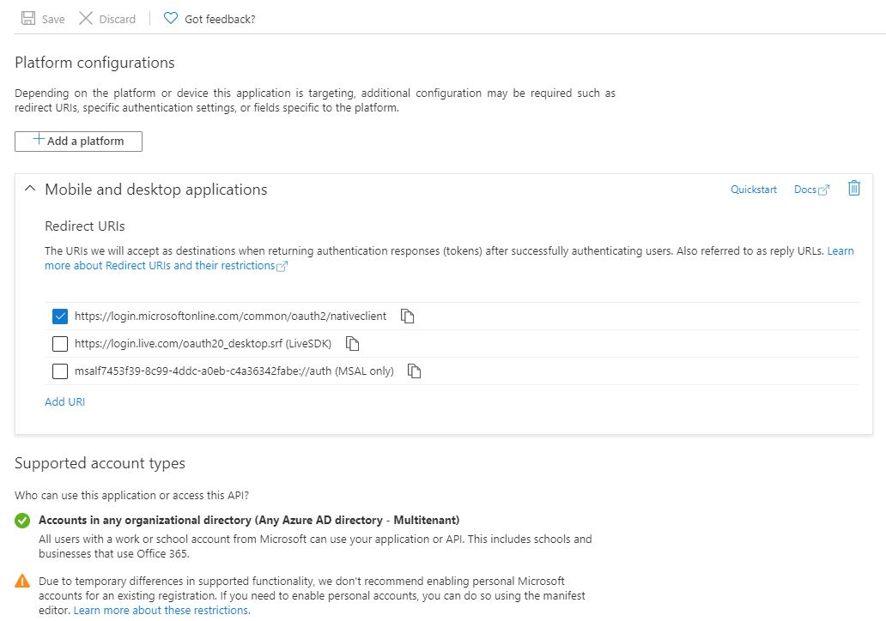

# How to configure access to specific Microsoft Azure deployments
In some cases it is a requirement to utilise specific Microsoft Azure cloud deployments to conform with data and security reuqirements that requires data to reside within the geographic borders of that country.
Current national clouds that are supported are:
*   Microsoft Cloud for US Government
*   Microsoft Cloud Germany
*   Azure and Office 365 operated by 21Vianet in China

In order to sucessfully use these specific Microsoft Azure deployments, the following steps are required:
1. Register an application with the Microsoft identity platform using the Azure portal
2. Configure the new application with the appropriate authentication scopes
3. Validate that the authentication / redirect URI is correct for your application registration
4. Configure the onedrive client to use the new application id as provided during application registration
5. Configure the onedrive client to use the right Microsoft Azure deployment region that your application was registered with
6. Authenticate the client

## Step 1: Register a new application with Microsoft Azure
1. Log into [Microsoft Azure](https://portal.azure.com/) with your applicable identity
2. Select 'Azure Active Directory' as the service you wish to configure
3. Under 'Manage', select 'App registrations' to register a new application
4. Click 'New registration'
5. Type in the appropriate details required as per below:


6. To save the application registration, click 'Register' and something similar to the following will be displayed:


**Note:** The Application (client) ID UUID as displayed after client registration, is what is required as the 'application_id' for Step 4 below.

## Step 2: Configure application authentication scopes
Configure the API permissions as per the following:

| API / Permissions name | Type | Description | Admin consent required |
|---|---|---|---|
| Files.ReadWrite | Delegated | Have full access to user files | No |
| Files.ReadWrite.All  | Delegated | Have full access to all files user can access | No |
| offline_access   | Delegated | Maintain access to data you have given it access to | No |
| Sites.Read.All   | Delegated | Read items in all site collections | No |
| Sites.ReadWrite.All   | Delegated | Edit or delete items in all site collections | No |


## Step 3: Validate that the authentication / redirect URI is correct
Add the appropriate redirect URI for your Azure deployment:



A valid entry for the response URI should be one of:
*   https://login.microsoftonline.us/common/oauth2/nativeclient (Microsoft Cloud for US Government)
*   https://login.microsoftonline.de/common/oauth2/nativeclient (Microsoft Cloud Germany)
*   https://login.chinacloudapi.cn/common/oauth2/nativeclient (Azure and Office 365 operated by 21Vianet in China)

## Step 4: Configure the onedrive client to use new application registration
Update to your 'onedrive' configuration file (`~/.config/onedrive/config`) the following:
```text
application_id = "insert valid entry here"
```

This will reconfigure the client to use the new application registration you have created.

**Example:**
```text
application_id = "22c49a0d-d21c-4792-aed1-8f163c982546"
```

## Step 5: Confgure the onedrive client to use the specific Microsoft Azure deployment
Update to your 'onedrive' configuration file (`~/.config/onedrive/config`) the following:
```text
azure_ad_endpoint = "insert valid entry here"
```

Valid entries are:
*   USL4 (Microsoft Cloud for US Government)
*   USL5 (Microsoft Cloud for US Government - DOD)
*   DE (Microsoft Cloud Germany)
*   CN (Azure and Office 365 operated by 21Vianet in China)

This will configure your client to use the correct Azure AD and Graph endpoints as per [https://docs.microsoft.com/en-us/graph/deployments](https://docs.microsoft.com/en-us/graph/deployments)

**Example:**
```text
azure_ad_endpoint = "USL4"
```

## Step 6: Authenticate the client
Run the application without any additional command switches.

You will be asked to open a specific URL by using your web browser where you will have to login into your Microsoft Account and give the application the permission to access your files. After giving permission to the application, you will be redirected to a blank page. Copy the URI of the blank page into the application.
```text
[user@hostname ~]$ onedrive 

Authorize this app visiting:

https://.....

Enter the response uri: 

```

**Example:**
```
[user@hostname ~]$ onedrive 
Authorize this app visiting:

https://login.microsoftonline.com/common/oauth2/v2.0/authorize?client_id=22c49a0d-d21c-4792-aed1-8f163c982546&scope=Files.ReadWrite%20Files.ReadWrite.all%20Sites.ReadWrite.All%20offline_access&response_type=code&redirect_uri=https://login.microsoftonline.com/common/oauth2/nativeclient

Enter the response uri: https://login.microsoftonline.com/common/oauth2/nativeclient?code=<redacted>

Application has been successfully authorised, however no additional command switches were provided.

Please use --help for further assistance in regards to running this application.
```
