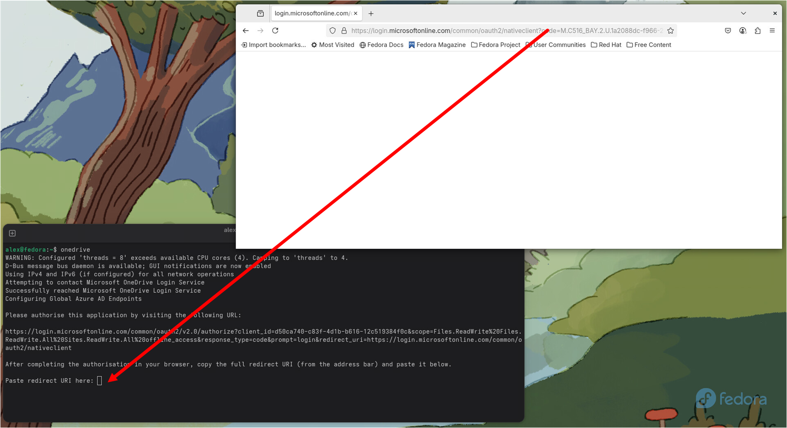
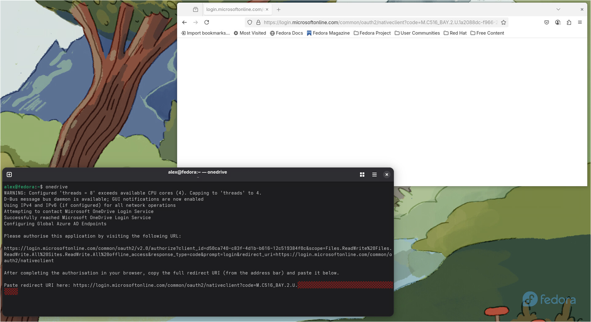
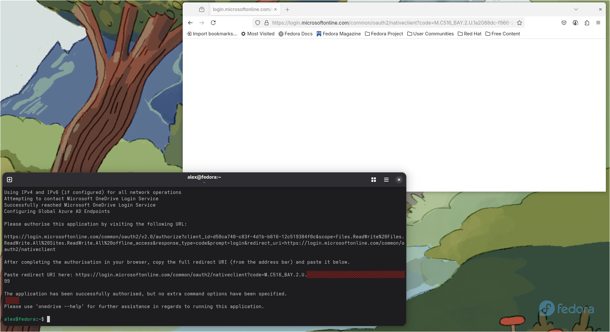

# Using the OneDrive Client for Linux
## Application Version
Before reading this document, please ensure you are running application version [](https://github.com/abraunegg/onedrive/releases) or greater. Use `onedrive --version` to determine what application version you are using and upgrade your client if required.

## Table of Contents

- [Important Notes](#important-notes)
  - [Memory Usage](#memory-usage)
  - [Guidelines for Local File and Folder Naming in the Synchronisation Directory](#guidelines-for-local-file-and-folder-naming-in-the-synchronisation-directory)
  - [Support for Microsoft Azure Information Protected Files](#support-for-microsoft-azure-information-protected-files)
  - [Compatibility with Editors and Applications Using Atomic Save Operations](#compatibility-with-editors-and-applications-using-atomic-save-operations)
  - [Compatibility with Obsidian](#compatibility-with-obsidian)
  - [Compatibility with curl](#compatibility-with-curl)
- [First Steps](#first-steps)
  - [Authorise the Application with Your Microsoft OneDrive Account](#authorise-the-application-with-your-microsoft-onedrive-account)
  - [Display Your Applicable Runtime Configuration](#display-your-applicable-runtime-configuration)
  - [Understanding OneDrive Client for Linux Operational Modes](#understanding-onedrive-client-for-linux-operational-modes)
    - [Standalone Synchronisation Operational Mode (Standalone Mode)](#standalone-synchronisation-operational-mode-standalone-mode)
    - [Ongoing Synchronisation Operational Mode (Monitor Mode)](#ongoing-synchronisation-operational-mode-monitor-mode)
- [Using the OneDrive Client for Linux to synchronise your data](#using-the-onedrive-client-for-linux-to-synchronise-your-data)
  - [Client Documentation](#client-documentation)
  - [Increasing application logging level](#increasing-application-logging-level)
  - [Using 'Client Side Filtering' rules to determine what should be synced with Microsoft OneDrive](#using-client-side-filtering-rules-to-determine-what-should-be-synced-with-microsoft-onedrive)
  - [Testing your configuration](#testing-your-configuration)
  - [Performing a sync with Microsoft OneDrive](#performing-a-sync-with-microsoft-onedrive)
  - [Performing a single directory synchronisation with Microsoft OneDrive](#performing-a-single-directory-synchronisation-with-microsoft-onedrive)
  - [Performing a 'one-way' download synchronisation with Microsoft OneDrive](#performing-a-one-way-download-synchronisation-with-microsoft-onedrive)
  - [Performing a 'one-way' upload synchronisation with Microsoft OneDrive](#performing-a-one-way-upload-synchronisation-with-microsoft-onedrive)
  - [Performing a selective synchronisation via 'sync_list' file](#performing-a-selective-synchronisation-via-sync_list-file)
  - [Performing a --resync](#performing-a---resync)
  - [Performing a --force-sync without a --resync or changing your configuration](#performing-a---force-sync-without-a---resync-or-changing-your-configuration)
  - [Enabling the Client Activity Log](#enabling-the-client-activity-log)
    - [Client Activity Log Example:](#client-activity-log-example)
    - [Client Activity Log Differences](#client-activity-log-differences)
  - [Display Manager Integration](#display-manager-integration)
  - [GUI Notifications](#gui-notifications)
  - [Using a local Recycle Bin](#using-a-local-recycle-bin)
  - [Handling a Microsoft OneDrive Account Password Change](#handling-a-microsoft-onedrive-account-password-change)
  - [Determining the synchronisation result](#determining-the-synchronisation-result)
  - [Resumable Transfers](#resumable-transfers)
  
- [Frequently Asked Configuration Questions](#frequently-asked-configuration-questions)
  - [How to change the default configuration of the client?](#how-to-change-the-default-configuration-of-the-client)
  - [How to change where my data from Microsoft OneDrive is stored?](#how-to-change-where-my-data-from-microsoft-onedrive-is-stored)
  - [Why does the client create 'safeBackup' files?](#why-does-the-client-create-safebackup-files)
  - [How to change what file and directory permissions are assigned to data that is downloaded from Microsoft OneDrive?](#how-to-change-what-file-and-directory-permissions-are-assigned-to-data-that-is-downloaded-from-microsoft-onedrive)
  - [How are uploads and downloads managed?](#how-are-uploads-and-downloads-managed)
  - [How to only sync a specific directory?](#how-to-only-sync-a-specific-directory)
  - [How to 'skip' files from syncing?](#how-to-skip-files-from-syncing)
  - [How to 'skip' directories from syncing?](#how-to-skip-directories-from-syncing)
  - [How to 'skip' .files and .folders from syncing?](#how-to-skip-files-and-folders-from-syncing)
  - [How to 'skip' files larger than a certain size from syncing?](#how-to-skip-files-larger-than-a-certain-size-from-syncing)
  - [How to 'rate limit' the application to control bandwidth consumed for upload & download operations?](#how-to-rate-limit-the-application-to-control-bandwidth-consumed-for-upload--download-operations)
  - [How can I prevent my local disk from filling up?](#how-can-i-prevent-my-local-disk-from-filling-up)
  - [How does the client handle symbolic links?](#how-does-the-client-handle-symbolic-links)
  - [How to synchronise OneDrive Personal Shared Folders?](#how-to-synchronise-onedrive-personal-shared-folders)
  - [How to synchronise OneDrive Business Shared Items (Files and Folders)?](#how-to-synchronise-onedrive-business-shared-items-files-and-folders)
  - [How to synchronise SharePoint / Office 365 Shared Libraries?](#how-to-synchronise-sharepoint--office-365-shared-libraries)
  - [How to Create a Shareable Link?](#how-to-create-a-shareable-link)
  - [How to Synchronise Both Personal and Business Accounts at once?](#how-to-synchronise-both-personal-and-business-accounts-at-once)
  - [How to Synchronise Multiple SharePoint Libraries simultaneously?](#how-to-synchronise-multiple-sharepoint-libraries-simultaneously)
  - [How to Receive Real-time Changes from Microsoft OneDrive Service, instead of waiting for the next sync period?](#how-to-receive-real-time-changes-from-microsoft-onedrive-service-instead-of-waiting-for-the-next-sync-period)
  - [How to initiate the client as a background service?](#how-to-initiate-the-client-as-a-background-service)
    - [OneDrive service running as root user via init.d](#onedrive-service-running-as-root-user-via-initd)
    - [OneDrive service running as root user via systemd (Arch, Ubuntu, Debian, OpenSuSE, Fedora)](#onedrive-service-running-as-root-user-via-systemd-arch-ubuntu-debian-opensuse-fedora)
    - [OneDrive service running as root user via systemd (Red Hat Enterprise Linux, CentOS Linux)](#onedrive-service-running-as-root-user-via-systemd-red-hat-enterprise-linux-centos-linux)
    - [OneDrive service running as a non-root user via systemd (All Linux Distributions)](#onedrive-service-running-as-a-non-root-user-via-systemd-all-linux-distributions)
    - [OneDrive service running as a non-root user via systemd (with notifications enabled) (Arch, Ubuntu, Debian, OpenSuSE, Fedora)](#onedrive-service-running-as-a-non-root-user-via-systemd-with-notifications-enabled-arch-ubuntu-debian-opensuse-fedora)
    - [OneDrive service running as a non-root user via runit (antiX, Devuan, Artix, Void)](#onedrive-service-running-as-a-non-root-user-via-runit-antix-devuan-artix-void)
  - [How to start a user systemd service at boot without user login?](#how-to-start-a-user-systemd-service-at-boot-without-user-login)
  - [How to access Microsoft OneDrive service through a proxy](#how-to-access-microsoft-onedrive-service-through-a-proxy)
  - [How to set up SELinux for a sync folder outside of the home folder](#how-to-set-up-selinux-for-a-sync-folder-outside-of-the-home-folder)
- [Advanced Configuration of the OneDrive Client for Linux](#advanced-configuration-of-the-onedrive-client-for-linux)
- [Overview of all OneDrive Client for Linux CLI Options](#overview-of-all-onedrive-client-for-linux-cli-options)

## Important Notes

### Memory Usage
Starting with version 2.5.x, the application has been completely rewritten. It is crucial to understand the memory requirements to ensure the application runs smoothly on your system.

During a `--resync` or full online scan, the OneDrive Client may use approximately 1GB of memory for every 100,000 objects stored online. This is because the client retrieves data for all objects via the OneDrive API before processing them locally. Once this process completes, the memory is freed. To avoid performance issues, ensure your system has sufficient available memory. If the system starts using swap space due to insufficient free memory, this can significantly slow down the application and impact overall performance.

To avoid potential system instability or the client being terminated by your Out-Of-Memory (OOM) process monitors, please ensure your system has sufficient memory allocated or configure adequate swap space.

### Guidelines for Local File and Folder Naming in the Synchronisation Directory
To ensure seamless synchronisation with Microsoft OneDrive, it's critical to adhere strictly to the prescribed naming conventions for your files and folders within the sync directory. The guidelines detailed below are designed to preempt potential sync failures by aligning with Microsoft Windows Naming Conventions, coupled with specific OneDrive restrictions.

> [!WARNING]
> Failure to comply will result in synchronisation being bypassed for the offending files or folders, necessitating a rename of the local item to establish sync compatibility.

#### Key Restrictions and Limitations
* Invalid Characters: 
  * Avoid using the following characters in names of files and folders: `" * : < > ? / \ |`
  * Names should not start or end with spaces
  * Names should not end with a fullstop / period character `.`
* Prohibited Names: 
  * Certain names are reserved and cannot be used for files or folders: `.lock`, `CON`, `PRN`, `AUX`, `NUL`, `COM0 - COM9`, `LPT0 - LPT9`, `desktop.ini`, any filename starting with `~$`
  * The text sequence `_vti_` cannot appear anywhere in a file or directory name
  * A file and folder called `forms` is unsupported at the root level of a synchronisation directory
* Path Length
  * All files and folders stored in your 'sync_dir' (typically `~/OneDrive`) must not have a path length greater than:
    * 400 characters for OneDrive Business & SharePoint
    * 430 characters for OneDrive Personal

Should a file or folder infringe upon these naming conventions or restrictions, synchronisation will skip the item, indicating an invalid name according to Microsoft Naming Convention. The only remedy is to rename the offending item. This constraint is by design and remains firm.

> [!TIP]
> The UTF-16 character set provides a capability to use alternative characters to work around the restrictions and limitations imposed by Microsoft OneDrive. An example of some replacement characters are below:
> | Standard Invalid Character | Potential UTF-16 Replacement Character |
> |--------------------|------------------------------|
> | .                  | ․ (One Dot Leader, `\u2024`)  |
> | :                  | ː (Modifier Letter Triangular Colon, `\u02D0`) |
> | \|                 | │ (Box Drawings Light Vertical, `\u2502`)       |

> [!CAUTION]
> The last critically important point is that Microsoft OneDrive does not adhere to POSIX standards, which fundamentally impacts naming conventions. In Unix environments (which are POSIX compliant), files and folders can exist simultaneously with identical names if their capitalisation differs. **This is not possible on Microsoft OneDrive.** If such a scenario occurs, the OneDrive Client for Linux will encounter a conflict, preventing the synchronisation of the conflicting file or folder. This constraint is a conscious design choice and is immutable. To avoid synchronisation issues, preemptive renaming of any conflicting local files or folders is advised.

#### Further reading:
The above guidelines are essential for maintaining synchronisation integrity with Microsoft OneDrive. Adhering to them ensures your files and folders sync without issue. For additional details, consult the following resources:
* [Microsoft Windows Naming Conventions](https://docs.microsoft.com/windows/win32/fileio/naming-a-file)
* [Restrictions and limitations in OneDrive and SharePoint](https://support.microsoft.com/en-us/office/restrictions-and-limitations-in-onedrive-and-sharepoint-64883a5d-228e-48f5-b3d2-eb39e07630fa)

**Adherence to these guidelines is not optional but mandatory to avoid sync disruptions.**

### Support for Microsoft Azure Information Protected Files
> [!CAUTION]
> If you are using OneDrive Business Accounts and your organisation implements Azure Information Protection, these AIP files will report as one size & hash online, but when downloaded, will report a totally different size and hash. This is due to how the Microsoft Graph API handles AIP files and how Microsoft SharePoint (the technology behind Microsoft OneDrive for Business) serves these files via the API.
>
> By default these files will fail integrity checking and be deleted locally, meaning that AIP files will not reside on your platform. These AIP files will be flagged as a failed download during application operation.
> 
> If you chose to enable `--disable-download-validation` , the AIP files will download to your platform, however, if there are any other genuine download failures where the size and hash are different, these too will be retained locally meaning you may experience data integrity loss. This is due to the Microsoft Graph API lacking any capability to identify up-front that a file utilises AIP, thus zero capability to differentiate between AIP and non-AIP files for failure detection.
> 
> Please use the `--disable-download-validation` option with extreme caution and understand the risk if you enable it.

### Compatibility with Editors and Applications Using Atomic Save Operations

Many modern editors and applications—including `vi`, `vim`, `nvim`, `emacs`, `LibreOffice`, `Obsidian` and others—use *atomic save* strategies to preserve data integrity when writing files. This section outlines how such operations interact with the `onedrive` client, what users can expect, and why certain side effects (such as editor warnings or perceived timestamp discrepancies) may occur.

#### How Atomic Save Operations Work

When these applications save a file, they typically follow this sequence:

1. **Create a Temporary File**  
   A new file is written with the updated content, often in the same directory as the original.

2. **Flush to Disk**  
   The temporary file is flushed to disk using `fsync()` or an equivalent method to ensure data safety.

3. **Atomic Rename**  
   The temporary file is renamed to the original filename using the `rename()` syscall.  
   This is an atomic operation on Linux, meaning the original file is *replaced*, not modified.

4. **Remove Lock or Swap Files**  
   Auxiliary files used during editing (e.g., `.swp`, `.#filename`) are deleted.

As a result, the saved file is **technically a new file** with a new inode and a new timestamp, even if the filename remains unchanged.

#### How This Affects the OneDrive Client

When the `onedrive` client observes such an atomic save operation via `inotify`, it detects:

- The original file as *deleted*.
- A new file (with the same name) as *created*.

The client responds accordingly:

- The "new" file is uploaded to Microsoft OneDrive.
- After upload, Microsoft assigns its own *modification timestamp* to the file.
- To ensure consistency between local and remote states, the client updates the local file’s timestamp to match the **exact time** stored in OneDrive.

> [!IMPORTANT]
> Microsoft OneDrive does **not support fractional-second precision** in file timestamps—only whole seconds. As a result, small discrepancies may occur if the local file system supports higher-resolution timestamps.

This behaviour ensures accurate syncing and content integrity, but may lead to subtle side effects in timestamp-sensitive applications.

#### Expected Side Effects

- **Timestamp Alignment for Atomic Saves**  
  Editors that rely on local file timestamps (rather than content checksums) can issue warnings that a file had changed unexpectedly—typically because the `onedrive` client potentially updated the modification time after upload.
  This client attempts to preserve the original modification timestamp only if fractional seconds differ, preventing unnecessary local timestamp changes. As a result, editors such as `vi`, `vim`, `nvim`, `emacs`, `LibreOffice` and `Obsidian` should not trigger warnings when saving files using atomic operations.

- **False Conflict Prompts (Collaborative Editing)**  
  In collaborative editing scenarios—such as with LibreOffice or shared OneDrive folders—conflict prompts may still occur if another user or device modifies a file, resulting in a meaningful timestamp or content change.  
  However, for local edits using atomic save methods, the client now avoids unnecessary timestamp updates, effectively eliminating false conflicts in those cases.

#### Recommendation

If you are using editors that rely on strict timestamp semantics and wish to minimise interference from the `onedrive` client:

- Save your work, then pause or temporarily stop sync (`onedrive --monitor`).
- Resume syncing when finished.
- Configure the client to ignore temporary files your editor uses via the `skip_file` setting if they do not need to be synced.
- Configure the client to use 'session uploads' for all files via the `force_session_upload` setting. This option, when enabled, forces the client to use a 'session' upload, which, when the 'file' is uploaded by the session, this includes the actual local timestamp (without fractional seconds) of the file that Microsoft OneDrive should store.

#### Summary

The `onedrive` client is fully compatible with applications that use atomic save operations. Users should be aware that:

- Atomic saves result in the file being treated as a new item.
- Timestamps may be adjusted post-upload to match OneDrive's stored value.
- In rare cases, timestamp-sensitive applications may display warnings or prompts.

This behaviour is by design and ensures consistency and data integrity between your local filesystem and the OneDrive cloud.

### Compatibility with Obsidian
Obsidian on Linux does not provide a built-in way to disable atomic saves or switch to a backup-copy method via configuration. The application is built on Electron and relies on the default save behaviour of its underlying libraries and editor components (such as CodeMirror), which typically perform *atomic writes* using the following process:

1. A temporary file is created containing the updated content.
2. That temporary file is flushed to disk.
3. The temporary file is atomically renamed to replace the original file.

This behaviour is intended to improve data integrity and crash resilience, but it results in high disk I/O — particularly in Obsidian, where auto-save is triggered nearly every keystroke.

> [!IMPORTANT]
> Obsidian provides no mechanism to change how this save behaviour operates. This is a serious design limitation and should be treated as a bug in the application. The excessive and unnecessary write operations can significantly reduce the lifespan of SSDs over time due to increased wear, leading to broader consequences for system reliability.

#### How This Affects the OneDrive Client

Because Obsidian is constantly writing files, running the OneDrive Client for Linux in `--monitor` mode causes the client to continually receive inotify events from the local file system. This leads to constant re-uploading of files, regardless of whether meaningful content has changed.

The consequences of this are:

1. Continuous upload attempts to Microsoft OneDrive.
2. Potential for repeated overwrites of online data.
3. Excessive API usage, which may result in Microsoft throttling your access — subsequently affecting the client’s ability to synchronise files reliably.

#### Recommendation

If you use Obsidian, it is *strongly* recommended that you enable the following two configuration options in your OneDrive Client for Linux `config` file:
```
force_session_upload = "true"
delay_inotify_processing = "true"
```
These settings introduce a delay in processing local file change events, allowing the OneDrive Client for Linux to batch or debounce Obsidian's frequent writes. By default, this delay is 5 seconds.

To adjust this delay, you can add the following configuration option:
```
inotify_delay = "10"
```
This example sets the delay to 10 seconds.

> [!CAUTION]
> Increasing `inotify_delay` too aggressively may have unintended side effects. All file system events are queued and processed in order, so setting a very high delay could result in large backlogs or undesirable data synchronisation outcomes — particularly in cases of rapid file changes or deletions.
>
> Adjust this setting with extreme caution and test thoroughly to ensure it does not impact your workflow or data integrity.

> [!TIP]
> An Obsidian Plugin also exists to 'control' the auto save behaviour of Obsidian.
> 
> Instead of saving every two seconds from start of typing (Obsidian default), this plugin makes Obsidian wait for the user to finish with editing, and after the input stops, it waits for a defined time (by default 10 seconds) and then it only saves once.
> 
> For more information please read: https://github.com/mihasm/obsidian-autosave-control 


### Compatibility with curl
If your system uses curl < 7.47.0, curl will default to HTTP/1.1 for HTTPS operations, and the client will follow suit, using HTTP/1.1.

For systems running curl >= 7.47.0 and < 7.62.0, curl will prefer HTTP/2 for HTTPS, but it will still use HTTP/1.1 as the default for these operations. The client will employ HTTP/1.1 for HTTPS operations as well.

However, if your system employs curl >= 7.62.0, curl will, by default, prioritise HTTP/2 over HTTP/1.1. In this case, the client will utilise HTTP/2 for most HTTPS operations and stick with HTTP/1.1 for others. Please note that this distinction is governed by the OneDrive platform, not our client.

If you explicitly want to use HTTP/1.1, you can do so by using the `--force-http-11` flag or setting the configuration option `force_http_11 = "true"`. This will compel the application to exclusively use HTTP/1.1. Otherwise, all client operations will align with the curl default settings for your distribution.

#### Known curl bugs that impact the use of this client
| id | curl bug | fixed in curl version |
|----|----------|-----------------------|
| 1  | HTTP/2 support: Introduced HTTP/2 support, enabling multiplexed transfers over a single connection | 7.47.0 |
| 2  | HTTP/2 issue: Resolved an issue where HTTP/2 connections were not properly reused, leading to unnecessary new connections. | 7.68.0 |
| 3  | HTTP/2 issue: Addressed a race condition in HTTP/2 multiplexing that could lead to unexpected behaviour. | 7.74.0 |
| 4  | HTTP/2 issue: Improved handling of HTTP/2 priority frames to ensure proper stream prioritisation. | 7.81.0 |
| 5  | HTTP/2 issue: Fixed a bug where HTTP/2 connections were prematurely closed, resulting in incomplete data transfers. | 7.88.1 |
| 6  | HTTP/2 issue: Resolved a problem with HTTP/2 frame handling that could cause data corruption during transfers. | 8.2.1 |
| 7  | HTTP/2 issue: Corrected an issue where HTTP/2 streams were not properly closed, leading to potential memory leaks. | 8.5.0 |
| 8  | HTTP/2 issue: Addressed a bug where HTTP/2 connections could hang under specific conditions, improving reliability. | 8.8.0 |
| 9  | HTTP/2 issue: Improved handling of HTTP/2 connections to prevent unexpected stream resets and enhance stability. | 8.9.0 |
| 10 | SIGPIPE issue: Resolved a problem where SIGPIPE signals were not properly handled, leading to unexpected behaviour. | 8.9.1 |
| 11 | SIGPIPE issue: Addressed a SIGPIPE leak that occurred in certain cases starting with version 8.9.1 | 8.10.0 |
| 12 | HTTP/2 issue: Stopped offering ALPN `http/1.1` for `http2-prior-knowledge` to ensure proper protocol negotiation. | 8.10.0 |
| 13 | HTTP/2 issue: Improved handling of end-of-stream (EOS) and blocked states to prevent unexpected behaviour.| 8.11.0 |
| 14 | OneDrive operation encountered an issue with libcurl reading the local SSL CA Certificates issue | 8.14.1 |

#### Known curl versions with compatibility issues for this client
| curl Version | distribution | curl bugs |
|--------------|--------------|-----------|
| 7.68.0       | Ubuntu 20.04 LTS (Focal Fossa) | 2,3,4,5,6,7,8,9,10,11,12,13 |
| 7.74.0       | Debian 11 (Bullseye) | 4,5,6,7,8,9,10,11,12,13 |
| 7.81.0       | Ubuntu 22.04 LTS (Jammy Jellyfish) | 5,6,7,8,9,10,11,12,13 |
| 7.88.1       | Debian 12 (Bookworm) | 6,7,8,9,10,11,12,13 |
| 8.2.1        | Alpine Linux 3.14 | 7,8,9,10,11,12,13 |
| 8.5.0        | Alpine Linux 3.15, Ubuntu 24.04 LTS (Noble Numbat) | 8,9,10,11,12,13 |
| 8.9.1        | Ubuntu 24.10 (Oracular Oriole) | 11,12,13 |
| 8.10.0       | Alpine Linux 3.17 | 13 |
| 8.13.0       | Various + Self Compiled | 14 |
| 8.13.1       | Various + Self Compiled | 14 |
| 8.14.0       | Various + Self Compiled | 14 |

> [!IMPORTANT]
> If your distribution provides one of these curl versions you must upgrade your curl version to the latest available, or get your distribution to provide a more modern version of curl. Refer to [curl releases](https://curl.se/docs/releases.html) for curl version information.
>
> If you are using one of the above curl versions, the following application message will be generated:
> ```text
> WARNING: Your curl/libcurl version (curl.version.number) has known HTTP/2 bugs that impact the use of this application.
>          Please report this to your distribution and request that they provide a newer curl version for your platform or upgrade this yourself.
>          Downgrading all application operations to use HTTP/1.1 to ensure maximum operational stability.
>          Please read https://github.com/abraunegg/onedrive/blob/master/docs/usage.md#compatibility-with-curl for more information.
> ```
>
> The WARNING line will be sent to the GUI for notification purposes if notifications have been enabled. To avoid this message and/or the GUI notification your only have 2 options:
> 1. Upgrade your curl version on your platform
> 2. Configure the client to always downgrade client operations to HTTP/1.1 and use IPv4 only
>
> If you are unable to upgrade your version of curl, to always downgrade client operations to HTTP/1.1 you must add the following to your config file:
> ```text
> force_http_11 = "true"
> ip_protocol_version = "1"
> ```
> When these two options are applied to your application configuration, the following application message will be generated:
> ```text
> WARNING: Your curl/libcurl version (curl.version.number) has known operational bugs that impact the use of this application.
>          Please report this to your distribution and request that they provide a newer curl version for your platform or upgrade this yourself.
> ```
>
> The WARNING line will be now only be written to application logging output, no longer sending a GUI notification message.

> [!IMPORTANT]
> Outside of the above known broken curl versions, there are significant HTTP/2 bugs in all curl versions < 8.6.x that can lead to HTTP/2 errors such as `Error in the HTTP2 framing layer on handle` or `Stream error in the HTTP/2 framing layer on handle`
>
> The only options to resolve this issue are the following:
> 1. Upgrade your curl version to the latest available, or get your distribution to provide a more modern version of curl. Refer to [curl releases](https://curl.se/docs/releases.html) for curl version information.
> 2. Configure the client to only use HTTP/1.1 via the config option `--force-http-11` flag or set the configuration file option `force_http_11 = "true"`

> [!IMPORTANT]
> Outside of the above known broken curl versions, it has also been evidenced that curl has an internal DNS resolution bug that at random times will skip using IPv4 for DNS resolution and only uses IPv6 DNS resolution when the host system is configured to use IPv4 and IPv6 addressing.
> 
> As a result of this internal curl resolution bug, if your system does not have an IPv6 DNS resolver, and/or does not have a valid IPv6 network path to Microsoft OneDrive, you may encounter these errors: 
> 
> * `A libcurl timeout has been triggered - data transfer too slow, no DNS resolution response, no server response`
> * `Could not connect to server on handle ABC12DEF3456`
>
> The only options to resolve this issue are the following:
> 1. Implement and/or ensure that IPv6 DNS resolution is possible on your system; allow IPv6 network connectivity between your system and Microsoft OneDrive
> 2. Configure the client to only use IPv4 DNS resolution via setting the configuration option `ip_protocol_version = "1"`

> [!IMPORTANT]
> If you are using Debian 12 or Linux Mint Debian Edition (LMDE) 6, you can install the latest curl version from the respective backports repositories to address the bugs present in the default Debian 12 curl version.

> [!CAUTION]
> If you continue to use a curl/libcurl version with known HTTP/2 bugs the application will automatically downgrade HTTP operations to HTTP/1.1, however you will continue to experience application runtime issues such as randomly exiting for zero reason or incomplete download/upload of your data.

## First Steps

### Authorise the Application with Your Microsoft OneDrive Account
Once you've installed the application, you'll need to authorise it using your Microsoft OneDrive Account. This can be done by simply running the application without any additional command switches.

Please be aware that some organisations may require you to explicitly add this app to the [Microsoft MyApps portal](https://myapps.microsoft.com/). To add an approved app to your apps, click on the ellipsis in the top-right corner and select "Request new apps." On the next page, you can add this app. If it's not listed, you should make a request through your IT department.

This client supports the following methods to authenticate the application with Microsoft OneDrive:
* Supports interactive browser-based authentication using OAuth2 and a redirect URI
* Supports seamless Single Sign-On (SSO) via Intune using the Microsoft Identity Device Broker D-Bus interface
* Supports OAuth2 Device Authorisation Flow for Microsoft Entra ID accounts

#### Interactive Authentication using OAuth2 and a redirect URI
When you run the application for the first time, you'll be prompted to open a specific URL in your web browser. This URL takes you to the Microsoft login page, where you’ll sign in with your Microsoft Account and grant the application permission to access your files.

After granting permission, your browser will redirect you to a blank page. This is expected behaviour.

At this point, copy the full redirect URI shown in your browser's address bar and paste it into the terminal where prompted.

**Example Terminal Session:**
```text
user@hostname:~$ onedrive
D-Bus message bus daemon is available; GUI notifications are now enabled
Using IPv4 and IPv6 (if configured) for all network operations
Attempting to contact Microsoft OneDrive Login Service
Successfully reached Microsoft OneDrive Login Service
Configuring Global Azure AD Endpoints

Please authorise this application by visiting the following URL:

https://login.microsoftonline.com/common/oauth2/v2.0/authorize?client_id=d50ca740-c83f-4d1b-b616-12c519384f0c&scope=Files.ReadWrite%20Files.ReadWrite.All%20Sites.ReadWrite.All%20offline_access&response_type=code&prompt=login&redirect_uri=https://login.microsoftonline.com/common/oauth2/nativeclient

After completing the authorisation in your browser, copy the full redirect URI (from the address bar) and paste it below.

Paste redirect URI here: https://login.microsoftonline.com/common/oauth2/nativeclient?code=<redacted>

The application has been successfully authorised, but no extra command options have been specified.

Please use 'onedrive --help' for further assistance in regards to running this application.

user@hostname:~$ 

```

**Interactive Authentication Process Illustrated:**








> [!IMPORTANT]
> Without additional input or configuration, the OneDrive Client for Linux will automatically adhere to default application settings during synchronisation processes with Microsoft OneDrive.


#### Single Sign-On (SSO) via Intune using the Microsoft Identity Device Broker 
To use this method of authentication, you must add the following configuration to your 'config' file:
```
use_intune_sso = "true"
```
The application will check to ensure that Intune is operational and that the required dbus elements are available. Should these be available, the following will be displayed:
```
...
Client has been configured to use Intune SSO via Microsoft Identity Broker dbus session - checking usage criteria
Intune SSO via Microsoft Identity Broker dbus session usage criteria met - will attempt to authenticate via Intune
...
```
> [!NOTE]
> The installation and configuration of Intune for your platform is beyond the scope of this documentation.

#### OAuth2 Device Authorisation Flow for Microsoft Entra ID accounts
To use this method of authentication, you must add the following configuration to your 'config' file:
```
use_device_auth = "true"
```
You will be required to open a URL using a web browser, and enter the code that this application presents:
```
Configuring Global Azure AD Endpoints

Authorise this application by visiting:

https://microsoft.com/devicelogin

Enter the following code when prompted: ABCDEFGHI

This code expires at: 2025-Jun-02 15:27:30
```
You will have ~15 minutes before the code expires.

> [!IMPORTANT]
> #### Limitation: OAuth2 Device Authorization Flow and Personal Microsoft Accounts
>
> While the OneDrive Client for Linux fully supports OAuth2 Device Authorisation Flow (`device_code` grant) for **Microsoft Entra ID (Work/School)** accounts, **Microsoft currently does not allow this flow to be used with personal Microsoft accounts (MSA)** unless the application is explicitly authorised by Microsoft.
>
> **Application Configuration Summary:**
>
> - `signInAudience`: `AzureADandPersonalMicrosoftAccount`
> - `allowPublicClient`: `true`
> - Uses Microsoft Identity Platform v2.0 endpoints (`/devicecode`, `/token`, etc.)
> - Microsoft Graph scopes properly defined
>
> Despite this correct configuration, users signing in with a Personal Microsoft OneDrive account will see the following error:
>
> > **"The code you entered has expired. Get a new code from the device you're trying to sign in to and try again."**
>
> This occurs even if the code is entered immediately. Microsoft redirects the user to:
>
> ```
> https://login.live.com/ppsecure/post.srf?username=......
> ```
>
> This behaviour confirms that Microsoft **blocks the `device_code` grant flow for MSA accounts** on unapproved (by Microsoft) applications.
>
> **Recommendation:**  
> If using a Personal Microsoft OneDrive account (e.g., @outlook.com or @hotmail.com), please complete authentication using the interactive authentication method detailed above.
>
> **Further Reading:**  
> 📚 [Microsoft Documentation — OAuth 2.0 device authorization grant](https://learn.microsoft.com/en-us/entra/identity-platform/v2-oauth2-device-code)

### Display Your Applicable Runtime Configuration
To verify the configuration that the application will use, use the following command:
```text
onedrive --display-config
```
This command will display all the relevant runtime interpretations of the options and configurations you are using. An example output is as follows:
```text
Reading configuration file: /home/user/.config/onedrive/config
Configuration file successfully loaded
onedrive version                             = vX.Y.Z-A-bcdefghi
Config path                                  = /home/user/.config/onedrive
Config file found in config path             = true
Config option 'drive_id'                     = 
Config option 'sync_dir'                     = ~/OneDrive
...
Config option 'webhook_enabled'              = false
```

> [!IMPORTANT]
> When using multiple OneDrive accounts, it's essential to always use the `--confdir` command followed by the appropriate configuration directory. This ensures that the specific configuration you intend to view is correctly displayed.

### Understanding OneDrive Client for Linux Operational Modes
There are two modes of operation when using the client:
1. Standalone sync mode that performs a single sync action against Microsoft OneDrive.
2. Ongoing sync mode that continuously syncs your data with Microsoft OneDrive.

> [!TIP]
> To understand further the client operational modes and how the client operates, please review the [client architecture](client-architecture.md) documentation.

> [!IMPORTANT]
> The default setting for the OneDrive Client on Linux will sync all data from your Microsoft OneDrive account to your local device. To avoid this and select specific items for synchronisation, you should explore setting up 'Client Side Filtering' rules. This will help you manage and specify what exactly gets synced with your Microsoft OneDrive account.

#### Standalone Synchronisation Operational Mode (Standalone Mode)
This method of use can be employed by issuing the following option to the client:
```text
onedrive --sync
```
For simplicity, this can be shortened to the following:
```text
onedrive -s
```

#### Ongoing Synchronisation Operational Mode (Monitor Mode)
This method of use can be utilised by issuing the following option to the client:
```text
onedrive --monitor
```
For simplicity, this can be shortened to the following:
```text
onedrive -m
```
> [!NOTE]
> This method of use is used when enabling a systemd service to run the application in the background.

Two common errors can occur when using monitor mode:
*   Initialisation failure
*   Unable to add a new inotify watch

Both of these errors are local environment issues, where the following system variables need to be increased as the current system values are potentially too low:
*   Open Files Soft limit (current session)
*   Open Files Hard limit (current session)
*   `fs.inotify.max_user_watches`

To determine what the existing values are on your system, use the following commands:

**open files**
```text
ulimit -Sn
ulimit -Hn
```

**inotify watches**
```text
sysctl fs.inotify.max_user_watches
```

Alternatively, when running the client with increased verbosity (see below), the client will display what the current configured system maximum values are:
```text
...
All application operations will be performed in the configured local 'sync_dir' directory: /home/alex/OneDrive
OneDrive synchronisation interval (seconds): 300
Maximum allowed open files (soft):           1024
Maximum allowed open files (hard):           262144
Maximum allowed inotify user watches:        29463
Initialising filesystem inotify monitoring ...
...
```
To determine what value to change to, you need to count all the files and folders in your configured 'sync_dir' location:
```text
cd /path/to/your/sync/dir
ls -laR | wc -l
```

To make a change to these variables using your file and folder count, use the following process:

**open files**

You can increase the limits for your current shell session temporarily using:
```
ulimit -n <new_value>
```
Refer to your distribution documentation to make the change persistent across reboots and sessions. 

> [!NOTE]
> systemd overrides these values for user sessions and services. If you are making a system wide change that is persistent across reboots and sessions you will also have to modify your systemd service files in the following manner:
> ```
> [Service]
> LimitNOFILE=<new_value>
> ```
> Post the modification of systemd service files you will need to reload and restart the services.

**inotify watches**
```text
sudo sysctl fs.inotify.max_user_watches=<new_value>
```
Once these values are changed, you will need to restart your client so that the new values are detected and used.

To make these changes permanent on your system, refer to your OS reference documentation.

## Using the OneDrive Client for Linux to synchronise your data

### Client Documentation

The following documents provide detailed guidance on installing, configuring, and using the OneDrive Client for Linux:

* **[advanced-usage.md](https://github.com/abraunegg/onedrive/blob/master/docs/advanced-usage.md)**
  Instructions for advanced configurations, including multiple account setups, Docker usage, dual-boot scenarios, and syncing to mounted directories.

* **[application-config-options.md](https://github.com/abraunegg/onedrive/blob/master/docs/application-config-options.md)**
  Comprehensive list and explanation of all configuration file and command-line options available in the client.

* **[application-security.md](https://github.com/abraunegg/onedrive/blob/master/docs/application-security.md)**
  Details on security considerations and practices related to the OneDrive client.

* **[business-shared-items.md](https://github.com/abraunegg/onedrive/blob/master/docs/business-shared-items.md)**
  Instructions on syncing shared items in OneDrive for Business accounts.

* **[client-architecture.md](https://github.com/abraunegg/onedrive/blob/master/docs/client-architecture.md)**
  Overview of the client's architecture and design principles.

* **[docker.md](https://github.com/abraunegg/onedrive/blob/master/docs/docker.md)**
  Instructions for running the OneDrive client within Docker containers.

* **[known-issues.md](https://github.com/abraunegg/onedrive/blob/master/docs/known-issues.md)**
  List of known issues and limitations of the OneDrive client.

* **[national-cloud-deployments.md](https://github.com/abraunegg/onedrive/blob/master/docs/national-cloud-deployments.md)**
  Information on deploying the client in national cloud environments.

* **[podman.md](https://github.com/abraunegg/onedrive/blob/master/docs/podman.md)**
  Guide for running the OneDrive client using Podman containers.

* **[sharepoint-libraries.md](https://github.com/abraunegg/onedrive/blob/master/docs/sharepoint-libraries.md)**
  Instructions for syncing SharePoint document libraries.

* **[ubuntu-package-install.md](https://github.com/abraunegg/onedrive/blob/master/docs/ubuntu-package-install.md)**
  Specific instructions for installing the client on Ubuntu systems.

* **[webhooks.md](https://github.com/abraunegg/onedrive/blob/master/docs/webhooks.md)**
  Information on configuring and using webhooks with the OneDrive client.

Further documentation not listed above can be found here: https://github.com/abraunegg/onedrive/blob/master/docs/

Please read these additional references to assist you with installing, configuring, and using the OneDrive Client for Linux.

### Increasing application logging level
When running a sync (`--sync`) or using monitor mode (`--monitor`), it may be desirable to see additional information regarding the progress and operation of the client. 

The client supports four levels of logging output:

#### 1. Normal (default)
Only essential information is shown — suitable for standard usage without additional output.

#### 2. Verbose 
Enables general status and progress information. Use:
```text
onedrive --sync --verbose

```
or its short form:
```text
onedrive -s -v
```

#### 3. Debug Logging
Enables detailed internal logging useful for diagnosing issues. This is activated by specifying the `--verbose` flag twice:
```text
onedrive --sync --verbose --verbose
```

#### 4. HTTPS Debug Logging
Enables full debug logging including HTTPS request/response information. This is typically only needed for advanced debugging of API or network issues. Activate with:
```text
onedrive --sync --verbose --verbose --debug-https
```

> [!IMPORTANT]
> When raising a bug report or attempting to understand unexpected behaviour, it is recommended to enable debug logging using `--verbose --verbose`.
>
> Only use `--debug-https` if explicitly requested or required, as it may expose sensitive information in logs.

### Using 'Client Side Filtering' rules to determine what should be synced with Microsoft OneDrive
Client Side Filtering in the context of the OneDrive Client for Linux refers to user-configured rules that determine what files and directories the client should upload or download from Microsoft OneDrive. These rules are crucial for optimising synchronisation, especially when dealing with large numbers of files or specific file types. The OneDrive Client for Linux offers several configuration options to facilitate this:

* **check_nosync:** This option allows you to create a `.nosync` file in local directories, to skip that directory from being included in sync operations.
* **skip_dir:** This option allows the user to specify directories that should not be synchronised with OneDrive. It's particularly useful for omitting large or irrelevant directories from the sync process.
* **skip_dotfiles:** Dotfiles, usually configuration files or scripts, can be excluded from the sync. This is useful for users who prefer to keep these files local.
* **skip_file:** Specific files can be excluded from synchronisation using this option. It provides flexibility in selecting which files are essential for cloud storage.
* **skip_size:** Skip files greater than this specific size (in MB)
* **skip_symlinks:** Symlinks often point to files outside the OneDrive directory or to locations that are not relevant for cloud storage. This option prevents them from being included in the sync.

Additionally, the OneDrive Client for Linux allows the implementation of Client Side Filtering rules through a 'sync_list' file. This file explicitly states which directories or files should be included in the synchronisation. By default, any item not listed in the 'sync_list' file is excluded. This method offers a more granular approach to synchronisation, ensuring that only the necessary data is transferred to and from Microsoft OneDrive.

These configurable options and the 'sync_list' file provide users with the flexibility to tailor the synchronisation process to their specific needs, conserving bandwidth and storage space while ensuring that important files are always backed up and accessible.

> [!IMPORTANT]
> Client Side Filtering rules are generally processed in the following order:
> 1. 'check_nosync'
> 2. 'skip_dotfiles'
> 3. 'skip_symlinks'
> 4. 'skip_dir'
> 5. 'skip_file'
> 6. 'sync_list'
> 7. 'skip_size'
>
> This can be best illustrated below:
> 
> 
>
> For further details please review the [client architecture](client-architecture.md) documentation.

> [!IMPORTANT]
> After changing any Client Side Filtering rule, you must perform a full re-synchronisation by using `--resync`.

### Testing your configuration
You can test your configuration by utilising the `--dry-run` CLI option. No files will be downloaded, uploaded, or removed; however, the application will display what 'would' have occurred. For example:
```text
onedrive --sync --verbose --dry-run
Reading configuration file: /home/user/.config/onedrive/config
Configuration file successfully loaded
Using 'user' Config Dir: /home/user/.config/onedrive
DRY-RUN Configured. Output below shows what 'would' have occurred.
DRY-RUN: Copying items.sqlite3 to items-dryrun.sqlite3 to use for dry run operations
DRY RUN: Not creating backup config file as --dry-run has been used
DRY RUN: Not updating hash files as --dry-run has been used
Checking Application Version ...
Attempting to initialise the OneDrive API ...
Configuring Global Azure AD Endpoints
The OneDrive API was initialised successfully
Opening the item database ...
Sync Engine Initialised with new Onedrive API instance
Application version:  vX.Y.Z-A-bcdefghi
Account Type:         <account-type>
Default Drive ID:     <drive-id>
Default Root ID:      <root-id>
Remaining Free Space: 1058488129 KB
All application operations will be performed in: /home/user/OneDrive
Fetching items from the OneDrive API for Drive ID: <drive-id> ..
...
Performing a database consistency and integrity check on locally stored data ... 
Processing DB entries for this Drive ID: <drive-id>
Processing ~/OneDrive
The directory has not changed
...
Scanning local filesystem '~/OneDrive' for new data to upload ...
...
Performing a final true-up scan of online data from Microsoft OneDrive
Fetching items from the OneDrive API for Drive ID: <drive-id> ..

Sync with Microsoft OneDrive is complete
```

### Performing a sync with Microsoft OneDrive
By default, all files are downloaded in `~/OneDrive`. This download location is controlled by the 'sync_dir' config option.

After authorising the application, a sync of your data can be performed by running:
```text
onedrive --sync
```
This will synchronise files from your Microsoft OneDrive account to your `~/OneDrive` local directory or to your specified 'sync_dir' location.

> [!TIP]
> #### Specifying the 'source of truth' for your synchronisation with Microsoft OneDrive
> By default, the OneDrive Client for Linux treats your online OneDrive data as the source of truth. This means that when determining which version of a file should be trusted as authoritative, the client prioritises the state of files stored online over local copies.
> 
> In some workflows, you may prefer to treat your local files as the primary reference instead — for example, when you regularly make changes locally and want those to take precedence during conflict resolution.
> 
> To change this behaviour, enable the local-first mode by setting the configuration option in your `config` file:
> ```text
> local_first = "true"
> ```
> or by using the command-line argument at runtime:
> ```text
> onedrive --sync --local-first
> ```
> 
> When this option is enabled, the client will prioritise local data as the source of truth when comparing file differences and resolving synchronisation conflicts.
> 

### Performing a single directory synchronisation with Microsoft OneDrive
In some cases, it may be desirable to synchronise a single directory under ~/OneDrive without having to change your client configuration. To do this, use the following command:
```text
onedrive --sync --single-directory '<dir_name>'
```

> [!TIP]
> If the full path is `~/OneDrive/mydir`, the command would be `onedrive --sync --single-directory 'mydir'`

### Performing a 'one-way' download synchronisation with Microsoft OneDrive
In some cases, it may be desirable to 'download only' from Microsoft OneDrive. To do this, use the following command:
```text
onedrive --sync --download-only
```
This will download all the content from Microsoft OneDrive to your `~/OneDrive` location. Any files that are deleted online will remain locally and will not be removed.

> [!IMPORTANT]
> There is an application functionality change between v2.4.x and v.2.5x when using this option.
>
> In prior v2.4.x releases, online deletes were automatically processed, thus automatically deleting local files that were deleted online, however there was zero way to perform a `--download-only` operation to archive the online state.
>
> In v2.5.x and above, when using `--download-only` the default is that all files will remain locally as an archive of your online data rather than being deleted locally if deleted online.

> [!TIP]
> If you have the requirement to clean up local files that have been removed online, use the following command:
> ```text
> onedrive --sync --download-only --cleanup-local-files
> ```

### Performing a 'one-way' upload synchronisation with Microsoft OneDrive
In certain scenarios, you might need to perform an 'upload only' operation to Microsoft OneDrive. This means that you'll be uploading data to OneDrive, but not synchronising any changes or additions made elsewhere. Use this command to initiate an upload-only synchronisation:

```text
onedrive --sync --upload-only
```

> [!IMPORTANT]
> - The 'upload only' mode operates independently of OneDrive's online content. It doesn't check or sync with what's already stored on OneDrive. It only uploads data from the local client.
> - If a local file or folder that was previously synchronised with Microsoft OneDrive is now missing locally, it will be deleted from OneDrive during this operation.

> [!TIP]
> If you have the requirement to ensure that all data on Microsoft OneDrive remains intact (e.g., preventing deletion of items on OneDrive if they're deleted locally), use this command instead:
> ```text
> onedrive --sync --upload-only --no-remote-delete
> ```

> [!IMPORTANT]
> - `--upload-only`: This command will only upload local changes to OneDrive. These changes can include additions, modifications, moves, and deletions of files and folders.
> - `--no-remote-delete`: Adding this command prevents the deletion of any items on OneDrive, even if they're deleted locally. This creates a one-way archive on OneDrive where files are only added and never removed.

### Performing a selective synchronisation via 'sync_list' file
Selective synchronisation allows you to sync only specific files and directories.
To enable selective synchronisation, create a file named `sync_list` in your application configuration directory (default is `~/.config/onedrive`).

> [!IMPORTANT]
> Important points to understand before using 'sync_list'.
> *    'sync_list' excludes _everything_ by default on OneDrive.
> *    'sync_list' follows an _"exclude overrides include"_ rule, and requires **explicit inclusion**.
> *    Order exclusions before inclusions, so that anything _specifically included_ is included.
> *    How and where you place your `/` matters for excludes and includes in subdirectories.

Each line of the 'sync_list' file represents a relative path from your `sync_dir`. All files and directories not matching any line of the file will be skipped during all operations. 

Additionally, the use of `/` is critically important to determine how a rule is interpreted. It is very similar to `**` wildcards, for those that are familiar with globbing patterns.
Here is an example of `sync_list`:
```text
# sync_list supports comments
#
# The ordering of entries is highly recommended - exclusions before inclusions
#
# Exclude temp folder(s) or file(s) under Documents folder(s), anywhere in OneDrive
!Documents/temp*
#
# Exclude secret data folder in root directory only
!/Secret_data/*
#
# Include everything else in root directory
# - Use 'sync_root_files' or --sync-root-files option
# Do not use /* as this will include everything including items you are expecting to be excluded
#
# Include my Backup folder(s) or file(s) anywhere on OneDrive
Backup
#
# Include my Backup folder in root
/Backup/
#
# Include Documents folder(s) anywhere in OneDrive
Documents/
#
# Include all PDF files in Documents folder(s), anywhere in OneDrive
Documents/*.pdf
#
# Include this single document in Documents folder(s), anywhere in OneDrive
Documents/latest_report.docx
#
# Include all Work/Project directories or files, inside 'Work' folder(s), anywhere in OneDrive
Work/Project*
#
# Include the 'Blog' directory, but exclude 'Parent' and any other children of the parent
# .
# ├── Parent
# │   ├── Blog
# │   │   ├── random_files
# │   │   │   ├── CZ9aZRM7U1j7pM21fH0MfP2gywlX7bqW
# │   │   │   └── k4GptfTBE2z2meRFqjf54tnvSXcXe30Y
# │   │   └── random_images
# │   │       ├── cAuQMfX7qsMIOmzyQYdELikZwsXeCYsL
# │   │       └── GqjZuo7UBB0qjYM2WUcZXOvToAhCQ29M
# │   └── other_stuffs
/Parent/Blog/*
#
# Include all "notes.txt" files, anywhere in OneDrive
notes.txt
#
# Include /Blender in the ~OneDrive root but not if elsewhere in OneDrive
/Blender
#
# Include these directories(or files) in 'Pictures' folder(s), that have a space in their name
Pictures/Camera Roll
Pictures/Saved Pictures
#
# Include these names if they match any file or folder
Cinema Soc
Codes
Textbooks
Year 2
```
The following are supported for pattern matching and exclusion rules:
*   Use the `*` to wildcard select any characters to match for the item to be included
*   Use either `!` or `-` characters at the start of the line to exclude an otherwise included item

> [!IMPORTANT]
> After changing the sync_list, you must perform a full re-synchronisation by adding `--resync` to your existing command line - for example: `onedrive --sync --resync`

> [!TIP]
> When enabling the use of 'sync_list,' utilise the `--display-config` option to validate that your configuration will be used by the application, and test your configuration by adding `--dry-run` to ensure the client will operate as per your requirement.

> [!TIP] 
> In some circumstances, it may be required to sync all the individual files within the 'sync_dir' root, but due to frequent name change / addition / deletion of these files, it is not desirable to constantly change the 'sync_list' file to include / exclude these files and force a resync. To assist with this, enable the following in your configuration file:
> ```text
> sync_root_files = "true"
> ```
> This will tell the application to sync any file that it finds in your 'sync_dir' root by default, negating the need to constantly update your 'sync_list' file.

### Performing a --resync
If you alter any of the subsequent configuration items, you will be required to execute a `--resync` to make sure your client is syncing your data with the updated configuration:
*   check_nosync
*   drive_id
*   sync_dir
*   skip_file
*   skip_dir
*   skip_dotfiles
*   skip_size
*   skip_symlinks
*   sync_business_shared_items
*   Creating, Modifying or Deleting the 'sync_list' file

Additionally, you might opt for a `--resync` if you think it's necessary to ensure your data remains in sync. If you're using this switch simply because you're unsure of the sync status, you can check the actual sync status using `--display-sync-status`.

When you use `--resync`, you'll encounter the following warning and advice:
```text
Using --resync will delete your local 'onedrive' client state, so there won't be a record of your current 'sync status.'
This may potentially overwrite local versions of files with older versions downloaded from OneDrive, leading to local data loss.
If in doubt, back up your local data before using --resync.

Are you sure you want to proceed with --resync? [Y/N] 
```

To proceed with `--resync`, you must type 'y' or 'Y' to allow the application to continue.

> [!CAUTION] 
> It's highly recommended to use `--resync` only if the application prompts you to do so. Don't blindly set the application to start with `--resync` as your default option.

> [!IMPORTANT]
> In certain automated environments (assuming you know what you're doing due to automation), to avoid the 'proceed with acknowledgement' requirement, add `--resync-auth` to automatically acknowledge the prompt.

### Performing a --force-sync without a --resync or changing your configuration
In some cases and situations, you may have configured the application to skip certain files and folders using 'skip_file' and 'skip_dir' configuration. You then may have a requirement to actually sync one of these items, but do not wish to modify your configuration, nor perform an entire `--resync` twice.

The `--force-sync` option allows you to sync a specific directory, ignoring your 'skip_file' and 'skip_dir' configuration and negating the requirement to perform a `--resync`.

To use this option, you must run the application manually in the following manner:
```text
onedrive --sync --single-directory '<directory_to_sync>' --force-sync <add any other options needed or required>
```

When using `--force-sync`, you'll encounter the following warning and advice:
```text
WARNING: Overriding application configuration to use application defaults for skip_dir and skip_file due to --sync --single-directory --force-sync being used

Using --force-sync will reconfigure the application to use defaults. This may have unknown future impacts.
By proceeding with this option, you accept any impacts, including potential data loss resulting from using --force-sync.

Are you sure you want to proceed with --force-sync [Y/N] 
```

To proceed with `--force-sync`, you must type 'y' or 'Y' to allow the application to continue.

### Enabling the Client Activity Log
When running onedrive, all actions can be logged to a separate log file. This can be enabled by using the `--enable-logging` flag or by adding `enable_logging = "true"` to your 'config' file.

By default, log files will be written to `/var/log/onedrive/` and will be in the format of `%username%.onedrive.log`, where `%username%` represents the user who ran the client to allow easy sorting of user to client activity log.

> [!NOTE]
> You will need to ensure the existence of this directory and that your user has the applicable permissions to write to this directory; otherwise, the following error message will be printed:
> ```text
> ERROR: Unable to access /var/log/onedrive
> ERROR: Please manually create '/var/log/onedrive' and set appropriate permissions to allow write access
> ERROR: The requested client activity log will instead be located in your user's home directory
> ```

On many systems, ensuring that the log directory exists can be achieved by performing the following:
```text
sudo mkdir /var/log/onedrive
sudo chown root:users /var/log/onedrive
sudo chmod 0775 /var/log/onedrive
```

Additionally, you need to ensure that your user account is part of the 'users' group:
```
cat /etc/group | grep users
```

If your user is not part of this group, then you need to add your user to this group:
```
sudo usermod -a -G users <your-user-name>
```

If you need to make a group modification, you will need to 'logout' of all sessions / SSH sessions to log in again to have the new group access applied.

If the client is unable to write the client activity log, the following error message will be printed:
```text
ERROR: Unable to write the activity log to /var/log/onedrive/%username%.onedrive.log
ERROR: Please set appropriate permissions to allow write access to the logging directory for your user account
ERROR: The requested client activity log will instead be located in your user's home directory
```

If you receive this error message, you will need to diagnose why your system cannot write to the specified file location.

#### Client Activity Log Example:
An example of a client activity log for the command `onedrive --sync --enable-logging` is below:
```text
2023-Sep-27 08:16:00.1128806    Configuring Global Azure AD Endpoints
2023-Sep-27 08:16:00.1160620    Sync Engine Initialised with new Onedrive API instance
2023-Sep-27 08:16:00.5227122    All application operations will be performed in: /home/user/OneDrive
2023-Sep-27 08:16:00.5227977    Fetching items from the OneDrive API for Drive ID: <redacted>
2023-Sep-27 08:16:00.7780979    Processing changes and items received from Microsoft OneDrive ...
2023-Sep-27 08:16:00.7781548    Performing a database consistency and integrity check on locally stored data ... 
2023-Sep-27 08:16:00.7785889    Scanning the local file system '~/OneDrive' for new data to upload ...
2023-Sep-27 08:16:00.7813710    Performing a final true-up scan of online data from Microsoft OneDrive
2023-Sep-27 08:16:00.7814668    Fetching items from the OneDrive API for Drive ID: <redacted>
2023-Sep-27 08:16:01.0141776    Processing changes and items received from Microsoft OneDrive ...
2023-Sep-27 08:16:01.0142454    Sync with Microsoft OneDrive is complete
```
An example of a client activity log for the command `onedrive --sync --verbose --enable-logging` is below:
```text
2023-Sep-27 08:20:05.4600464    Checking Application Version ...
2023-Sep-27 08:20:05.5235017    Attempting to initialise the OneDrive API ...
2023-Sep-27 08:20:05.5237207    Configuring Global Azure AD Endpoints
2023-Sep-27 08:20:05.5238087    The OneDrive API was initialised successfully
2023-Sep-27 08:20:05.5238536    Opening the item database ...
2023-Sep-27 08:20:05.5270612    Sync Engine Initialised with new Onedrive API instance
2023-Sep-27 08:20:05.9226535    Application version:  vX.Y.Z-A-bcdefghi
2023-Sep-27 08:20:05.9227079    Account Type:         <account-type>
2023-Sep-27 08:20:05.9227360    Default Drive ID:     <redacted>
2023-Sep-27 08:20:05.9227550    Default Root ID:      <redacted>
2023-Sep-27 08:20:05.9227862    Remaining Free Space: <space-available>
2023-Sep-27 08:20:05.9228296    All application operations will be performed in: /home/user/OneDrive
2023-Sep-27 08:20:05.9228989    Fetching items from the OneDrive API for Drive ID: <redacted>
2023-Sep-27 08:20:06.2076569    Performing a database consistency and integrity check on locally stored data ... 
2023-Sep-27 08:20:06.2077121    Processing DB entries for this Drive ID: <redacted>
2023-Sep-27 08:20:06.2078408    Processing ~/OneDrive
2023-Sep-27 08:20:06.2078739    The directory has not changed
2023-Sep-27 08:20:06.2079783    Processing Attachments
2023-Sep-27 08:20:06.2080071    The directory has not changed
2023-Sep-27 08:20:06.2081585    Processing Attachments/file.docx
2023-Sep-27 08:20:06.2082079    The file has not changed
2023-Sep-27 08:20:06.2082760    Processing Documents
2023-Sep-27 08:20:06.2083225    The directory has not changed
2023-Sep-27 08:20:06.2084284    Processing Documents/file.log
2023-Sep-27 08:20:06.2084886    The file has not changed
2023-Sep-27 08:20:06.2085150    Scanning the local file system '~/OneDrive' for new data to upload ...
2023-Sep-27 08:20:06.2087133    Skipping item - excluded by sync_list config: ./random_25k_files
2023-Sep-27 08:20:06.2116235    Performing a final true-up scan of online data from Microsoft OneDrive
2023-Sep-27 08:20:06.2117190    Fetching items from the OneDrive API for Drive ID: <redacted>
2023-Sep-27 08:20:06.5049743    Sync with Microsoft OneDrive is complete
```

#### Client Activity Log Differences
Despite application logging being enabled as early as possible, the following log entries will be missing from the client activity log when compared to console output:

**No user configuration file:**
```text
No user or system config file found, using application defaults
Using 'user' configuration path for application state data: /home/user/.config/onedrive
Using the following path to store the runtime application log: /var/log/onedrive
```
**User configuration file:**
```text
Reading configuration file: /home/user/.config/onedrive/config
Configuration file successfully loaded
Using 'user' configuration path for application state data: /home/user/.config/onedrive
Using the following path to store the runtime application log: /var/log/onedrive
```

### Display Manager Integration
Modern desktop environments such as GNOME and KDE Plasma provide graphical file managers — Nautilus (GNOME Files) and Dolphin, respectively — to help users navigate their local and remote storage.

#### What “Display Manager Integration” means
Display Manager Integration refers to an ability to integrate your configured Microsoft OneDrive synchronisation directory (`sync_dir`) with the desktop’s file manager environment. Depending on the platform and desktop environment, this may include:

1. **Sidebar registration** — Adding the OneDrive folder as a “special place” within the sidebar of Nautilus (GNOME) or Dolphin (KDE), providing easy access without manual navigation.
2. **Custom folder icon** — Applying a dedicated OneDrive icon to visually distinguish the synchronised directory within the file manager.
3. **Context-menu extensions** — Adding right-click actions such as “Upload to OneDrive” or “Share via OneDrive” directly inside Nautilus or Dolphin.
4. **File overlay badges** — Displaying icons (check-marks, sync arrows, or cloud symbols) to represent file synchronisation state.
5. **System tray or application indicator** — Presenting sync status, pause/resume controls, or notifications via a tray icon.

#### What display manager integration is available in the OneDrive Client for Linux
The OneDrive Client for Linux currently supports the following integration features:

1. **Sidebar registration** — The client automatically registers the OneDrive folder as a “special place” within the sidebar of Nautilus (GNOME) or Dolphin (KDE).
2. **Custom folder icon** — The client applies a OneDrive-specific icon to the synchronisation directory where supported by the installed icon theme.
3. **GUI Notifications** — The client (when compiled with `--enable-notifications`) will send notifications to the GUI when important events occur.
4. **Recycle Bin** — The client (when configured with `use_recycle_bin = "true"`) will use your Display Manager Recycle Bin for online deletions that are actioned locally.

This behaviour is controlled by the configuration option:
```text
display_manager_integration = "true"
```
When enabled, the client detects the active desktop session and applies the corresponding integration automatically when the client is running in `--monitor` mode only.

> [!NOTE] 
> Display Manager Integration remains active only while the OneDrive client or its systemd service is running. If the client stops or the service is stopped, the desktop integration is automatically cleared. It is re-applied the next time the client starts.

#### Fedora (GNOME) Display Manager Integration Example


#### Fedora (KDE) Display Manager Integration Example


#### Ubuntu Display Manager Integration Example


#### Kubuntu Display Manager Integration Example


#### What about context menu integration?
Context-menu integration is a desktop-specific capability, not part of the core OneDrive Client. It can be achieved through desktop-provided extension mechanisms:

1. **Shell-script bridge** — A simple shell script can be registered as a KDE ServiceMenu or a GNOME Nautilus Script to trigger local actions (for example, creating a symbolic link in `~/OneDrive` to upload a file).
2. **Python + Nautilus API (GNOME)** — Implemented via nautilus-python bindings by registering a subclass of `Nautilus.MenuProvider`.
3. **Qt/KIO Plugins (KDE)** — Implemented using C++ or declarative .desktop ServiceMenu definitions under `/usr/share/kservices5/ServiceMenus/`.

These methods are optional and operate independently of the core OneDrive Client. They can be used by advanced users or system integrators to provide additional right-click functionality.

#### What about file overlay badges?
File overlay badges are typically associated with Microsoft’s Files-On-Demand feature, which allows selective file downloads and visual state indicators (online-only, available offline, etc.).

Because Files-On-Demand is currently a feature request for this client, overlay badges are not implemented and remain out of scope for now.

#### What about a system tray or application indicator?
While the core OneDrive Client for Linux does not include its own tray icon or GUI dashboard, the community provides complementary tools that plug into it — exposing sync status, pause/resume controls, tray menus, and GUI configuration front-ends. Below are two popular options:

**1. OneDriveGUI** - https://github.com/bpozdena/OneDriveGUI
* A full-featured graphical user interface built for the OneDrive Linux client.
* Key features include: multi-account support, asynchronous real-time monitoring of multiple OneDrive profiles, a setup wizard for profile creation/import, automatic sync on GUI startup, and GUI-based login. 
* Includes tray icon support when the desktop environment allows it. 
* Intended to simplify one-click configuration of the CLI client, help users visualise current operations (uploads/downloads), and manage advanced features such as SharePoint libraries and multiple profiles.

**2. onedrive_tray** - https://github.com/DanielBorgesOliveira/onedrive_tray
* A lightweight system tray utility written in Qt (using libqt5 or later) that monitors the running OneDrive Linux client and displays status via a tray icon. 
* Left-click the tray icon to view sync progress; right-click to access a menu of available actions; middle-click shows the PID of the running client. 
* Ideal for users who just want visual status cues (e.g., “sync in progress”, “idle”, “error”) without a full GUI configuration tool.

### GUI Notifications
To enable GUI notifications, you must compile the application with GUI Notification Support. Refer to [GUI Notification Support](install.md#gui-notification-support) for details. Once compiled, GUI notifications will work by default in the display manager session under the following conditions:

* A D-Bus message bus daemon must be running.
* The environment variables XDG_RUNTIME_DIR and DBUS_SESSION_BUS_ADDRESS must be set.

Without these conditions met, GUI notifications will not function even if the support is compiled in.

Once these conditions have been met, the following application events will trigger a GUI notification within the display manager session by default:
*   Aborting a sync if .nosync file is found
*   Skipping a particular item due to an invalid name
*   Skipping a particular item due to an invalid symbolic link
*   Skipping a particular item due to an invalid UTF sequence
*   Skipping a particular item due to an invalid character encoding sequence
*   Cannot create remote directory
*   Cannot upload file changes (free space issue, breaches maximum allowed size, breaches maximum OneDrive Account path length)
*   Cannot delete remote file / folder
*   Cannot move remote file / folder
*   When a re-authentication is required
*   When a new client version is available
*   Files that fail to upload
*   Files that fail to download

Additionally, GUI notifications can also be sent for the following activities:
*   Successful file download
*   Successful file upload
*   Successful deletion locally (files and folders)
*   Successful deletion online (files and folders)

To enable these specific notifications, add the following to your 'config' file:
```
notify_file_actions = "true"
```

To disable *all* GUI notifications, add the following to your 'config' file:
```
disable_notifications = "true"
```

### Using a local Recycle Bin
By default, this application will process online deletions and directly delete the corresponding file or folder directly from your configured 'sync_dir'.

In some cases, it may actually be desirable to move these files to your Linux user default 'Recycle Bin', so that you can manually delete the files at your own discretion.

To enable this application functionality, add the following to your 'config' file:
```
use_recycle_bin = "true"
```

This capability is designed to be compatible with the [FreeDesktop.org Trash Specification](https://specifications.freedesktop.org/trash-spec/1.0/), ensuring interoperability with GUI-based desktop environments such as GNOME (GIO) and KDE (KIO). It follows the required structure by:
* Moving deleted files and directories to `~/.local/share/Trash/files/`
* Creating matching metadata files in `~/.local/share/Trash/info/` with the correct `.trashinfo` format, including the original absolute path and ISO 8601-formatted deletion timestamp
* Resolving filename collisions using a `name.N.ext` pattern (e.g., `Document.2.docx`), consistent with GNOME and KDE behaviour.

To specify an explicit 'Recycle Bin' directory, add the following to your 'config' file:
```
recycle_bin_path = "/path/to/desired/location/"
```

The same FreeDesktop.org Trash Specification will be used with this explicit 'Recycle Bin' directory.

### Handling a Microsoft OneDrive Account Password Change
If you change your Microsoft OneDrive Account Password, the client will no longer be authorised to sync, and will generate the following error upon next application run:
```text
AADSTS50173: The provided grant has expired due to it being revoked, a fresh auth token is needed. The user might have changed or reset their password. The grant was issued on '<date-and-timestamp>' and the TokensValidFrom date (before which tokens are not valid) for this user is '<date-and-timestamp>'.

ERROR: You will need to issue a --reauth and re-authorise this client to obtain a fresh auth token.
```

To re-authorise the client, follow the steps below:
1.   If running the client as a system service (init.d or systemd), stop the applicable system service
2.   Run the command `onedrive --reauth`. This will clean up the previous authorisation, and will prompt you to re-authorise the client as per initial configuration. Please note, if you are using `--confdir` as part of your application runtime configuration, you must include this when telling the client to re-authenticate.
3.   Restart the client if running as a system service or perform the standalone sync operation again

The application will now sync with OneDrive with the new credentials.

### Determining the synchronisation result
When the client has finished syncing without errors, the following will be displayed:
```
Sync with Microsoft OneDrive is complete
```

If any items failed to sync, the following will be displayed:
```
Sync with Microsoft OneDrive has completed, however there are items that failed to sync.
```
A file list of failed upload or download items will also be listed to allow you to determine your next steps.

In order to fix the upload or download failures, you may need to:
*   Review the application output to determine what happened
*   Re-try your command utilising a resync to ensure your system is correctly synced with your Microsoft OneDrive Account

### Resumable Transfers
The OneDrive Client for Linux supports resumable transfers for both uploads and downloads. This capability enhances the reliability and robustness of file transfers by allowing interrupted operations to continue from the last successful point, instead of restarting from the beginning. This is especially important in environments with unstable network connections or during large file transfers.

#### What Are Resumable Transfers?
A resumable transfer is a process that:
*   Detects when a file upload or download was interrupted due to a network error, system shutdown, or other external factors.
*   Saves the current state of the transfer, including offsets, temporary filenames, and online session metadata.
*   Upon application restart, automatically detects these incomplete operations and resumes them from where they left off.

#### When Does It Occur?
Resumable transfers are automatically engaged when:
*   The application is not started with `--resync`.
*   Interrupted downloads exist with associated metadata saved to disk.
*   Interrupted uploads using session-based transfers are pending resumption.

> [!IMPORTANT]
> If a `--resync` operation is being performed, all resumable transfer metadata is purged to ensure a clean and consistent resynchronisation state.

#### How It Works Internally
*   **Downloads:** Partial download state is stored as a JSON metadata file, including the online hash, download URL, and byte offset. The file itself is saved with a `.partial` suffix. When detected, this metadata is parsed and the download resumes using HTTP range headers.
*   **Uploads:** Session uploads use OneDrive Upload Sessions. If interrupted, the session URL and transfer state are persisted. On restart, the client attempts to resume the upload using the remaining byte ranges.

#### Benefits of Resumable Transfers
*   Saves bandwidth by avoiding full re-transfer of large files.
*   Improves reliability in poor network conditions.
*   Increases performance and reduces recovery time after unexpected shutdowns.

#### Considerations
Resumable state is only preserved if the client exits gracefully or the system preserves temporary files across sessions.

If `--resync` is used, all resumable data is discarded intentionally.

#### Recommendations
*   Avoid using `--resync` unless explicitly required.
*   Enable logging (`--enable-logging`) to help diagnose resumable transfer behaviour.
*   For environments where network interruptions are common, ensure that the system does not clean temporary or cache files between reboots.

> [!NOTE] 
> Resumable transfer support is built-in and requires no special configuration. It is automatically applied during both standalone and monitor operational modes when applicable.

## Frequently Asked Configuration Questions

### How to change the default configuration of the client?
The OneDrive Client for Linux determines its configuration from three layers, applied in the following order of priority:

1. Application default values – internal defaults built into the client
2. Configuration file values – user-defined settings from a config file (if present)
3. Command-line arguments – values passed at runtime override both of the above

The built-in application defaults are sufficient for most users and provide a reliable operational baseline. Adding a configuration file or command-line options is optional, and only required when you want to customise application runtime behaviour.

>[!NOTE]
> The OneDrive Client does not create a configuration file automatically.
> If no configuration file is found, the client runs entirely using its internally defined default values.
> You only need to create a config file if you wish to override those defaults.

If you want to adjust the default settings, download a copy of the configuration template into your local configuration directory. Valid configuration file locations are:
*   `~/.config/onedrive` – for per-user configuration
*   `/etc/onedrive` – for system-wide configuration

> [!TIP] 
> To download a copy of the default configuration template, run:
> ```text
> mkdir -p ~/.config/onedrive
> wget https://raw.githubusercontent.com/abraunegg/onedrive/master/config -O ~/.config/onedrive/config
> ```

For a full list of configuration options and command-line switches, see [application-config-options.md](application-config-options.md)

### How to change where my data from Microsoft OneDrive is stored?
By default, the location where your Microsoft OneDrive data is stored, is within your Home Directory under a directory called 'OneDrive'. This replicates as close as possible where the Microsoft Windows OneDrive client stores data.

To change this location, the application configuration option 'sync_dir' is used to specify a new local directory where your Microsoft OneDrive data should be stored.

> [!IMPORTANT]
> Please be aware that if you designate a network mount point (such as NFS, Windows Network Share, or Samba Network Share) as your `sync_dir`, this setup inherently lacks 'inotify' support. Support for 'inotify' is essential for real-time tracking of local file changes, which means that the client's 'Monitor Mode' cannot immediately detect changes in files located on these network shares. Instead, synchronisation between your local filesystem and Microsoft OneDrive will occur at intervals specified by the `monitor_interval` setting. This limitation regarding 'inotify' support on network mount points like NFS or Samba is beyond the control of this client.

### Why does the client create 'safeBackup' files?
'safeBackup' files are created to prevent local data loss whenever the client is about to replace or remove a local file and there’s any chance the current on-disk content might be different to what OneDrive expects.

Under the hood, the client makes specific decisions right before a local file would otherwise be overwritten, renamed, or deleted. Instead of risking silent data loss, the client renames your current local file to a clearly marked backup name and then proceeds with the sync action.

From v2.5.3+, the backup name is:
```
filename-hostname-safeBackup-0001.ext
```
The client will increment the number if additional backups are needed.

#### The most common reasons you’ll see 'safeBackup' files
**1. You ran the client with `--resync`**

`--resync` intentionally discards the client’s local state, so the client no longer “knows” what used to be in sync. During the first pass after a resync, the online state is treated as source-of-truth. If the client finds a local file whose content differs from the online version (hash mismatch), it will back up your local copy first and then bring the local file in line with OneDrive.

If you wish to treat your local files as the source-of-truth, you can set the following configuration option:
```
local_first = "true"
```

**2. Dual-booting and pointing sync_dir at your Windows OneDrive folder.**

If you dual boot and set the Linux client’s sync_dir to the same path used by the Windows client, there will be times when files already exist on disk without matching local DB entries or with content that changed while Linux wasn’t running. When the Linux client encounters such a file (e.g. “exists locally but isn’t represented the way the DB expects” or “exists but content/hash differs”), the client will protect the on-disk content by creating a 'safeBackup' before it reconciles the file.

**3. The online file was modified (server-side) and now differs from your local copy**

If Microsoft OneDrive (or another app) changes a file online, the hash reported by the Graph API won’t match your local content. When the client is about to update the local item to match what’s online, a 'safeBackup' is created so your current local data isn’t lost if the client determines that this action should be taken.

#### Can I turn this functionality off?

Yes, but be careful. To disable local data protection entirely, set the following configuration option:
```
bypass_data_preservation = "true"
```
If you enable this, the client will not create 'safeBackup' files and may overwrite or remove local content during conflict resolution. **Use with extreme caution.**

If you simply don’t want 'safeBackup' files uploaded to OneDrive, it is advisable to keep protection enabled and add a 'skip_file' rule:
```
skip_file = "~*|.~*|*.tmp|*.swp|*.partial|*-safeBackup-*"
```
This allows you to handle the safeBackup files locally, without having to remediate anything online.

### How to change what file and directory permissions are assigned to data that is downloaded from Microsoft OneDrive?
The following are the application default permissions for any new directory or file that is created locally when downloaded from Microsoft OneDrive:
*   Directories: 700 - This provides the following permissions: `drwx------`
*   Files: 600 - This provides the following permissions: `-rw-------`

These default permissions align to the security principal of 'least privilege' so that only you should have access to your data that you download from Microsoft OneDrive.

To alter these default permissions, you can adjust the values of two configuration options as follows. You can also use the [Unix Permissions Calculator](https://chmod-calculator.com/) to help you determine the necessary new permissions.
```text
sync_dir_permissions = "700"
sync_file_permissions = "600"
```

> [!IMPORTANT]
> Please note that special permission bits such as setuid, setgid, and the sticky bit are not supported. Valid permission values range from `000` to `777` only.

> [!NOTE]
> To prevent the application from modifying file or directory permissions and instead rely on the existing file system permission inheritance, add `disable_permission_set = "true"` to your configuration file.

### How are uploads and downloads managed?
The system manages downloads and uploads using a multi-threaded approach. Specifically, the application utilises by default 8 threads (a maximum of 16 can be configured) for these processes. Refer to [configuration documentation](application-config-options.md#threads) for further details.

### How to only sync a specific directory?
There are two methods to achieve this:
*   Employ the '--single-directory' option to only sync this specific path
*   Employ 'sync_list' as part of your 'config' file to configure what files and directories to sync, and what should be excluded

### How to 'skip' files from syncing?
There are two methods to achieve this:
*   Employ 'skip_file' as part of your 'config' file to configure what files to skip
*   Employ 'sync_list' to configure what files and directories to sync, and what should be excluded

For further details please read the ['skip_file' config option documentation](https://github.com/abraunegg/onedrive/blob/master/docs/application-config-options.md#skip_file)

### How to 'skip' directories from syncing?
There are three methods available to 'skip' a directory from the sync process:
*   Employ 'skip_dir' as part of your 'config' file to configure what directories to skip
*   Employ 'sync_list' to configure what files and directories to sync, and what should be excluded
*   Employ 'check_nosync' as part of your 'config' file and a '.nosync' empty file within the directory to exclude to skip that directory

> [!IMPORTANT]
> Entries for 'skip_dir' are *relative* to your 'sync_dir' path.

For further details please read the ['skip_dir' config option documentation](https://github.com/abraunegg/onedrive/blob/master/docs/application-config-options.md#skip_dir)

### How to 'skip' .files and .folders from syncing?
There are three methods to achieve this:
*   Employ 'skip_file' or 'skip_dir' to configure what files or folders to skip
*   Employ 'sync_list' to configure what files and directories to sync, and what should be excluded
*   Employ 'skip_dotfiles' as part of your 'config' file to skip any dot file (for example: `.Trash-1000` or `.xdg-volume-info`) from syncing to OneDrive

### How to 'skip' files larger than a certain size from syncing?
Use `skip_size = "value"` as part of your 'config' file where files larger than this size (in MB) will be skipped.

### How to 'rate limit' the application to control bandwidth consumed for upload & download operations?
To optimise Internet bandwidth usage during upload and download processes, include the 'rate_limit' setting in your configuration file. This setting controls the bandwidth allocated to each thread.

By default, 'rate_limit' is set to '0', indicating that the application will utilise the maximum available bandwidth across all threads.

To check the current 'rate_limit' value, use the `--display-config` command.

> [!NOTE]
> Since downloads and uploads are processed through multiple threads, the 'rate_limit' value applies to each thread separately. For instance, setting 'rate_limit' to 1048576 (1MB) means that during data transfers, the total bandwidth consumption might reach around 16MB, not just the 1MB configured due to the number of threads being used.

### How can I prevent my local disk from filling up?
By default, the application will reserve 50MB of disk space to prevent your filesystem from running out of disk space.

This default value can be modified by adding the 'space_reservation' configuration option and the applicable value as part of your 'config' file.

You can review the value being used when using `--display-config`.

### How does the client handle symbolic links?
Microsoft OneDrive has no concept or understanding of symbolic links, and attempting to upload a symbolic link to Microsoft OneDrive generates a platform API error. All data (files and folders) that are uploaded to OneDrive must be whole files or actual directories.

As such, there are only two methods to support symbolic links with this client:
1. Follow the Linux symbolic link and upload whatever the local symbolic link is pointing to to Microsoft OneDrive. This is the default behaviour.
2. Skip symbolic links by configuring the application to do so. When skipping, no data, no link, no reference is uploaded to OneDrive.

Use 'skip_symlinks' as part of your 'config' file to configure the skipping of all symbolic links while syncing.

### How to synchronise OneDrive Personal Shared Folders?
Folders shared with you can be synchronised by adding them to your OneDrive online. To do that, open your OneDrive account online, go to the Shared files list, right-click on the folder you want to synchronise, and then click on "Add to my OneDrive".

### How to synchronise OneDrive Business Shared Items (Files and Folders)?
Folders shared with you can be synchronised by adding them to your OneDrive online. To do that, open your OneDrive account online, go to the Shared files list, right-click on the folder you want to synchronise, and then click on "Add to my OneDrive".

Files shared with you can be synchronised using two methods:
1. Add a shortcut link to the file to your OneDrive folder online
2. Sync the actual file locally using the configuration option to sync OneDrive Business Shared Files.

Refer to [business-shared-items.md](business-shared-items.md) for further details.

### How to synchronise SharePoint / Office 365 Shared Libraries?
There are two methods to achieve this:
* SharePoint library can be directly added to your OneDrive online. To do that, open your OneDrive account online, go to the Shared files list, right-click on the SharePoint Library you want to synchronise, and then click on "Add to my OneDrive".
* Configure a separate application instance to only synchronise that specific SharePoint Library. Refer to [sharepoint-libraries.md](sharepoint-libraries.md) for configuration assistance.

### How to Create a Shareable Link?
In certain situations, you might want to generate a shareable file link and provide this link to other users for accessing a specific file.

To accomplish this, employ the following command:
```text
onedrive --create-share-link <path/to/file>
```
> [!IMPORTANT]
> By default, this access permissions for the file link will be read-only.

To make the shareable link a read-write link, execute the following command:
```text
onedrive --create-share-link <path/to/file> --with-editing-perms
```
> [!IMPORTANT]
> The order of the file path and option flag is crucial.

### How to Synchronise Both Personal and Business Accounts at once?
You need to set up separate instances of the application configuration for each account.

Refer to [advanced-usage.md](advanced-usage.md) for guidance on configuration.

### How to Synchronise Multiple SharePoint Libraries simultaneously?
For each SharePoint Library, configure a separate instance of the application configuration.

Refer to [advanced-usage.md](advanced-usage.md) for configuration instructions.

### How to Receive Real-time Changes from Microsoft OneDrive Service, instead of waiting for the next sync period?

Refer to [webhooks.md](webhooks.md) for configuration instructions.

### How to initiate the client as a background service?
There are a few ways to employ onedrive as a service:
* via init.d
* via systemd
* via runit

#### OneDrive service running as root user via init.d
```text
chkconfig onedrive on
service onedrive start
```
To view the logs, execute:
```text
tail -f /var/log/onedrive/<username>.onedrive.log
```
To alter the 'user' under which the client operates (typically root by default), manually modify the init.d service file and adjust `daemon --user root onedrive_service.sh` to match the correct user.

#### OneDrive service running as root user via systemd (Arch, Ubuntu, Debian, OpenSuSE, Fedora)
Initially, switch to the root user with `su - root`, then activate the systemd service:
```text
systemctl --user enable onedrive
systemctl --user start onedrive
```

> [!IMPORTANT]
> This will execute the 'onedrive' process with a UID/GID of '0', which means any files or folders created will be owned by 'root'.

> [!IMPORTANT]
> The `systemctl --user` command is not applicable to Red Hat Enterprise Linux (RHEL) or CentOS Linux platforms - see below.

To monitor the service's status, use the following:
```text
systemctl --user status onedrive.service
```

To observe the systemd application logs, use:
```text
journalctl --user-unit=onedrive -f
```

> [!TIP]
> For systemd to function correctly, it requires the presence of XDG environment variables. If you encounter the following error while enabling the systemd service:
> ```text
> Failed to connect to bus: No such file or directory
> ```
> The most likely cause is missing XDG environment variables. To resolve this, add the following lines to `.bashrc` or another file executed upon user login:
> ```text
> export XDG_RUNTIME_DIR="/run/user/$UID"
> export DBUS_SESSION_BUS_ADDRESS="unix:path=${XDG_RUNTIME_DIR}/bus"
> ```
> 
> To apply this change, you must log out of all user accounts where it has been made.

> [!IMPORTANT]
> On certain systems (e.g., Raspbian / Ubuntu / Debian on Raspberry Pi), the XDG fix above may not persist after system reboots. An alternative to starting the client via systemd as root is as follows:
> 1. Create a symbolic link from `/home/root/.config/onedrive` to `/root/.config/onedrive/`.
> 2. Establish a systemd service using the '@' service file: `systemctl enable onedrive@root.service`.
> 3. Start the root@service: `systemctl start onedrive@root.service`.
>
> This ensures that the service correctly restarts upon system reboot.

To examine the systemd application logs, run:
```text
journalctl --unit=onedrive@<username> -f
```

#### OneDrive service running as root user via systemd (Red Hat Enterprise Linux, CentOS Linux)
```text
systemctl enable onedrive
systemctl start onedrive
```
> [!IMPORTANT]
> This will execute the 'onedrive' process with a UID/GID of '0', meaning any files or folders created will be owned by 'root'.

To view the systemd application logs, execute:
```text
journalctl --unit=onedrive -f
```

#### OneDrive service running as a non-root user via systemd (All Linux Distributions)
In some instances, it is preferable to run the OneDrive client as a service without the 'root' user. Follow the instructions below to configure the service for your regular user login.

1. As the user who will run the service, launch the application in standalone mode, authorise it for use, and verify that synchronisation is functioning as expected:
```text
onedrive --sync --verbose
```
2. After validating the application for your user, switch to the 'root' user, where <username> is your username from step 1 above.
```text
systemctl enable onedrive@<username>.service
systemctl start onedrive@<username>.service
```
3. To check the service's status for the user, use the following:
```text
systemctl status onedrive@<username>.service
```

To observe the systemd application logs, use:
```text
journalctl --unit=onedrive@<username> -f
```

#### OneDrive service running as a non-root user via systemd (with notifications enabled) (Arch, Ubuntu, Debian, OpenSuSE, Fedora)
In some scenarios, you may want to receive GUI notifications when using the client as a non-root user. In this case, follow these steps:

1. Log in via the graphical UI as the user you want to enable the service for.
2. Disable any `onedrive@` service files for your username, e.g.:
```text
sudo systemctl stop onedrive@alex.service
sudo systemctl disable onedrive@alex.service
```
3. Enable the service as follows:
```text
systemctl --user enable onedrive
systemctl --user start onedrive
```

To check the service's status for the user, use the following:
```text
systemctl --user status onedrive.service
```

To view the systemd application logs, execute:
```text
journalctl --user-unit=onedrive -f
```

> [!IMPORTANT]
> The `systemctl --user` command is not applicable to Red Hat Enterprise Linux (RHEL) or CentOS Linux platforms.

#### OneDrive service running as a non-root user via runit (antiX, Devuan, Artix, Void)

1. Create the following folder if it doesn't already exist: `/etc/sv/runsvdir-<username>`

  - where `<username>` is the `USER` targeted for the service
  - e.g., `# mkdir /etc/sv/runsvdir-nolan`

2. Create a file called `run` under the previously created folder with executable permissions

   - `# touch /etc/sv/runsvdir-<username>/run`
   - `# chmod 0755 /etc/sv/runsvdir-<username>/run`

3. Edit the `run` file with the following contents (permissions needed):

  ```sh
  #!/bin/sh
  export USER="<username>"
  export HOME="/home/<username>"

  groups="$(id -Gn "${USER}" | tr ' ' ':')"
  svdir="${HOME}/service"

  exec chpst -u "${USER}:${groups}" runsvdir "${svdir}"
  ```

  - Ensure you replace `<username>` with the `USER` set in step #1.

4. Enable the previously created folder as a service

  - `# ln -fs /etc/sv/runsvdir-<username> /var/service/`

5. Create a subfolder in the `USER`'s `HOME` directory to store the services (or symlinks)

   - `$ mkdir ~/service`

6. Create a subfolder specifically for OneDrive

  - `$ mkdir ~/service/onedrive/`

7. Create a file called `run` under the previously created folder with executable permissions

   - `$ touch ~/service/onedrive/run`
   - `$ chmod 0755 ~/service/onedrive/run`

8. Append the following contents to the `run` file

  ```sh
  #!/usr/bin/env sh
  exec /usr/bin/onedrive --monitor
  ```

  - In some scenarios, the path to the `onedrive` binary may vary. You can obtain it by running `$ command -v onedrive`.

9. Reboot to apply the changes

10. Check the status of user-defined services

  - `$ sv status ~/service/*`

> [!NOTE]
> For additional details, you can refer to Void's documentation on [Per-User Services](https://docs.voidlinux.org/config/services/user-services.html)

### How to start a user systemd service at boot without user login?
In some situations, it may be necessary for the systemd service to start without requiring your 'user' to log in.

To address this issue, you need to reconfigure your 'user' account so that the systemd services you've created launch without the need for you to log in to your system:
```text
loginctl enable-linger <your_user_name>
```

### How to access Microsoft OneDrive service through a proxy
If you have a requirement to run the client through a proxy, there are a couple of ways to achieve this:

#### Option 1: Use '.bashrc' to specify the proxy server details
Set proxy configuration in `~/.bashrc` to allow the 'onedrive' application to use a specific proxy server:
```text
# Set the HTTP proxy
export http_proxy="http://your.proxy.server:port"

# Set the HTTPS proxy
export https_proxy="http://your.proxy.server:port"
```

Once you've edited your `~/.bashrc` file, run the following command to apply the changes:
```
source ~/.bashrc
```

#### Option 2: Update the 'systemd' service file to include the proxy server details
If running as a systemd service, edit the applicable systemd service file to include the proxy configuration information:
```text
[Unit]
Description=OneDrive Client for Linux
Documentation=https://github.com/abraunegg/onedrive
After=network-online.target
Wants=network-online.target

[Service]
........
Environment="HTTP_PROXY=http://your.proxy.server:port"
Environment="HTTPS_PROXY=http://your.proxy.server:port"
ExecStart=/usr/local/bin/onedrive --monitor
........

```
> [!NOTE]
> After modifying the service files, you will need to run `sudo systemctl daemon-reload` to ensure the service file changes are picked up. A restart of the OneDrive service will also be required to pick up the change to send the traffic via the proxy server

### How to set up SELinux for a sync folder outside of the home folder

If SELinux is enforced and the sync folder is outside of the home folder, as long as there is no policy for cloud file service providers, label the file system folder to `user_home_t`.
```text
sudo semanage fcontext -a -t user_home_t /path/to/onedriveSyncFolder
sudo restorecon -R -v /path/to/onedriveSyncFolder
```
To remove this change from SELinux and restore the default behaviour:
```text
sudo semanage fcontext -d /path/to/onedriveSyncFolder
sudo restorecon -R -v /path/to/onedriveSyncFolder
```

## Advanced Configuration of the OneDrive Client for Linux

Refer to [advanced-usage.md](advanced-usage.md) for further details on the following topics:

* Configuring the client to use multiple OneDrive accounts / configurations
* Configuring the client to use multiple OneDrive accounts / configurations using Docker
* Configuring the client for use in dual-boot (Windows / Linux) situations
* Configuring the client for use when 'sync_dir' is a mounted directory
* Upload data from the local ~/OneDrive folder to a specific location on OneDrive

## Overview of all OneDrive Client for Linux CLI Options
Below is a comprehensive list of all available configuration options for the OneDrive Client for Linux, as shown by the output of `onedrive --help`. These commands provide a range of options for synchronising, monitoring, and managing files between your local system and Microsoft's OneDrive cloud service.

The following configuration options are available:
```text
onedrive - A client for the Microsoft OneDrive Cloud Service

  Usage:
    onedrive [options] --sync
      Do a one-time synchronisation with Microsoft OneDrive
    onedrive [options] --monitor
      Monitor filesystem and synchronise regularly with Microsoft OneDrive
    onedrive [options] --display-config
      Display the currently used configuration
    onedrive [options] --display-sync-status
      Query OneDrive service and report on pending changes
    onedrive -h | --help
      Show this help screen
    onedrive --version
      Show version

  Options:

  --auth-files '<path or required value>'
      Perform authentication via files rather than an interactive dialogue. The application reads/writes the required values from/to the specified files
  --auth-response '<path or required value>'
      Perform authentication via a supplied response URL rather than an interactive dialogue
  --check-for-nomount
      Check for the presence of .nosync in the syncdir root. If found, do not perform sync
  --check-for-nosync
      Check for the presence of .nosync in each directory. If found, skip directory from sync
  --classify-as-big-delete '<path or required value>'
      Number of children in a path that is locally removed which will be classified as a 'big data delete'
  --cleanup-local-files
      Clean up additional local files when using --download-only. This will remove local data
  --confdir '<path or required value>'
      Set the directory used to store the configuration files
  --create-directory '<path or required value>'
      Create a directory on OneDrive. No synchronisation will be performed
  --create-share-link '<path or required value>'
      Create a shareable link for an existing file on OneDrive
  --debug-https
      Debug OneDrive HTTPS communication.
  --destination-directory '<path or required value>'
      Destination directory for renamed or moved items on OneDrive. No synchronisation will be performed
  --disable-download-validation
      Disable download validation when downloading from OneDrive
  --disable-notifications
      Do not use desktop notifications in monitor mode
  --disable-upload-validation
      Disable upload validation when uploading to OneDrive
  --display-config
      Display what options the client will use as currently configured. No synchronisation will be performed
  --display-quota
      Display the quota status of the client. No synchronisation will be performed
  --display-running-config
      Display what options the client has been configured to use on application startup
  --display-sync-status
      Display the sync status of the client. No synchronisation will be performed
  --download-file '<path or required value>'
      Download a single file from Microsoft OneDrive
  --download-only
      Replicate the OneDrive online state locally, by only downloading changes from OneDrive. Do not upload local changes to OneDrive
  --dry-run
      Perform a trial sync with no changes made
  --enable-logging
      Enable client activity to a separate log file
  --file-fragment-size
      Specify the file fragment size for large file uploads (in MB)
  --force
      Force the deletion of data when a 'big delete' is detected
  --force-http-11
      Force the use of HTTP 1.1 for all operations
  --force-sync
      Force a synchronisation of a specific folder, only when using --sync --single-directory and ignore all non-default skip_dir and skip_file rules
  --get-O365-drive-id '<path or required value>'
      Query and return the Office 365 Drive ID for a given Office 365 SharePoint Shared Library (DEPRECATED)
  --get-file-link '<path or required value>'
      Display the file link of a synced file
  --get-sharepoint-drive-id '<path or required value>'
      Query and return the Office 365 Drive ID for a given Office 365 SharePoint Shared Library
  --help -h
      This help information.
  --list-shared-items
      List OneDrive Business Shared Items
  --local-first
      Synchronise from the local directory source first, before downloading changes from OneDrive
  --log-dir '<path or required value>'
      Directory where logging output is saved to, needs to end with a slash
  --logout
      Log out the current user
  --modified-by '<path or required value>'
      Display the last modified by details of a given path
  --monitor -m
      Keep monitoring for local and remote changes
  --monitor-fullscan-frequency '<path or required value>'
      Number of sync runs before performing a full local scan of the synced directory
  --monitor-interval '<path or required value>'
      Number of seconds by which each sync operation is undertaken when idle under monitor mode
  --monitor-log-frequency '<path or required value>'
      Frequency of logging in monitor mode
  --no-remote-delete
      Do not delete local file 'deletes' from OneDrive when using --upload-only
  --print-access-token
      Print the access token, useful for debugging
  --reauth
      Reauthenticate the client with OneDrive
  --remove-directory '<path or required value>'
      Remove a directory on OneDrive. No synchronisation will be performed
  --remove-source-files
      Remove source file after successful transfer to OneDrive when using --upload-only
  --remove-source-folders
      Remove the local directory structure post successful file transfer to Microsoft OneDrive when using --upload-only --remove-source-files
  --resync
      Forget the last saved state, perform a full sync
  --resync-auth
      Approve the use of performing a --resync action
  --share-password '<path or required value>'
      Require a password to access the shared link when used with --create-share-link <file>
  --single-directory '<path or required value>'
      Specify a single local directory within the OneDrive root to sync
  --skip-dir '<path or required value>'
      Skip any directories that match this pattern from syncing
  --skip-dir-strict-match
      When matching skip_dir directories, only match explicit matches
  --skip-dot-files
      Skip dot files and folders from syncing
  --skip-file '<path or required value>'
      Skip any files that match this pattern from syncing
  --skip-size '<path or required value>'
      Skip new files larger than this size (in MB)
  --skip-symlinks
      Skip syncing of symlinks
  --source-directory '<path or required value>'
      Source directory to rename or move on OneDrive. No synchronisation will be performed
  --space-reservation '<path or required value>'
      The amount of disk space to reserve (in MB) to avoid 100% disk space utilisation
  --sync -s
      Perform a synchronisation with Microsoft OneDrive
  --sync-root-files
      Sync all files in sync_dir root when using sync_list
  --sync-shared-files
      Sync OneDrive Business Shared Files to the local filesystem
  --syncdir '<path or required value>'
      Specify the local directory used for synchronisation to OneDrive
  --synchronize
      Perform a synchronisation with Microsoft OneDrive (DEPRECATED)
  --threads
      Specify a value for the number of worker threads used for parallel upload and download operations
  --upload-only
      Replicate the locally configured sync_dir state to OneDrive, by only uploading local changes to OneDrive. Do not download changes from OneDrive
  --verbose -v+
      Print more details, useful for debugging (repeat for extra debugging)
  --version
      Print the version and exit
  --with-editing-perms
      Create a read-write shareable link for an existing file on OneDrive when used with --create-share-link <file>
```

Refer to [application-config-options.md](application-config-options.md) for in-depth details on all application options. 
