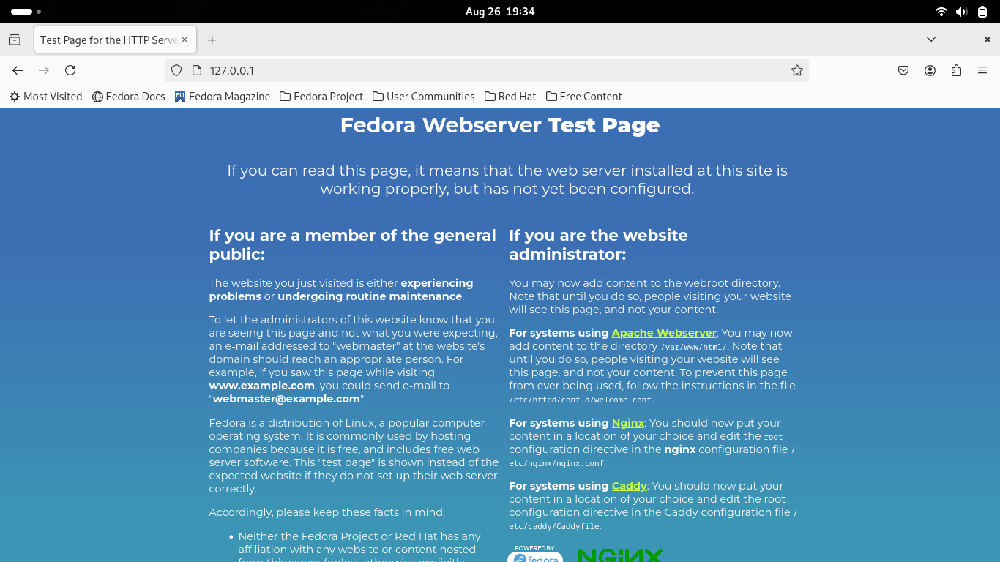
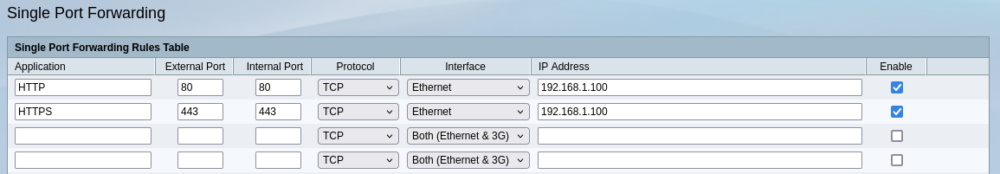
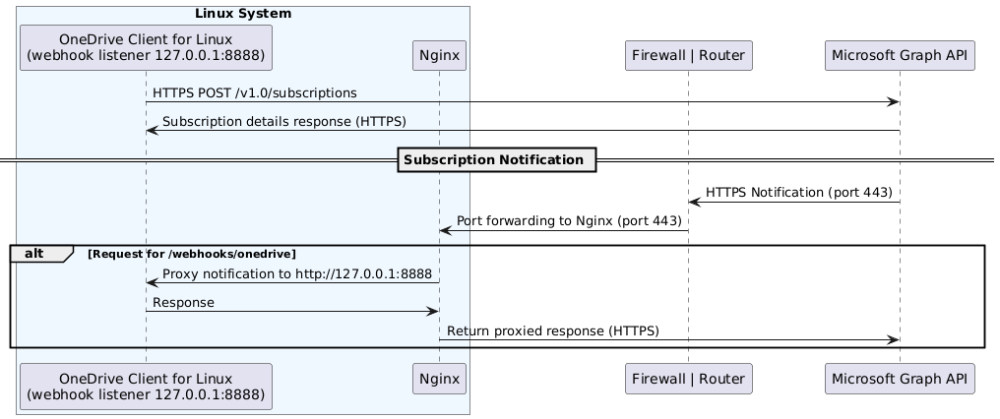

# How to configure receiving real-time changes from Microsoft OneDrive using webhooks

When operating in 'Monitor Mode,' receiving real-time updates to online data can significantly enhance synchronisation efficiency. This is achieved by enabling 'webhooks,' which allows the client to subscribe to remote updates and receive real-time notifications when certain events occur on Microsoft OneDrive.

With this setup, any remote changes are promptly synchronised to your local file system, eliminating the need to wait for the next scheduled synchronisation cycle.

> [!IMPORTANT]
> In March 2023, Microsoft updated the webhook notification capability in Microsoft Graph to only allow valid HTTPS URLs as the destination for subscription updates.
>
> This change was part of Microsoft's ongoing efforts to enhance security and ensure that all webhooks used with Microsoft Graph comply with modern security standards. The enforcement of this requirement prevents the registration of subscriptions with non-secure (HTTP) endpoints, thereby improving the security of data transmission.
>
> Therefore, as a prerequisite, you must have a valid fully qualified domain name (FQDN) for your system that is externally resolvable, or configure Dynamic DNS (DDNS) using a provider such as:
> * No-IP
> * DynDNS
> * DuckDNS
> * Afraid.org
> * Cloudflare
> * Google Domains
> * Dynu
> * ChangeIP
>
> This FQDN will allow you to create a valid HTTPS certificate for your system, which can be used by Microsoft Graph for webhook functionality.
>
> Please note that it is beyond the scope of this document to provide guidance on setting up this requirement.

Depending on your environment, a number of steps are required to configure this application functionality. At a very high level these configuration steps are:

1. Application configuration to enable 'webhooks' functionality
2. Install and configure 'nginx' as a reverse proxy for HTTPS traffic
3. Install and configure Let's Encrypt 'certbot' to provide a valid HTTPS certificate for your system using your FQDN
4. Configure your Firewall or Router to forward traffic to your system

> [!NOTE]
> The configuration steps below were validated on [Fedora 40 Workstation](https://fedoraproject.org/)
>
> The installation of required components (nginx, certbot) for your platform is beyond the scope of this document and it is assumed you know how to install these components. If you are unsure, please seek support from your Linux distribution support channels.

### Step 1: Application configuration

#### Enable the 'webhook' application feature
*  In your 'config' file, set `webhook_enabled = "true"` to activate the webhook feature.

#### Configure the public notification URL
*  In your 'config' file, set `webhook_public_url = "https://<your.fully.qualified.domain.name>/webhooks/onedrive"` as the public URL that will receive subscription updates from the Microsoft Graph API platform.

> [!NOTE]
> This URL will utilise your FQDN and must be resolvable from the Internet. This FQDN will also be used within your 'nginx' configuration.

#### Testing
At this point, if you attempt to test 'webhooks', when they are attempted to be initialised, the following error *should* be generated:
```
ERROR: Microsoft OneDrive API returned an error with the following message:
  Error Message:    HTTP request returned status code 400 (Bad Request)
  Error Reason:     Subscription validation request timed out.
  Error Code:       ValidationError
  Error Timestamp:  YYYY-MM-DDThh:mm:ss
  API Request ID:   eb196382-51d7-4411-984a-45a3fda90463
Will retry creating or renewing subscription in 1 minute
```
This error is 100% normal at this point.

### Step 2: Install and configure 'nginx'

> [!NOTE]
> Nginx is a web server that can also be used as a reverse proxy, load balancer, mail proxy and HTTP cache.

#### Install and enable 'nginx'
*  Install 'nginx' and any other requirements to install 'nginx' on your platform. It is beyond the scope of this document to advise on how to install this. Enable and start the 'nginx' service.

> [!TIP]
> You may need to enable firewall rules to allow inbound http and https connections on your system:
> ```
> sudo firewall-cmd --permanent --add-service=http
> sudo firewall-cmd --permanent --add-service=https
> sudo firewall-cmd --reload
> ```

#### Verify your 'nginx' installation
* From your local machine, attempt to access the local server now running, by using a web browser and pointing at http://127.0.0.1/



#### Configure 'nginx' to receive the subscription update
*  Create a basic 'nginx' configuration file to support proxying traffic from Nginx to the local 'onedrive' process, which will, by default, have an HTTP listener running on TCP port 8888
```
server {
	listen 80;
	server_name <your.fully.qualified.domain.name>;
	location /webhooks/onedrive {
		# Proxy Options
		proxy_http_version 1.1;
		proxy_pass http://127.0.0.1:8888;
	}
}
```
The configuration above will:
* Create an endpoint listener at `https://<your.fully.qualified.domain.name>/webhooks/onedrive`
* Proxy the received traffic at this listener to the local listener TCP port

> [!TIP]
> Save this file in the nginx configuration directory similar to the following path: `/etc/nginx/conf.d/onedrive_webhook.conf`. This will help keep all your configurations organised.

*  Test your 'nginx' configuration using `sudo nginx -t` to validate that there are no errors. If any are identified, please correct them.
*  Once tested, reload your 'nginx' configuration to activate the webhook reverse proxy configuration.

### Step 4: Initial Firewall/Router Configuration
*  Configure your firewall or router to forward all incoming HTTP and HTTPS traffic to the internal address of your system where 'nginx' is running. This is required for to allow the Let's Encrypt `certbot` tool to create a valid HTTPS certificate for your system.



* A valid configuration will be similar to the above illustration.

### Step 5: Use Let's Encrypt 'certbot' to create a SSL Certificate and deploy to your 'nginx' webhook configuration
*  Install the Let's Encrypt 'certbot' tool along with the associated python module 'python-certbot-nginx' for your platform
*  Run the 'certbot' tool on your platform to generate a valid HTTPS certificate for your `<your.fully.qualified.domain.name>` by running `certbot --nginx`. This should *detect* your active `server_name` from your 'nginx' configuration and install the certificate in the correct manner.

*  The resulting 'nginx' configuration will look something like this:
```
server {
	server_name <your.fully.qualified.domain.name>;
	location /webhooks/onedrive {
		# Proxy Options
		proxy_http_version 1.1;
		proxy_pass http://127.0.0.1:8888;
	}

    listen 443 ssl; # managed by Certbot
    ssl_certificate /etc/letsencrypt/live/<your.fully.qualified.domain.name>/fullchain.pem; # managed by Certbot
    ssl_certificate_key /etc/letsencrypt/live/<your.fully.qualified.domain.name>/privkey.pem; # managed by Certbot
    include /etc/letsencrypt/options-ssl-nginx.conf; # managed by Certbot
    ssl_dhparam /etc/letsencrypt/ssl-dhparams.pem; # managed by Certbot

}
server {
    if ($host = <your.fully.qualified.domain.name>) {
        return 301 https://$host$request_uri;
    } # managed by Certbot


	listen 80;
	server_name <your.fully.qualified.domain.name>;
    return 404; # managed by Certbot
}
```

*  Test your 'nginx' configuration using `sudo nginx -t` to validate that there are no errors. If any are identified, please correct them.
*  Once tested, reload your 'nginx' configuration to activate the webhook reverse proxy configuration.

> [!IMPORTANT]
> It is strongly advised that post doing this step, you implement a method to automatically keep your SSL certificate in a healthy state, as if the SSL certificate expires, webhook functionality will stop working. It is also beyond the scope of this document on how to do this.

### Step 6: Update 'nginx' to only use TLS 1.2 and TLS 1.3
To ensure that you are configuring your 'nginx' configuration to use secure communication, it is advisable for you to add the following to your `onedrive_webhook.conf` within the `server {}` configuration section:
```
    # Ensure only TLS 1.2 and TLS 1.3 are used
    ssl_protocols TLSv1.2 TLSv1.3;
```
The resulting 'nginx' configuration will look something like this:
```
server {
	server_name <your.fully.qualified.domain.name>;
	location /webhooks/onedrive {
		# Proxy Options
		proxy_http_version 1.1;
		proxy_pass http://127.0.0.1:8888;
	}

    listen 443 ssl; # managed by Certbot
    ssl_certificate /etc/letsencrypt/live/<your.fully.qualified.domain.name>/fullchain.pem; # managed by Certbot
    ssl_certificate_key /etc/letsencrypt/live/<your.fully.qualified.domain.name>/privkey.pem; # managed by Certbot
    include /etc/letsencrypt/options-ssl-nginx.conf; # managed by Certbot
    ssl_dhparam /etc/letsencrypt/ssl-dhparams.pem; # managed by Certbot
	
    # Ensure only TLS 1.2 and TLS 1.3 are used
    ssl_protocols TLSv1.2 TLSv1.3;
}
server {
    if ($host = <your.fully.qualified.domain.name>) {
        return 301 https://$host$request_uri;
    } # managed by Certbot


	listen 80;
	server_name <your.fully.qualified.domain.name>;
    return 404; # managed by Certbot
}
```
*  Test your 'nginx' configuration using `sudo nginx -t` to validate that there are no errors. If any are identified, please correct them.
*  Once tested, reload your 'nginx' configuration to activate the webhook reverse proxy configuration.

To validate that the TLS configuration is working, perform the following tests from a different system that is able to resolve your FQDN externally:
```
curl -I -v --tlsv1.2 --tls-max 1.2 https://<your.fully.qualified.domain.name>
curl -I -v --tlsv1.3 --tls-max 1.3 https://<your.fully.qualified.domain.name>
```
This should return valid TLS information similar to the following:
```
* Rebuilt URL to: https://your.fully.qualified.domain.name/
*   Trying 123.123.123.123...
* TCP_NODELAY set
* Connected to your.fully.qualified.domain.name (123.123.123.123) port 443 (#0)
* ALPN, offering h2
* ALPN, offering http/1.1
* successfully set certificate verify locations:
*   CAfile: /etc/pki/tls/certs/ca-bundle.crt
  CApath: none
* TLSv1.2 (OUT), TLS handshake, Client hello (1):
* TLSv1.2 (IN), TLS handshake, Server hello (2):
* TLSv1.2 (IN), TLS handshake, Certificate (11):
* TLSv1.2 (IN), TLS handshake, Server key exchange (12):
* TLSv1.2 (IN), TLS handshake, Server finished (14):
* TLSv1.2 (OUT), TLS handshake, Client key exchange (16):
* TLSv1.2 (OUT), TLS change cipher, Change cipher spec (1):
* TLSv1.2 (OUT), TLS handshake, Finished (20):
* TLSv1.2 (IN), TLS handshake, Finished (20):
* SSL connection using TLSv1.2 / ECDHE-ECDSA-AES256-GCM-SHA384
* ALPN, server accepted to use http/1.1
* Server certificate:
*  subject: CN=your.fully.qualified.domain.name
*  start date: Aug 28 07:18:04 2024 GMT
*  expire date: Nov 26 07:18:03 2024 GMT
*  subjectAltName: host "your.fully.qualified.domain.name" matched cert's "your.fully.qualified.domain.name"
*  issuer: C=US; O=Let's Encrypt; CN=E6
*  SSL certificate verify ok.
> HEAD / HTTP/1.1
> Host: your.fully.qualified.domain.name
> User-Agent: curl/7.61.1
> Accept: */*
> 
< HTTP/1.1 200 OK
HTTP/1.1 200 OK
< Server: nginx/1.26.2
Server: nginx/1.26.2
< Date: Sat, 31 Aug 2024 22:36:01 GMT
Date: Sat, 31 Aug 2024 22:36:01 GMT
< Content-Type: text/html
Content-Type: text/html
< Content-Length: 8474
Content-Length: 8474
< Last-Modified: Mon, 20 Feb 2023 17:42:39 GMT
Last-Modified: Mon, 20 Feb 2023 17:42:39 GMT
< Connection: keep-alive
Connection: keep-alive
< ETag: "63f3b10f-211a"
ETag: "63f3b10f-211a"
< Accept-Ranges: bytes
Accept-Ranges: bytes
```

Lastly, to validate that TLS 1.1 and below is being blocked, perform the following tests from a different system that is able to resolve your FQDN externally:
```
curl -I -v --tlsv1.1 --tls-max 1.1 https://<your.fully.qualified.domain.name>
```

The response should be similar to the following:
```
* Rebuilt URL to: https://your.fully.qualified.domain.name/
*   Trying 123.123.123.123...
* TCP_NODELAY set
* Connected to your.fully.qualified.domain.name (123.123.123.123) port 443 (#0)
* ALPN, offering h2
* ALPN, offering http/1.1
* successfully set certificate verify locations:
*   CAfile: /etc/pki/tls/certs/ca-bundle.crt
  CApath: none
* TLSv1.3 (OUT), TLS alert, internal error (592):
* error:141E70BF:SSL routines:tls_construct_client_hello:no protocols available
curl: (35) error:141E70BF:SSL routines:tls_construct_client_hello:no protocols available
```

> [!IMPORTANT]
> TLS 1.2 and TLS 1.3 support is provided by OpenSSL.
>
> To correctly support only using these TLS versions, you must be using 'nginx' version 1.15.0 or later combined with OpenSSL 1.1.1 or later.
> 
> If your distribution does not provide these, then please raise this with your distribution or upgrade your distribution to one that does.

> [!NOTE]
> If you use a version of 'nginx' that supports TLS 1.3 but are using an older version of OpenSSL (e.g., OpenSSL 1.0.x), TLS 1.3 will not be supported even if your 'nginx' configuration requests it.

> [!NOTE]
> If using 'LetsEncrypt', TLS 1.2 and TLS 1.3 support will be automatically configured in the `/etc/letsencrypt/options-ssl-nginx.conf` include file when the SSL Certificate is added to your 'nginx' configuration.


### Step 7: Secure your 'nginx' configuration to only allow Microsoft 365 to connect
Enhance your 'nginx' configuration to only allow the Microsoft 365 platform which includes the Microsoft Graph API to communicate with your configured webhooks endpoint. Review https://www.microsoft.com/en-us/download/details.aspx?id=56519 to assist you. Please note, it is beyond the scope of this document to tell you how to secure your system against unauthorised access of your endpoint listener.

> [!IMPORTANT]
> The IP address ranges that are part of the Microsoft 365 Common and Office Online services, which also cover Microsoft Graph API can be sourced from the above Microsoft URL. You should regularly update your configuration as Microsoft updates these ranges frequently.
> It is recommended to automate these updates accordingly and is also beyond the scope of this document on how to do this.

### Step 8: Test your 'onedrive' application using this configuration

*  Run the 'onedrive' application using `--monitor --verbose` and the client should now create a new subscription and register itself:
```
.....
Performing initial synchronisation to ensure consistent local state ...
Started webhook server
Initializing subscription for updates ...
Webhook: handled validation request
Created new subscription a09ba1cf-3420-4d78-9117-b41373de33ff with expiration: 2024-08-28T08:42:00.637Z
Attempting to contact Microsoft OneDrive Login Service
Successfully reached Microsoft OneDrive Login Service
Starting a sync with Microsoft OneDrive
.....
```

*  Review the 'nginx' logs to validate that applicable communication is occurring:
```
70.37.95.11 - - [28/Aug/2024:18:26:07 +1000] "POST /webhooks/onedrive?validationToken=Validation%3a+Testing+client+application+reachability+for+subscription+Request-Id%3a+25460109-0e8b-4521-8090-dd691b407ed8 HTTP/1.1" 200 128 "-" "-" "-"
137.135.11.116 - - [28/Aug/2024:18:32:02 +1000] "POST /webhooks/onedrive?validationToken=Validation%3a+Testing+client+application+reachability+for+subscription+Request-Id%3a+65e43e3c-cbab-4e74-87ec-0e8fafdef6d3 HTTP/1.1" 200 128 "-" "-" "-"

```

## Troubleshooting
In some circumstances, `SELinux` can provent 'nginx' from communicating with local system processes. When this occurs, the application will generate an error similar to the following:
```
ERROR: Microsoft OneDrive API returned an error with the following message:
  Error Message:    HTTP request returned status code 400 (Bad Request)
  Error Reason:     Subscription validation request failed. Notification endpoint must respond with 200 OK to validation request.
  Error Code:       ValidationError
  Error Timestamp:  2024-08-28T08:22:34
  API Request ID:   36684746-1458-4150-aeab-9871355a106c
  Calling Function: logSubscriptionError()
```

To correct this issue, use the `setsebool` tool to allow HTTPD processes (which includes 'nginx') to make network connections:
```
sudo setsebool -P httpd_can_network_connect 1
```
After setting the boolean, restart 'nginx' to apply the SELinux configuration change.

## Resulting configuration

When these steps are followed, your environment configuration will be similar to the following diagram:



## Additional Configuration Assistance

Refer to [application-config-options.md](application-config-options.md) for further guidance on 'webhook' configuration options.